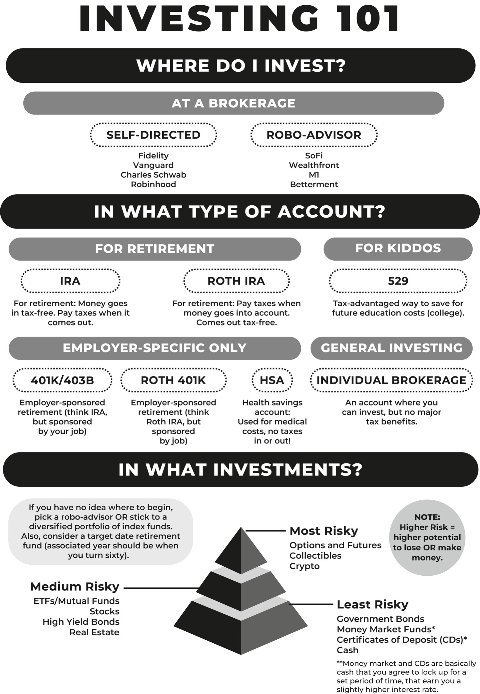

## 五、我不是富人出生，但我的孩子会是

## 投资部分

当涉及投资时，我有三个关于致富的真相要分享：

一：投资可能*看起来*很复杂，但实际上并不需要。

二：投资*不*需要你成为股市天才（如果你认为自己是，你很可能陷入困境）。

三：投资——而不是储蓄——才是致富之道。因为你*无法通过储蓄致富*。

如果你认为投资对你来说太复杂了，你并不孤单。说真的，我有一个朋友在私募股权公司工作——所以，你知道，一个懂钱的人。他真的把这当作一种职业。生活在 Excel 电子表格中。直到工作了*四年*，他才开设了一个退休投资账户。

当我和我们其他朋友发现时，我们都像是，“到底怎么回事？你刚刚白白给了钱！就像，你真的把钱冲进马桶里！”

他只是说，“我不知道，这很复杂，而且设置起来很麻烦，所以我就 . . . 没有。”

现在，要非常清楚，确实需要一定数量的繁琐文书工作来设置你的投资账户，但在更多“我们在学校没有学到这个”层面上，投资账户的世界看起来复杂是因为负责人没有动力让它变得更简单。在我朋友的情况下，设置他的雇主赞助的 401(k)账户的过程非常痛苦，以至于他基本上一直拖延。这对*他*来说很糟糕，因为他错过了投资回报和税收优惠，但你知道谁不会感到糟糕？

他的雇主。因为他的雇主有一个 401(k)匹配计划——他们会为每个员工贡献的一美元在账户中贡献一美元。那么为什么他们会*帮助*像我朋友这样的人弄清楚如何做到这一点——或者解释为什么这是一个好主意呢？

如果一点点文书工作和金融术语不会让你却步，也许你认为你需要在选择股票时非常聪明才能赚钱投资。

不不不*不*。如果我的经验表明了什么，那就是相反的：如果你*认为*自己很聪明，你很可能即将*亏钱*。在我在华尔街实习了十周之后——在那里我甚至不被允许点击任何按钮，因为我没有证书——我以为我知道关于投资的一切。

看，那个夏天，每个实习生都被要求在特定领域做一个关于好的股票选择的研究项目，而在我的情况下是生物技术，坦率地说，我对捍卫我的交易想法有点紧张。幸运的是，交易台上有一个医疗保健专家对我很感兴趣，而且在我早上给他带来一个甜甜圈和一杯咖啡之后——你知道的，只是因为——并感谢他的所有帮助，他恰好提供给我三十分钟的时间来练习我的生物技术演讲。在练习、回答他的所有问题并且在那个夏天做出了最好的实习生演讲之一之后，我感觉自己很厉害。我*了解*生物技术。

实习结束后，我的雇佣合同被终止，直到毕业后才被允许在我的个人账户进行交易。我做了什么？我把$4,000 投入到我在演讲中推荐的一只股票中，因为我对我的研究和投资论点*非常有把握*。而且，整个团队中最了解医疗保健的人告诉我，我的想法是*可靠的*！

你知道发生了什么吗？

公司令人兴奋的新旗舰药物——我做了很多研究的那个药物——未能通过第三阶段的试验。它无法上市。股票完全崩盘了。我一天之内损失了一半的钱。

我很幸运，我并不*需要*那笔钱来生存，但作为一堂课，这仍然是一堂相当昂贵的课程。我拥有*一切*——比 99.99%的投资公众拥有更多的资源——但我*仍然*选错了。所以，从我的错误中吸取教训：即使你认为自己知道自己在做什么，你*远远*比试图成为天才股票选手更好地投资于多样化的投资组合。

但这一切并不是为了吓唬你远离投资。投资对你未来的财务成功至关重要。

这就引出了第三个真相：你不能通过节省来变得富有。

是的，预算编制和储蓄是获得财务基础的重要部分。但请记住，富人之所以富有并不仅仅是因为他们比你赚更多的钱。他们不是因为他们“更有纪律”或“更节俭”而富有。他们之所以富有是因为他们利用他们的钱来赚钱——他们投资。

*没有*什么比你的钱更努力赚钱了。

钱不需要呼吸、睡觉、吃甜甜圈和喝咖啡。它可以全天候为你赚钱，比你从储蓄账户中获得的利率*永远*更高，而且比在工作中过度劳累要*轻松得多*。

投资应该是一个您可以轻松背景操作的系统，并且随着时间的推移，将逐渐使您越来越富有。它真的可以如此简单——我保证，无论您是即将上大学的十八岁青年还是觉得自己需要在退休前赶上进度的四十岁人，都有一种投资策略，您可以理解，可以实施，并可以用来实现您的目标。即使您没有很多资金起步，或者您不知道股票与债券与共同基金有何不同，您都会没问题的。

本章将涵盖从如何开设账户到购买何种投资再到道琼斯究竟是什么（或者是谁？）的所有基础知识。

一旦我向您展示您的资金如何为您赚钱，您会震惊于它曾经看起来如此不可能。（说真的，数学？比微积分更容易。可以说比代数更容易。而且你甚至不必亲自做任何事情。）

### 您唯一需要的投资分解

金融教育最大的错误是试图逐个解释一个概念。这就像把一块拼图交给你，让你画出整个图片。我发现，放大看盒子上的图案，然后分解拼图如何组合在一起构建它，会*更*容易。一旦您理解了整体情况，您就可以开始让它为您工作——但您必须先理解这个大局。

怀着这样的想法，我向您呈现这份专有的、极其正式的、独家的和豪华的您的富有好友投资流程图。

这就是：您应该如何思考投资的鸟瞰图。一旦您掌握了这个大局，我将帮助您深入准备投资前工作，设置您的账户，并购买您的投资。

本章的其余部分将扩展和解释您在这里看到的所有术语，所以请随时将此页面书签，以便在阅读时翻回来。

### 用六个简单步骤像富人一样投资

如果那份流程图是规则书，那么这部分就是策略。既然您已经看到整个系统的概述，我将向您展示如何玩转它——富人的方式。

#### 第一步：了解投资的实质。

非富裕人士往往有这样一个误解，即投资意味着“交易股票”。他们想象这将是一场*华尔街之狼*般的火焰，整天盯着股票涨跌，对着电话大喊“买！卖！买！卖！”。

好消息：不是。

在其最基本的层面上，投资就是简单地将您的资金投入到有潜力随时间增值的东西中。足够的时间过去后，您将其出售，并获得利润。您如何知道某物随时间增值？嗯，您不知道——至少不是 100%，但如果您购买不同投资的正确平衡，您基本上可以押注整体经济随时间增长。

猜猜看？这是一个非常非常*非常*稳妥的赌注。真的从来没有一个时期我们陷入衰退而没有走出来的。是的，会有暂时的低迷，但长期来看，*市场会恢复*。是的，你可能会购买一些股票作为你整体投资组合的一部分，但当你想到*股市*时，你所想象的可能*不*会是你的策略。

因为你想象的那种疯狂紧张的华尔街场景？那是*交易*，不是投资。正如我的导师向我解释的那样，当你交易时，你是在搬运业务。当你投资时，你是在储存业务。你可能听说过另一个术语*日内交易*，这意味着在交易日内快速买卖资产，而*投资*意味着购买并持有。

富人可能会买卖股票、债券、基金和其他华尔街的东西，但一般来说，他们*不*会进行日内交易，因为这需要大量的工作和压力（这两者，我需要提醒你，富人都讨厌），而且从统计上讲，这不是一个好的赌注（因为 85%的日内交易者长期亏损）。他们是*投资*—打赌经济会随着时间继续向上走—这也是你要做的。

#### 第二步：建立稳定的财务基础和预算。

尽管他们喜欢激进的投资策略，富人并不会冒险。他们知道市场会做市场该做的事情，虽然他们知道短期的波动并不会对他们的长期收益构成威胁，但他们*不*希望这影响到他们舒适的日常生活方式——换句话说，他们已经准备好了紧急基金。

在投资任何东西之前，你要确保已经留出足够的现金来支付三到六个月的生活费用。这不仅是因为一旦你投资了就有失去资金的风险，而且因为在许多情况下，投资会让你的钱暂时无法动用—比如当你投入养老账户时，你不能动用它（至少，不会没有巨额罚款，或者我稍后会提到的特殊情况）直到你至少 59.5 岁。

你还需要计算每月应该投资多少钱：例如，如果你按照 50/30/20 的比例分配，那么你收入的 20%将用于储蓄和投资，但这 20%在这两者之间如何分配取决于你的个人判断，很可能你并不会 100%的时间将这 20%全部投资。

话虽如此，我想要明确指出：无论你贡献多少，投资都是值得的。每个月遵循 50/30/20 你都不会错，但每个月只投入二十美元也不会错。

*这*就是富人投资的方式。无论他们能投入多少或多少，他们都会这样做。他们不会错过任何一个机会往他们的经纪账户里投入甚至是字面上的几分钱。他们不会困扰于任何“你应该在你多少岁时贡献 X 金额”的废话。

#### 第三步：了解你的债务（以及你的三角洲）。

请注意，我并*没有*说“先还清所有债务”。即使你有债务，你也可以投资。重复一遍：即使你有债务，你也可以投资。富人当然会这样做。

为什么？因为并非所有债务都是平等的，一切都取决于*三角洲*。

三角洲（如果你不记得代数课上的话...或者第一章的内容）基本上是两个变化率之间的差异。在这种情况下，这两个变化率分别是“你的债务积累利息的速度”和“你的投资赚取回报的速度”。如果你有一个正的三角洲——如果你的投资收益大于你的债务利息支付——你会在长期内*赚钱*。是的，即使你在技术上仍然“负债”。想象一下一个有漏洞的水桶：水可能从底部一滴一滴地滴出（你的债务利率），但如果你从高压水龙头中灌入更多的水（你的投资回报），水桶仍然会随着时间变得更满。

因此，*你可以*在负债的情况下通过投资赚钱*如果*你能实现正的三角洲。为了做到这一点——为了保持水桶中的水位稳步上升——你首先需要了解水龙头速率：水（也就是钱）将以多快的速度平均流入你的水桶（也就是你的投资账户）。

幸运的是，你不必猜测资金会以多快的速度流入你的桶中，因为我们有几十年的历史数据可以告诉我们市场平均增长多少，以一个方便的数字形式呈现。那个神奇的数字？7%。七分之一是基于过去三十年标普 500 的平均回报。[[*]](24_Footnote.xhtml#footnote_1 "footnote") 为什么是标普 500？因为标普 500 包括在美国交易股票的五百家最大公司，因此被认为是经济整体随时间增长速度的可靠衡量标准。这如何得出 7%？通过计算这五百家公司在一个漫长的时间段（比如三十年）内的表现，考虑通货膨胀（当然），并估计范围的下限平均值（为了安全起见），我们得出 7%的“水管速率”。换句话说，你的投资有些年份可能以 3%左右的速度涓涓细流，而其他年份可能以 20%的速度涌入，但随着时间的推移——因为时间是关键！——你可以合理地指望每年 7%的“流入”。

一旦你知道比喻中的水流速度，你只需看看你的债务——桶中的泄漏速度。你想知道哪些债务失去钱太快（桶中最大的漏洞）以及哪些债务流失速度足够慢，你可以用水管更多地补充。换句话说，你将找出哪些债务的利率高于 7%，*那些*是你需要在开始投资之前偿还的债务。

一旦高利息债务消除，你就处于积极增长的最佳位置，*净*变化率（投资收益减去债务利息支付）将大于零。此时，只需对所有剩余债务进行最低还款*同时*进行投资，你就实际上创造了一个赚钱机器。这两种利率之间的差额就是额外的钱：额外的钱可以更快地偿还债务，或者帮助你更多地投资。无论如何，额外的钱都是好事。

如果你感觉自己的债务确实难以克服，完全可以暂停一切投资。债务管理的心理负担是真实存在的，处理催收机构或信用评分受损比现在投资更重要。在第六章的“债务”部分查看一些策略。

#### 第四步：按照政府的规定行事。

现在跟我说：*富人讨厌交税*。

像富人一样投资意味着尽可能少地将你辛苦赚来的投资回报百分之几交给政府——不，你不必要进行税务欺诈，这要感谢 100%合法的税收优惠投资账户。将你的投资资金放入这些账户，你可以避免现在或以后支付税款，有时甚至*两者*都不用。

“但等等”，你可能会想。“这基本上是免费钱吧？有什么陷阱？为什么政府*希望*我们在某些方面少交税呢？”

嗯，如果你问富人，那是因为政府把我们看作一群幼儿。我们固执，不听话，需要严重的贿赂才能进行基本的自我照顾，而且我们随时有走进交通道的风险，除非有人把我们关在游乐园里。当政府希望我们做某事时，他们会用贿赂来哄骗我们。当政府*不*希望我们做某事时，他们会设定一个严厉的后果*。*

当我们投资时，政府希望我们做什么？*为退休存钱*。为什么呢？想想看：如果你停止工作，不再有收入，名下一分钱都没有，你知道谁将为你的食物、房租和医疗费用买单吗？没错：联邦政府，而他*绝对*不想支付这笔账单。不，政府更希望你亲自大力储蓄，为你的晚年退休生活存下*足够*的钱，以支付关节炎药物和佛罗里达州的公寓。

由于他们不相信我们这些幼儿公民会为了退休而投资*仅仅因为*，他们会给我们一个贿赂：一种减少联邦税收的方式。美国税法制定了一整套税收激励的投资账户。通过使用这些特殊类型的账户进行投资，你同意遵守一定的限制（比如，只有在达到一定年龄后才能使用那笔钱），但也会获得美味的优势（比如向政府支付更少的钱—得分！）。

当然，讽刺的是，富人是最不可能在退休时需要政府援助的人，他们绝对不会如此*愚昧*和*落后*，以至于*忽视*长期储蓄！他们*不需要*被*激励*！但是，他们肯定会接受税收优惠。因为免费钱。 （也就是说，一些税收优惠的投资选择—比如向 IRA 做出贡献—确实有收入限制和其他限制，所以富人也不是完全自由。）

因此，要像富人一样投资，你首先要优先考虑那些税收优惠的退休账户。看着吧，联邦政府。

#### 步骤 5：了解你的目标、时间范围和风险承受能力。

当然，退休并不是富人唯一为之储蓄的事情，无论有没有税收优惠。他们为他们的钱设定了一系列目标，根据这些目标以及他们想要实现这些目标的时间，他们会计算出不同的*风险承受能力*。

听起来复杂，但我们基本上在必须在某个截止日期前完成某事时，会考虑我们的风险承受能力。

举个例子，想象一下，今天是一个重要的晚会，你*仍然*没有合适的服装。你会怎么做？嗯，我不知道你，但我会去最近的百货商店挑选一件经典的小黑裙。如果距离我需要参加活动只有几个小时，我不会浪费时间在各个地方逛逛（因为我的时间视野很短），也不会选择一些疯狂或者剪裁奇怪的衣服（因为我的目标是看起来漂亮）。当然，我可以在晚会当天去一些角落里的古董店，也许会找到一些绝妙而独一无二的东西，但我*也*可能什么都找不到。我没有时间去冒险。在那个紧要关头，我是*风险规避者*。所以选择小黑裙。

另一方面，如果我只是在周日在 SoHo 随意购物，我可能会挑选一件蓝色鸵鸟羽毛上衣，因为为什么不呢？我的目标仍然是看起来漂亮，但我没有为此组装服装而必须做出的决定，所以我的时间视野*更*灵活：如果最终我发现不喜欢这件上衣，我可以退货。如果最终我穿着上衣并喜欢它，我可以再去买一件。在这种情况下，我更具*风险承受能力*。

这个例子简明地解释了风险承受能力：你需要某事尽快完成，你就越有可能选择一种风险较低的方式来完成。

这对你和你的投资意味着什么？总的来说，投资方面，你的时间视野越长，你就能承受更多的风险。你现在可能有的*最遥远*的目标是什么，时间上？

是的：退休。

在还有几十年时间之前才需要那笔钱的情况下，如果市场动荡，你有足够的时间来恢复——因此你可以选择更激进的方式并在投资选择中承受更多的风险。随着时间视野缩短和年龄增长，你的风险承受能力会降低，你会重新平衡你的投资，选择更少风险的投资（这样你就不会担心失去那笔钱，这笔钱将支撑你直到你去世）。

如果你有更短期的目标（比如送孩子上大学），那就需要选择风险较低的投资：你仍然希望资金增长，但在潜在的下跌后，你没有太多时间来恢复。至于*非常*近期的支出？富人仍然会投资——毕竟，富人*不*会让自己的资金闲置，即使他们的风险承受能力非常低，你也可以这样做。你为新车或两年后的婚礼预留的现金可以投资于回报低、风险低、时间框架较短的投资选项。这样，当你需要时，现金就会准备好，并且额外增加一点。

#### 步骤 6：对“只有一次”的冒险和“害怕错过”的恐惧说不。

最后但绝对最重要的是：富人不会仅仅因为互联网上的人告诉他们而投资于随机的东西。不是最新的加密货币，也不是那些“肯定会飙升到月球”的模因股票。

因为他们了解投资的运作方式，而这不是。

富人知道市场是如何运作的。

他们不会因为“时机”而在“正确”的毫秒购买东西而感到恐慌，因为他们知道随着时间的推移，它几乎总是会上涨（记住那个神奇的 7%的数字）？

他们知道什么事情看起来太美好而不真实，因为价值并非凭空而来，而许多 NFT 并没有真正……嗯……有任何有用的东西。

他们知道如何*等待*。他们可以延迟满足感。他们不需要快速致富——他们想永远保持富有。

### 姑娘，你拥有资产：投资时应该买什么

你有没有去过高档餐厅吃晚餐，点了一些你只知道一半的东西？

就像甜饼。*哦，甜点！*

或者落基山牛睾丸。*我的意思，我喜欢牡蛎，所以那*可能*没问题，对吧？*

然后你的盘子端上来，惊喜，惊喜：原来甜饼是又滑又腥的胸腺腺体肉，而落基山牛睾丸是公牛的睾丸。

当你开始投资时就会发生这种情况。菜单上可能有很多你可能*听说过*的东西，但一点点知识可能是一件危险的事情，你最终可能会在你实际上*对零*感兴趣的东西上浪费你的钱。

所以在你甚至打开你的第一个经纪账户之前，让我们放慢脚步，看看投资菜单上有什么。

正如我们刚刚学到的，投资基本上是将你的钱投入到随着时间增值潜力的东西中。那个*东西*被称为*资产*：它是你拥有的具有价值并可以用来赚钱的东西。资产可以是实物的，比如房子、毕加索、一堆金砖等，但它们也可以是无形的，比如股票、债券或加密货币。

但是。仅仅因为某样东西在技术上可以被视为资产并不意味着它会自动让你赚钱——换句话说，仅仅因为它在菜单上并*听起来*高级并不意味着它是一个好选择。一些资产更有可能随着时间的推移升值，而另一些则更像是“可能/可能不”情况。虽然不同类型的资产（也就是*资产类别*）随着时间的推移*倾向于*以相同的方式变化，但没有人可以百分之百保证 X 资产在 Z 日期的 Y 价值（除了两个例外，我们会讨论到这些）。

换句话说，所有资产都会涉及风险（参见：我之前的新手交易员故事）。然而。如果你知道不同类型的资产是什么，它们有多大风险以及是什么*使它们*有风险，你就可以选择最适合你的资产，并开始了解什么会帮助你建立多样化投资组合，从而让你从简单的预测“随着时间经济会发展”中获利。因此，这里列出了一些（但不是全部！）现有的资产，按照你最有可能熟悉的顺序排列到你可能没有那么多接触的更抽象的东西。

#### 奢侈品资产

一幅班克斯画作，一枚卡地亚戒指，一个爱马仕包：我们随意地将这些高端商品称为“投资品”，*从技术上讲*，这是正确的：那个爱马仕包更有可能随着时间保持其价值，而不是来自 Target 的一个，因此，是的，能够以更高的价格转售这些物品的几率比大规模生产版本更高。

但只是因为它们*可以*转售并不意味着它们*会*。奢侈品资产市场非常*Project Runway*：你要么在内，要么在外。因为你能否获利于像十克拉蓝宝石戒指或手工编织的东方地毯这样的东西始终取决于是否有人愿意购买它（并愿意支付你要价的价格），所以从长期来看，它比更通用的资产*要*风险更大。此外，由于奢侈品资产只是实物，它们可能会丢失、被盗、损坏、被老太太扔进*泰坦尼克号*里的海洋等等。比如，还记得班克斯在拍卖会上卖出那幅画然后立即让它通过隐藏的碎纸机吗？购买它的人认为他们在做一笔投资 . . . 班克斯像班克斯一样做了，基本上当场让他们破产了。（开玩笑，我怀疑他们把最后一分钱花在一幅画上，我很有信心有人会购买那些碎片，但你明白我的意思。）这基本上是任何奢侈品资产可能发生的事情：如果你最大的“投资”是一条钻石网球手镯，你基本上离被一场房屋火灾或一个贼手地铁小偷搞砸财务的距离只有一步。

你富有的最好朋友的立场是这样的：购买奢侈品是因为你*想要*奢侈品，而不是因为你期望从中获利。对奢侈品没有任何偏见，但它们不会与经济的整体增长同步（这是我们想要的，记住吗？），它们*也*不能在那些额外特殊的税收优惠账户中持有（这是个遗憾）。此外，由于很难衡量或预测它们的升值速度，它们很难纳入债务投资差距中。三振出局，伙计。

#### 房地产

房地产就像奢侈品资产的另一面：并非每个人都需要一双 Louboutins，但*每个人*都需要一个头顶的屋檐。拥有房屋、商业建筑，甚至只是普通的*土地*是人类历史上最古老的投资策略之一，简单地因为“存在和做事的空间”永远都是人们需要的东西。

最常见的房地产投资方式可能甚至*看起来*不像是投资：购买一栋房子，居住在那里，最终出售它（或将其遗赠给你的孩子）。几代人以来，这一直是大多数中产阶级人士保值和增值财富的*方式*。随着时间的推移，房价往往会上涨，当你准备出售时，你的房子的价值会比你支付的更高—咔嚓，获利。

将房地产用作资产的另一种方式是成为房东：拥有一栋房屋、公寓大楼、商店等，向其他人收取使用费。这是一个很好的安排，因为它基本上让你双倍受益：随着时间的推移，你持有的资产价值上升，你还可以从租户/AirBnB 客人/大豆种植者/任何使用你的财产的人那里获得现金流。

房地产的美妙之处在于投资几乎永远不会归零—即使是地上的一堆砖也是有价值的—并且最终，所有房地产*倾向于*升值。但使房地产成为一种超级资产的原因—以及为什么富人*非常喜爱*它—是它让你使用*杠杆*。

事实上，大多数房产所有者—甚至是富人—并不会一次性用现金支付房屋的全部价值。相反，他们会获得抵押贷款，他们会支付一定金额的现金作为抵押贷款的担保金（最常见的是房屋价格的 20%首付款，但这可能有所不同），并同意在一定时间内偿还（30 年的抵押贷款在美国最为常见，但你也会看到 15 年和 25 年的抵押贷款）。通过抵押贷款，你可以*杠杆*一个$60,000 的现金首付款变成$300,000 的房产—基本上没有其他资产类别有这种让你做到这一点的贷款安排。

现在，在最初阶段，这意味着负债：你需要向银行支付购房余款，再加上每月的利息。但如果你持有房屋足够长的时间，希望是房屋价值的增长将超过总债务，这样你仍然能获利—而且在此期间，你可以*使用和居住在房子里*。巨大。而且在租赁物业方面，杠杆效应甚至更好，因为来自租户的租金可以支付给银行的抵押贷款—所以对于那$60,000 的首付款，你不仅拥有了价值$300,000 的资产，而且你的有效月付款为*零*（而且你可能每个月还能额外赚几百美元）。

话虽如此，虽然房地产是一种经得起考验的资产类别，但它的门槛很高（不仅仅是首付，还有税费等成本，以及持续的维护），而且总体上是一个更大的承诺（卖出一栋实体房屋比卖出一只共同基金份额需要更长时间，例如）。所以，老实说，如果你刚开始投资，房地产不是我会选择的*第一个*地方。如果你已经考虑购房只是为了，你知道，有一个居住的地方，那么你完全可以继续追求，但如果你每个月的预算中有一些现金想要增值，那么你最好选择一些可以在经纪账户中购买的东西，比如股票、债券或基金。

#### 股票

股票让你拥有的实质上是公司的一小部分所有权。当一家公司在股票交易所公开交易时，它们基本上是在以*股份*的形式出售小小的所有权份额。

让我们以一个大型、熟悉的公司为例——比如一家名为香蕉（Banana）的科技公司。如果你将香蕉的每一分价值都编制成一个饼图，那么一股香蕉股票就像是那个饼图中的一小块。当你拥有那一小块饼时，实质上是在向公司提供资金，以换取参与他们成功的机会，但也可能面临失败的风险。如果香蕉做得很好，卖出大量新手机并赚取大量利润，那么公司的饼图价值会变得更高，你的那一小块也会变得更有价值。你可以通过将你的那一小块卖给别人来实现成功，或者你可以继续持有，因为你认为它会涨得更*多*。

但如果香蕉开始走下坡路，比如他们最新的笔记本电脑在人们面前爆炸，他们面临一场巨大的集体诉讼，那么他们的饼图突然就会贬值很多，你的那一小块也会贬值。你*可以*卖掉你的那一小块，但由于没有人愿意为爆炸笔记本公司的一小块支付高价，你可能只能拿回*部分*最初的投资。

股票也可以通过*股息*形式为你赚钱，这是公司定期向所有股东支付的款项（比如每个季度）。你获得的股息金额被称为*股息收益*，是股票价值的百分比。但一般来说，大多数投资者通过购买他们预期价值会上升的公司的股票来赚钱，这样他们就可以在未来卖出股票赚更多钱。

但问题在于。

当涉及为自己购买投资时，我不建议选择个别股票。我说这话是作为一个在华尔街交易个别股票为生的人。（我还要再讲一遍我的悲惨生物科技故事吗？拜托，不要。）

也就是说，远离挑选个别股票并不等同于“我太蠢了，不懂股市”。实际上恰恰相反：因为你*确实*了解股票是如何运作的，你也明白只押注于一家公司的巨大风险是无法承受的。你仍然可以利用基于你认为会蓬勃发展的行业和经济领域的低风险投资方式（我们将在稍后讨论部门基金），并且你仍然可以花费大量时间、思考和精力来打造你的投资组合。

因此，如果所有这些让你感觉像是我向你泼了一桶冷的 FOMO，我理解——但相信我，你仍然有很多实际投资的机会。

#### 债券

如果股票让你拥有一家公司的一小部分并有可能从其成功中赚钱，那么债券就是你向一家公司（或政府）借钱，并从他们偿还债务中赚钱。

换句话说，当你购买一张债券时，你实际上是在发行债务。你成为了银行。当你带着利息偿还债券时，你就像银行一样赚钱。

如果你购买一张**公司债券**，那意味着你正在向一家公司借钱，而这家公司将支付给你利息。这比购买该公司的股票风险较小，因为如果一家公司破产，所有债权人都会首先得到偿还，这是一项合同义务。股东（也就是股票所有者）没有义务得到任何东西。

但债券的酷之处在于，你不仅仅局限于仅仅购买来自公司的债券。**政府债券**由国家政府发行，作为筹集资金的一种方式（因为税收无法覆盖一切，对吧？），而**市政债券**由地方政府（如城市和城镇）发行，用于资助学校和公路等公共项目。

债券的更*酷*之处在于它们具有内置系统，帮助你进行比较购物。你知道当你考虑为你的必备睫毛膏选择一个新品牌时，你会搜索那些 Beautuber 视频之一，其中有人对成分、刷头、持久性等进行了*详尽*深入研究，以便你在购买之前决定这是否适合你？对于债券，你可以找到*债券评级*，这实质上是对给定债券在从 AAA（非常低风险）到 CCC（相当高风险）的风险评级的审查。在这种情况下，Beautuber 是独立的信用评级机构，如穆迪或标准普尔，他们对所有细节进行深入研究，并为你总结出一个不错的评级。

因此，当你评估个别债券时，你可以查看债券类型、评级和利率（你将获得多少钱）来找到符合你舒适水平并让你满意的回报的债券。

话虽如此，一般来说，政府债券在风险方面往往是最安全的选择：它们具有非常高的债券评级，因为它们得到了整个政府的支持。

如果你在债券生活中可以接受稍微更多的风险，你也可以看看**高收益债券**。这些债券由信用评级较低的公司发行，借给它们有一定风险，*但*作为回报，它们将为你提供更高的利率。

因为债券总体上比其他资产类别风险要小得多，基本上没有人不适合投资债券——但除非你距离退休只有五分钟的时间，否则你可能不希望将*所有*的投资资金都投入债券。是的，它们风险较低，但回报也较低，如果你有足够长的时间让你的资金增长，最好将更大一部分的投资资本投入具有更大盈利潜力（是的，也有更大风险）的股票中。

“但等等，维维安”，你可能会说。“股票就是股票，对吧？我记得你说过我*不应该*自己挑选个别股票？那么如果我不买个别股票，也不会一直买债券，那还有什么其他的选择呢？”

朋友，我*非常*高兴你提出了这个问题。

#### 基金

基金本质上是由*其他*投资组成的资产。基金可能包含一些股票、一些债券、一些其他资产……基本上，如果购买个别股票或债券产品就像是为万圣节购买一盒太妃糖，那么投资基金就像是购买一大袋各种糖果的混合包。

这就是基金如此出色的地方：你在分散风险（购买各种糖果）的同时，只需选择*一个*资产（混合包）。如果今年太妃糖不受欢迎，你整袋糖果也不会被浪费。

现在，就像生活中有不同种类的糖果混合包一样，基金也有不同种类。有两个主要因素决定我们正在看的基金是什么类型。第一个是显而易见的，即混合包的内容：例如，股票基金只是一篮子不同的股票，而债券基金是一篮子许多债券。

另一个因素是基金是**交易所交易基金（ETF）**还是**共同基金***.* ETF 和共同基金都是投资的混合包，它们内部可能有类似的内容——主要区别在于它们如何组合以及如何购买。

通过 ETF，您可以通过购买该基金的若干股份来进行投资，有点类似于购买股票。由于*大多数*ETF 都与特定指数（如标普 500、纳斯达克等）、地区市场（如美国、亚洲、拉丁美洲）或行业（如科技、能源或房地产）的表现挂钩，它们不需要人类监督，全天候交易，价格不断波动。

通过共同基金，您需要以最低金额进行投资—无论股价是多少，您都必须至少投入 X 金额的资金（通常是几千美元）。大多数（但不是全部）都是积极管理的，这意味着某个地方的一个人负责监控篮子中的投资，并交换其中的内容，以试图击败市场。这意味着共同基金只在市场收盘后一天定价（并且人类监督当天已经完成）。

#### 加密货币

让我直接说吧：您不应该把任何您不愿意失去的东西投入到加密货币中。这不是一个把您所有资金投入的好地方。如果您是一个相当普通的投资者，在日常工作中没有赚很多钱，您可能有*更多*的投资选择要考虑，而不是一开始就考虑加密货币。购买加密货币不会获得任何税收优惠，也不会获得雇主的匹配，与房地产不同，如果您的硬币持有价值暴跌，您可能会一无所有。

现在，说了这些：加密货币到底*是*什么？

嗯，在本质上，加密货币只是虚拟货币。它基于一组保持交易准确记录的计算机网络—称为*区块链*—这使得它可以通过点对点交易发送，而无需银行干涉（或收取费用）。

然而，虽然您*可以*使用加密货币进行在线支付，但大多数人购买加密货币不是为了花费，而是为了持有它们，因为它们的价值上涨—换句话说，作为一种投资。您可以使用标准货币或其他加密货币在交易所购买它们—在这个意义上，投资加密货币就像投资任何其他资产类别。但这也是相似性的尽头。

例如，股票受政府机构严格监管，必须遵循某些规则和披露要求。另一方面，加密货币基本上没有受到监管，以分散化方式运作。没有第三方收取费用，但*也*没有第三方在发生可疑（或非法）事件时阻止。

加密货币也比传统资产类别更加波动。是的，股价会上下波动，但它们很少像加密货币那样剧烈（或迅速）波动，这使得加密货币成为一种更加风险投资。

你富有的最好朋友的看法？基本上，一个健康的投资策略完全可以包括加密货币，但它不应该是你投资的首要事项，而且它*绝对*不应该是你唯一的资产类别。我建议加密货币占你整个投资组合的 1 到 5％。如果你对某项加密货币投资感到有些可疑？赶紧离开。

### 经纪公司和投资账户

好的，你已经准备好让你的资金发挥作用，你已经了解了资产类别的所有知识，你也有一些想要投入市场以赚取更多钱的资金。但是，就像 . . . 怎么做呢？

好吧，如果你还记得第 168 页上美丽的流程图，你将要开设一个投资账户，而且你将在经纪公司开设。

**经纪公司**是一家基本上充当中间人帮助你买卖投资的公司。你将在其中一家公司开设账户，存入一些现金，然后选择用这笔现金购买的投资。你的经纪公司将处理这笔交易，保留你投资的实际资产（股票、共同基金等）在你的账户中，并跟踪这些资产的价值上升或下降。你的经纪公司还可以根据你的财务目标和风险承受能力为你提供建议，告诉你哪些投资可能适合你。基本上，这就是所有投资魔法发生的地方。

传统上，经纪公司过去会对客户每笔交易收取*佣金*，并提供大量服务，如研究、交易思路的获取以及各种投资账户可供选择。如果你需要这些东西，那一切都很好，但否则只会使入门成本变得相当昂贵。如果你只是投资少量资金，那些佣金和其他成本基本上会抹去你的收益。

随着像罗宾汉这样的无费经纪商的引入，那些传统公司受到了**颠覆**。新生代公司不收取佣金，但提供了购买和出售相同物品的途径。突然之间，普通人可以更轻松*和*更便宜地开始投资，而老牌公司则*震惊*了。传统经纪公司被迫将佣金降至零（以免他们的小额客户跳槽），同时保留他们以前提供的好处（以免他们的大额投资者抱怨）。

所以关于经纪公司的总结是，你现在可以支付廉价的价格获得头等服务。基本上，你不应该再为进行交易而付费了——如果你在任何地方都不支付交易费用，那么你最好把钱投资在能够获得最多资源和工具帮助你学习的地方。话虽如此，我不希望你因分析而瘫痪——没有最好的经纪公司，只有最适合*你*的经纪公司，所以在他们的用户界面、应用程序和网站上四处看看，然后选择你感觉最舒适的那个。如果你想要我的建议，或者不知道从哪里开始，前往[richAF.club](https://richAF.club)并参加我的方便的“我应该使用哪个经纪公司？”测验。

一旦你注册了一个经纪公司，你将开设一个**投资账户**，那可能是你将遇到所有这些胡言乱语的地方：401(k)。403(b)。IRA。HSA。

如果看到那个列表让你感到惊讶，那么*欢迎*。我不认识一个人会看着投资账户选项的字母汤瞬间就会说，“啊，是的，这些完全有道理，名字正好描述了它们的用途。” 但一旦你弄清楚这些到底是什么意思，它其实也*不那么*复杂。

首先——再次强调——上面所有的花哨数字和首字母缩写只是不同种类的*投资账户*。如果你的投资（你的资产）就像你的钱包、手机、唇彩、水瓶等，那么你的投资*账户*就是将它们都放在一个地方的手提袋。

其次，每种账户都有略微不同的目的和略微不同的优势——就像手提袋一样。就像，是的，来自独立书店的可爱棉质手提袋和丑陋的可重复使用杂货袋都*技术上*可以装东西，但只有一个是可以替代手袋的合理选择，对吧？根据你打算用那个袋子做什么，你知道该拿哪一个。

那么你该怎么做呢？嗯，每种投资账户都用于特定目的、场景或人群类型，我将概述每种的好处。

这远非详尽的列表——但这些是一些对初学者投资者来说最常见的选项，也是最合理的选择。考虑到这一点，每个人都可以通过为退休而投资获得某种税收优惠，所以每个人都应该有一个退休投资账户。完结。（记得政府基本上会通过降低税收来贿赂你，如果你是一个负责任的小公民，并为老年时投资钱。是的，就是这样！）你个人可以开设的退休账户种类将取决于一些因素，具体取决于你的雇主是否提供退休账户（稍后会详细介绍），但至少你应该有资格开设个人退休账户。

所以，考虑到这一点，让我们来看看这些账户。（对于税收优惠的账户，你会看到名字旁边有钱的表情符号。）

#### 401(k)和 403(b)

401(k)和 403(b)是你通过雇主获得的投资账户，用于为退休存钱（和增加你的财富）。两者之间的主要区别在于 401(k)适用于私营公司的雇员，而 403(b)适用于公共部门或非营利组织的雇员，如教师、政府工作人员等（这些名称来自于管理这些账户的美国税法部分）。

如果你的雇主提供这样的福利，你应该*绝对*要有一个。

首先，这些账户能为你省钱。工作原理是你所有对 401(k)或 403(b)的贡献都是*税前*的。这些美元可以直接从你的雇主转到你的投资账户，而且它们*不会*算作你当年赚的钱——这意味着你总体上要缴纳的税少了，因此在年底税单上要付的税也会少。

当然，这也有一些小小的限制。如果没有支付高额罚款，你不能在 59.5 岁之前从你的 401(k)/403(b)中提取资金——这是政府说“*不许碰*”的方式。而且你不能每年都把*所有*的钱都存进去（毕竟政府还希望你支付*一些*税）：每年的贡献上限为 22500 美元（截至 2023 年的限额；限额通常每年增加以跟上生活成本的增长）。但正如我们将看到的，与其他税收激励账户相比，这个限额是*相当高*的。

但税收节省只是开始。401(k)和 403(b)有可能成为*最好*的退休账户类型，这要归功于两个小词：*雇主匹配*，又称*免费钱*。

这里是雇主匹配的工作原理。假设你一年赚 10 万美元，你的公司提供一比一的 401(k)匹配，上限为你工资的 6%（这是我第一份工作时我的雇主提供的）。这意味着如果你将你工资的 6%——也就是 6000 美元——存入你的 401(k)，到年底，你的账户将有你的 6%贡献*加上*雇主的匹配金额——所以总共是 12000 美元。

这是在你甚至投资一分钱之前就有的 100%无风险回报，*这*是难以超越的。

雇主匹配是为了让员工在退休福利中达到最佳平衡而出现的。快速历史课：过去，公司通常会提供养老金并在员工退休后为他们支付*一切*。但对公司来说这并不是一个好主意，因为他们承担了支付这笔费用的所有风险（如果一个副总裁活到 105 岁，他们可能需要支付*大量*的养老金）。渐渐地，越来越多的公司开始想，“嘿，如果我们让*员工*承担大部分风险怎么样？毕竟他们才是退休的人！”并转向了 401(k)，在这种情况下，责任在于*你*采取行动并做出贡献。但是，因为他们（以及政府）仍在努力激励你为退休储蓄，公司通常会给你一些免费的钱放入那个投资账户，以雇主匹配的形式。

当然，并非每家雇主都提供匹配的贡献（有些雇主仍然提供养老金！）但即使你的雇主不提供匹配，你仍然可以获得税收优惠。此外，401(k)和 403(b)通常受到债权人的保护，以防你陷入某种财务困境，而一些公司计划允许你在某些情况下（比如买房）从你的退休投资账户中借款，只要在规定的时间内偿还，就不会受到处罚。

关于 401(k)和 403(b)的另一件事是，当到了填满这种购物袋——也就是投资你贡献的钱——的时候，你的选择会受到限制。再次强调，这是一种激励做出正确选择的方式：因为这些投资账户的设计、监管和管理都是为了*让人们能够舒适地退休*，所以能够随意将钱投入任何你感兴趣的超高风险投资并潜在地失去所有的钱对任何人（尤其是你）都不利。回到我们的购物袋比喻，把这些账户想象成大购物袋，你可以把它填满——但只能装上相当健康的食物。（而雇主匹配就像买一送一！）

实际上，这意味着你通常不能在你的 401(k)/403(b)中购买个别股票或交易期权。相反，你很可能会从公司提供的招股说明书中进行选择——基本上是你所有投资选择的菜单。（我强烈建议，如果你有 401(k)或 403(b)，找出那份招股说明书，在我们讨论基金类型时参考一下。这将帮助你理解什么对*你*来说是最好的选择！）

#### 传统和罗斯 IRA

让我们从这个缩写开始：IRA 代表“个人退休账户”。

*个人*意味着与 401(k)和 403(b)不同，IRA 不是由雇主赞助的：你在这里是最重要的人，所以你是那个开设账户、贡献资金和选择投资的人。

*退休*意味着……嗯，退休。就像当你年老不再工作时。而账户就是账户。所以，ta-da？

但是，IRA 账户专门用于储存和增长你的退休金。就像 401(k)和 403(b)一样，每年有存款限制（截至目前为止为$6,500，如果你超过五十岁则有“补充”存款限制为$7,500），你不能在达到 59.5 岁之前从 IRA 中提取收益——或者说，你*可以*提取这些收益，但你将为这笔钱支付资本利得税，还有早期提取罚款。记得政府如何对它不希望你做的事情征税吗？它绝对不希望你触碰这笔钱，直到是你的时候。但同样地，你也会得到税收优惠来增加诱惑……这就是我们谈到传统与罗斯的情况。

在开设这些账户时，你可以选择传统和罗斯两种税收优惠方式。我喜欢用一个普遍易懂的比喻来解释两者的区别：披萨。

你的传统 IRA 就像一块意大利辣香肠披萨。当你吃的时候会非常美味，从第一口开始就令人愉悦……但可能会有点，嗯，辣。 （就是当你上厕所时。只是为了澄清。）这是因为传统 IRA 让你从一开始就享受所有惊人的税收优惠。你为传统 IRA 捐款的金额将从你当年的应税收入中扣除。因此，举个非常简化的例子，如果你今年赚了$70,000，但将$6,500 存入传统 IRA，你的应税收入将降至$63,500（$70,000 - $6,500）。计入的收入较少=向 IRS 支付的钱较少。

然而，你会在传统 IRA 中赚取的投资收入上缴税款——只是稍后而已。你将在取款时（也就是在退休时从账户中开始取款时）缴纳所得税，所以事情就变得有趣了。

相比之下，罗斯 IRA 就像一块素食披萨。现在是一个健康、有营养的选择，也许不那么美味，但到时候会容易得多（如果你明白我的意思的话……抱歉，因为我把这个比喻*太*远了）。在罗斯 IRA 中，你不能从今年的收入中扣除你的捐款并节省税款。*但是*，当你在退休时开始从账户中取款时，这些分配将是 100%免税的，宝贝。

不知为何，人们似乎对*Roth*这个词很在意，但其实它只是一个花哨的说法，意思是“你现在交税，而不是以后”。（顺便说一句，这个名字是发明者的名字，不是任何缩写，FYI。）所以即使你记不住所有这些不同的定义，只要你能铭记“Roth = 税前交税，而不是税后”，在养老账户智慧方面就没问题了。（401(k)也可以有 Roth 类型，是否能使用取决于你的雇主。）

关于 Roth IRA 的另一件事是，除了年度贡献限制外，它们还有一个*收入*限制——基本上，如果你每年的收入超过一定金额，你就不符合向 Roth IRA 进行贡献的资格。

除了让你现在非常想吃披萨（只有我吗？），这一切都*意味着*什么？如果你现在赚的钱更多，并且认为接近退休时会赚得更少，那么传统类型的账户可能适合你：在你的税收可能相对于收入更高时，即你赚更多钱时，利用前期的税收优惠更有意义。如果相反情况成立——即你认为退休时会赚*更多*的钱，那么 Roth 类型的账户可能适合你，因为在你的税率相对较高时，你可以免税领取分配。

显然，你不能准确知道哪种情况适合你。我们都不能简单地说，“是的，我肯定以后会变富有！”然后仅仅基于这一个因素就百分之百自信地选择 IRA 的某种类型。还有很多其他因素可能影响你的选择——例如，如果你正在按收入比例还学生贷款，并希望尽可能减少年收入以减少每月付款，或者如果你在 ACA 下的健康保险计划中，并希望最大化你获得的保费抵扣。

在我看来，最终选择传统账户还是 Roth 账户并不会让你起死回生。我*知道*的是，如果你两者都不使用，你更有可能一直贫困。所以不要太担心到最后什么都不做，最好的办法就是选择一个开始行动。

#### 健康储蓄账户（HSAs）

你准备好迎接税收优惠投资世界的明珠了吗？让我向你介绍健康储蓄账户，即 HSAs。

是的，你没听错。从技术上讲，HSAs 是你的健康福利套餐的一部分，其明确的主要目的是帮助你支付医疗费用。简而言之，它是一个*账户*，用于*储蓄*以支付*健康*支出。但尽管如此，它们是一个很棒的方式来免税支付医疗费用，*并且*可以作为一个出色的养老储蓄工具。

要符合 HSA 的资格，你需要年满十八岁，并且要有符合条件的高免赔额健康计划（HDHP）。那个 HDHP 必须是你*唯一*的医疗保险，而且你也不能被他人（比如你的父母）在税务上认定为受抚养人。拥有那个 HDHP 作为你唯一的健康保险后，你就有资格向 HSA 账户存入资金。（更好的是，很多时候你的雇主也会匹配你的 HSA 存款，要么作为一次性支付，要么作为你存款的一部分的百分比。）

现在，你向 HSA 账户的所有存款都是免税的，这本身就很好——你每存入一美元都会降低你向 IRS 报告的年度收入，这意味着你在四月份要向他们支付的税款会更少。但使这个账户特别的是，一旦你在账户中达到一定的资金门槛，你就可以开始投资。这意味着你不仅仅是像在沉没基金中一样存钱：你实际上可以让你的资金在 HSA 账户中增长。而且在增长的过程中，它是*免税*的。

当然，你可能需要从 HSA 账户中提取资金来支付医疗费用，如果你这样做了，那也是*免税*的。但如果你最终没有立即用于医疗费用，它将继续增长。如果你能够坚持到年纪更大（可能有更多医疗费用），那么你实际上可以用纯粹的投资回报来支付这些费用——这些*你的*资金通过投资赚取的美元。

*这*就是使 HSAs 成为退休投资账户中的翘楚。HSAs 具有三重税收优势：你可以在税前将资金存入账户，资金增长免税，而且你可以随时从中提取资金支付医疗费用 . . . 而且那也是*免税*的。

但这里真正的关键在于。即使你已经达到了对退休账户的最大贡献限额（比如 IRA 或 401(k)），你仍然可以*继续*向 HSA 账户存款——因为毕竟，它*技术上*是一个健康储蓄账户，而不是一个退休账户，并且有自己的存款限额（2023 年为个人 3,650 美元，如果你年满五十五岁，则额外增加 1,000 美元）。但你可以将额外的几千美元存入 HSA 账户，实际上也可以成为退休储蓄：如果你最终没有用于医疗费用，你可以在六十五岁开始取款，用于*任何事情*——不仅仅是医疗费用——只需按照普通的所得税缴纳税款。

明确一点，HSA 并不适合每个人：并非每家保险公司和雇主都提供高自付额健康计划选项，如果你有很多医疗费用并需要豪华的健康保险覆盖，高自付额计划很可能会让你花更多钱（或者推迟获得所需的护理），这两者都不值得获得投资回报（因为你的健康也是一种投资！）。但如果你的雇主提供这种选择，并且你可以接受高自付额计划，HSA 对于长期增加财富非常重要。（为什么最好的投资工具之一与健康保健相关，而健康保健又与就业相关？我不知道，美国。）

#### 个人经纪账户

不幸的是，并非*每种*投资账户都有税收优惠，但这并不意味着您就此止步：如果您已经尽可能在您的税收优惠账户中投资了，您仍然可以为所有其他投资$$$开设一个个人账户——这就是个人经纪账户的用途。

如果传统的和罗斯 IRA 是投资账户世界的意大利辣香肠和蔬菜片，那么个人经纪账户就是奶酪片。

这相当不错。甚至很棒。（因为，你知道，这是披萨。）

它是您曾经吃过的*最好*的披萨吗？可能不是。

它是最糟糕的吗？绝对不是。

仍然值得拥有吗？如果您仍然有需求—那当然。

个人经纪账户非常简单。这些是您通过与 SoFi、Fidelity、Vanguard 或 Charles Schwab 等经纪公司注册而获得的标准零售投资账户。任何人都可以拥有个人经纪账户。任何人都可以拥有它。没有税收优惠，但也没有限制——每年可以投入多少钱，没有收入限制，也没有限制哪些实际投资可以持有在这个账户中。虽然您肯定要优先考虑您的退休账户（因为税收优惠），但如果您仍有资金可供投资，那么抓住一块奶酪的机会绝对没有错（也就是说，您仍有资金可供投资）。个人经纪账户可以帮助增加您的财富。

### 如何投资，你富有的 BFF 方式

好的。您了解了经纪公司是什么，不同种类的投资账户（也就是手提袋）的用途，以及您可以购买和放入其中的各种资产。

现在是时候*真正实际投资*了。是时候买一样东西并把它放在您的手提袋里了。你激动吗？我将一步步地引导您。

#### 第一步：查看您的预算。

我们必须从某个地方开始，那就是实际现金。重新审视您的预算，并查看您的储蓄/投资类别——再次确保您的应急基金得到妥善处理——确保您有一些可以负担得起投资的资金。

理想情况下，你可以投资所有这个类别的预算，但可能有一些你需要短期加强的储备基金（例如，为婚礼或已经预订的度假存钱），所以快速计算一下这些数字，这样你就知道自己实际能够贡献多少。这就是你每月自动转账到投资账户的金额。

#### 步骤 2：与经纪公司签约，开设投资账户并进行资金投入。

现在你要找一个地方让预算投资资金去。

对于你的雇主赞助的账户，你被限制于处理公司员工账户的经纪公司，所以这方面已经为你处理了。（但老实说，这可能很好：它节省时间，消除了任何决策疲劳或分析瘫痪。）否则，进行研究并找到一个适合你并合理的经纪公司——记住，它们最终提供的产品大多是*非常*相似的。

注册几乎与注册银行账户的过程完全相同。你会填写一些文件（或在线表格），提供你的社会安全号码和联系信息等，然后链接一个你将用于贡献资金的银行账户。有了这个，你将设置一个登录账户（即，用户名/密码组合），然后你就可以打开任何你想要的投资账户了。

与银行账户一样，你不仅*可以*拥有多个投资账户，而且应该拥有。我之前谈到过不同账户类型服务不同目的，虽然没有一个“最佳”组合账户适合每个人，但在*资金*这些账户和投资这些资金方面，有一个最*高效*的操作顺序来最大化税收优惠：基本上，你要优先考虑给你最大税收优惠（和/或雇主匹配）的账户。

在实践中，这意味着你将每月预算的投资资金投入到一个账户中，从获得最多税收优惠和雇主匹配的账户开始。当你达到该账户的限额时，你会转移到列表中的下一个账户并开始填充该账户。从那里，只需重复这个过程。通过这样做，你将确保自己没有放弃任何免费的钱，并获得最大可能的投资税收优惠。

幸运的是，我有一个方便的逐步指南来帮助你完成。

有两个版本：一个是如果你有雇主赞助的退休账户（清单 A），一个是如果你没有（清单 B）。从上往下开始，选择适用于你的列，并按照其下的清单进行操作。

CHECKLIST A：

如果你的雇主提供 401(k)或 403(b)

设置你的雇主赞助账户并资助，直到达到公司的匹配限额。

如果你年收入低于$153,000[[*]](26_Footnote.xhtml#footnote_3 "footnote")

. . . 并且您有 HDHP/HSA

将您的健康储蓄账户资金投入到联邦限额。一旦达到$1,000 的最低投资额，开始分配到投资项目。

开设一个 Roth IRA 账户，将其资金投入到联邦限额，并分配到投资项目。

将您的 401(k) /403(b)基金投资到联邦限额，并分配到投资项目。

如果您年收入超过$153,000

. . . 并且您有 HDHP/HSA

将您的健康储蓄账户资金投入到联邦限额。一旦达到$1,000 的最低投资额，开始分配到投资项目。

开设一个传统 IRA 账户，将其资金投入到联邦限额，并分配到投资项目（并考虑转入后门 Roth IRA 账户—请咨询您的经纪人以获取有关如何启动此过程的更多详细信息）。

将您的 401(k)/403(b)基金投资到联邦限额，并分配到投资项目。

如果您年收入低于$153,000

. . . 并且您没有 HDHP/HSA

开设一个 Roth IRA 账户，将其资金投入到联邦限额，并分配到投资项目。

将您的 401(k) /403(b)基金投资到联邦限额，并分配到投资项目。

如果您年收入超过$153,000

. . . 并且您没有 HDHP/HSA

开设一个传统 IRA 账户，将其资金投入到联邦限额，并分配到投资项目（并考虑转入后门 Roth IRA 账户—请咨询您的经纪人以获取有关如何启动此过程的更多详细信息）。

将您的 401(k) /403(b)基金投资到联邦限额，并分配到投资项目。

用于年度剩余投资资金

开设一个个人经纪账户，将其资金投入到年底，并分配到投资项目。

可选：如果您计划要孩子并希望为他们的教育储蓄

考虑开设一个 529 账户，资助并投资这笔资金。虽然没有联邦税收优惠，但许多州提供激励措施！

检查清单 B：

如果您没有雇主赞助的账户

您为自己工作[[*]](27_Footnote.xhtml#footnote)

. . . 并且您年收入低于$153,000†

开设一个独立的 401(k)账户，将其资金投入到联邦限额，并分配到投资项目。

开设一个 SEP IRA 账户，将其资金投入到联邦限额，并分配到投资项目。

开设一个 Roth IRA 账户，将其资金投入到联邦限额，并分配到投资项目。

.

您为自己工作

. . . 并且您年收入低于$153,000†

开设一个独立的 401(k)账户，将其资金投入到联邦限额，并分配到投资项目。

开设一个 SEP IRA 账户，将其资金投入到联邦限额，并分配到投资项目。

开设一个传统 IRA 账户，将其资金投入到联邦限额，并分配到投资项目（并考虑转入后门 Roth IRA 账户—请咨询您的经纪人以获取有关如何启动此过程的更多详细信息）。

您为他人工作[[*]](28_Footnote.xhtml#footnote)

...如果您年收入超过$153,000

开设一个 Roth IRA 账户，资助至联邦限额，并配置投资。

您为别人工作

...如果您年收入超过$153,000

开设一个传统 IRA 账户，资助至联邦限额，并配置投资（并考虑转入后门 Roth IRA 账户—请咨询您的经纪公司以获取有关如何启动此过程的更多详细信息）。

用于本年度剩余投资的美元预算...

开设一个个人经纪账户，资助至年底，并配置投资。

可选：如果您计划要孩子并想为他们的教育储蓄

考虑开设一个 529 账户，资助它，并投资这笔钱。虽然没有联邦税收优惠，但许多州提供激励措施！

请记住，一旦您将资金转入投资账户，立即将这笔钱配置到投资中。即使您仍在努力达到最大限额，您也不希望您的资金只是闲置在账户中—您想购买资产！

#### 第 3 步：选择您的投资并购买。

是时候把钱投入到您的经纪账户中，并开始投资这些资产了！

有三种基本的资产配置方法，也就是选择要购买的投资，取决于您想要自己动手的程度。您可以将它们视为美甲沙龙、美甲贴纸和自己涂指甲油：这三种选择都可以让您看起来很棒，所以真正的问题是，什么*过程*对您最好——您想要花多少时间在这上面，您对学习所有细节有多感兴趣？

##### 美甲沙龙：财务顾问

在沙龙，您是在好手中—真的。这是最昂贵的选择，但您将得到水疗体验，并且会有专业的工具、技能和关注为您的外表倾注关爱。

因此，如果您希望专业人员处理您投资生活中的所有混乱工作，好消息——这就是财务顾问的工作。

嗯，还有就是收取一大笔钱。

好吧，我并不*反对*财务顾问（事实上，有一些雇佣他们的好理由，我们将在第六章中讨论），但他们*不*便宜。如果您刚开始，并且您的净资产还不那么高，我不建议立即雇佣财务顾问。（简而言之，如果您的净资产还没有达到七位数，我个人认为您不会得到足够的回报。）说真的，几乎完成了本章的所有内容，您现在已经了解了财务顾问试图教给初学者的*很多*知识（干得好！）。此外，独立的财务顾问可能会收取如此高的费用，以至于您在投资上获得的任何收益都会被抹去，所以...有点毫无意义。

一些券商（如 Vanguard）将为你投资的一定比例提供财务咨询服务，虽然这比自己找人雇佣要便宜 . . . 当然，这将取决于*你*的个人情况，但从我看到的情况来看，它们并不比 DIY 选项如目标日期基金更深入或更个性化地定制你的选择。（不过，它们确实会使费用更高！）

唯一值得考虑的例外情况可能是，如果你能咨询（或只是聊天）与你的雇主赞助的退休账户合作的财务顾问。如果你对公司的 401(k)系统运作方式、可用的投资或甚至对你个人来说有何意义都不明白，那么值得看看是否有人可以和你交谈——这通常应该是免费提供给你的。

##### **指甲包裹选项：Robo-Advisors**

使用指甲包裹，你不必担心太多：颜色不会晕染，不会淹没你的甲沟，也不会在睡觉时弄脏你的外观。你没有得到专业的触感，但你可以大大节省，而且它们几乎完全不会出错。

这基本上就是 Robo-Advisor。Robo-Advisors 是通过你的券商提供的在线平台，使用计算机算法分析你的财务状况，并自动推荐最适合你的投资和配置。它们简单、完全合法，是一种了不起的方式，在不必自己费力的情况下获得定制的投资账户。并非所有券商都提供 Robo-Advisors，但许多主要券商都提供（如果这是你认为会选择的选项，请确保你选择的券商在你注册时有这些选项）。

Robo-Advisor 将首先给你一个测验，以了解你、你的生活和目标的情况（例如“你多大了？”、“你赚多少钱？”、“你想什么时候退休？”），然后根据这个情况确定你的风险承受能力。然后，基于这个风险承受能力，他们代表你做出投资决策。你把钱给他们，他们会自动将其分配到股票、债券、共同基金或他们计算出对你有意义的任何投资组合中。

而关于 Robo-Advisors 的*额外*美好之处在于，它们永远不会忘记你。它们会定期骚扰你，让你每隔一段时间填写问卷，以便尽可能更新你的信息。随着年龄增长或生活中的变化，你的 Robo-Advisor 可以相应地重新平衡你的投资组合。

带有智能顾问平台的经纪公司使用该服务会收取管理费（通常为 0.25%）。这比人类顾问的成本要低得多（大约为 1 到 1.25%），但也比自己操作（免费）要高。 （你也可以前往[richAF.club](https://richAF.club)找到我最喜欢的智能顾问推荐！）

##### 自主投资组合：自主投资组合

自己涂指甲*可能*有风险（你可能会把整瓶 OPI 洒在地毯上），而且*可能*需要一段时间才能掌握（练习让你的主导手看起来不那么糟糕，对吧？），但最终是可行的，而且学起来也不*太*难。

选择自己的资产也是一样的道理。如果你迄今为止一直在跟着本章的内容并理解我的意思，那么你完全爆炸你整个财务生活的机会*非常*小（因为你不会把所有的钱都投入到一个迷因股票中，对吧？）。

话虽如此，不一定非此即彼。你可以让大部分投资由智能顾问或通过雇主的计划管理*并且*拥有一个单独的经纪账户，在那里你每月投资一些钱到一个自主投资组合中。当你感到更有信心时，你可以继续下去—或者停止。

当你购买个别资产时，你会用几个字母的符号查找它们—这对于 ETF 和共同基金以及股票都是正确的！—你也可以使用这些符号提前在 Yahoo! Finance 等网站上研究资产的构成。你将登录经纪公司的在线门户，并选择你想要的数量（无论是股票或 ETF 的股数，还是共同基金的金额），经纪公司会处理剩下的事情。

“但是*我应该买什么，维维安*？！”好的，深呼吸！这里有两个适合初学者投资者的稳妥选择，让你有一个明智的开始调查的地方。

+   **目标日期基金：** 当你刚开始投资时，这可能是我为自主账户选择的首选，这些基金是一个非常适合初学者的选项，可以购买你的第一批股票，同时仍然知道你正在做出一个明智的选择。目标日期基金是定期重新平衡的共同基金，包括股票、债券和其他资产，适合于某一年退休的人。要找到*你的*目标日期基金，首先计算你将在六十岁时转变的年份—那就是你的目标日期。接下来，登录你的经纪公司，搜索“目标日期基金”，找到与你的目标日期相符的基金（或者最接近你的目标日期的基金—如果你在两者之间距离相等，只需选择其中一个：差异不会太大以至于真的有影响）。一些目标日期基金确实有最低投资金额，所以请向你的经纪公司查询是否有这种情况。

+   **指数基金：** 如果你浏览过 #richtok，你可能听说过指数基金不止一次……你可能会说，“好吧，我知道它们是个好主意或者其他什么，但为什么。这是什么巫术。” 那么，这里有解释：*指数*只是某些公司股票交易的地方：你听说过的像纳斯达克、标普 500 和道琼斯工业平均指数。指数*基金*是一篮子投资，复制了特定指数中的所有公司。所以，如果你有一个基于标普 500 的指数基金，那将是一个装满这 500 家公司一部分的篮子。指数基金然后就像一个烦人的小弟弟，模仿指数的一切行为：如果大哥标普 500 上涨，小弟指数基金也会上涨。标普下跌？指数基金也会下跌。总的来说，这使得指数基金对于初学者来说是相当不错的长期投资，因为它们是一个简单的方式来押注我们经济中最大和最有影响力的公司会随着时间增长。与目标日期基金相比，你*不会*得到特定年龄资产配置，而且当经济暂时下滑时，指数基金的模仿行为也不太理想。（还记得 2008 年吗？2020 年 3 月？）指数基金可以作为共同基金和交易所交易基金（ETF）购买。如果你愿意，许多指数基金也可以购买为零头股份（总体投资更少）。

现在，如果所有这些让你非常紧张，不要担心！深呼吸，记住机器顾问始终是一个选择。

#### 第四步：等待并观察。

每个人最喜欢的投资部分——等待。但说真的，你不必像鹰一样监视这些事情。偶尔查看一下你的投资情况是可以的（而且是个好主意），但主要是为了让*你*熟悉使用你的经纪平台，并看到你的投资会经历的（非常正常的）起伏。你*不想*做的是看到下跌，恐慌，然后把所有的钱完全从投资账户中取出。暂时的下跌——甚至更大的“市场修正”——都会发生，你必须在心理上做好长期坚持的准备。记住，你有一个多样化的投资组合，不是 100%的钱投在 Shitcoin 或 Beanie Babies Incorporated 上。你在押注*整体经济*，有时经济会有点小跌。只要你这样做，你就处于良好状态：事实上，根据 NerdWallet 最近的市场模拟研究，如果你投资于一个简单跟踪经济增长的基金（比如指数基金），你有 99%的机会在四十年内*至少*保持你的初始投资，有 95%的机会将初始投资*翻三倍*。
