# 第三部分：YouTube 公式

> 丹·马克汉姆是一个非常成功的 YouTube 创作者。有一天，我接到他的电话，问他是否可以使用我的工作室拍摄视频，因为他最近搬到了我居住的地区，他的工作室还没有搭建好。丹和他的儿子林肯过来拍摄了几个小时的视频。在他们的频道《里面有什么》上，丹和林肯剖开东西看里面有什么（这是一个很棒的频道主意……为什么我没想到呢？）。那天的视频是剖开一块真正的劳力士手表和一块假的手表。你可以通过搜索“里面有什么真假劳力士”找到这个视频。

数据驱动，以人为中心的公式

> *开始一个 YouTube 频道并获得大量观看量和订阅者不可能那么难。那个少年拍摄了自己和朋友胡闹的视频，现在他是百万富翁。我也可以做到。我只需录制、上传，然后看着钱滚进来！*

很不幸，我见过太多 YouTube 创作者开始他们的频道时以为这很容易。在创作者感到沮丧之前，他们的视频很快就会没有多少观看量。YouTube 比他们想象的要困难。我们都曾有过这样的经历。你花了很多时间来计划、拍摄和剪辑，你觉得你做了一个相当不错的视频……为什么没有人想看呢？原来 YouTube 的游泳池实际上是一个海洋，而你只是海洋中的一条小鱼。当人们在 YouTube 上坚持不懈却没有得到他们想要的结果时，我总是印象深刻。这是非常令人沮丧的，但他们拒绝放弃。

我热爱 YouTube，也热爱帮助 YouTube 创作者和企业。我很幸运能与世界各地的各种频道合作。无论频道大小如何，或者他们创作的内容类型是什么，每个 YouTuber 都希望我帮助他们实现同样的目标：他们想要成长。有些人希望在观看量上成长，有些人希望在订阅者上成长，有些人希望在收入上成长。实际上，不同类型的成长通常是相辅相成的。当你获得更多的观看量时，你会获得更多的订阅者，而收入的增长通常会随之而来。

本书的第一部分是为了帮助你了解 YouTube，历史、生态系统和平台。第二部分是为了帮助你发现 YouTube 上创作者和企业的可能性和机会。我希望你受到教育和启发。我希望它让你重新考虑你的目标。第三部分是我将帮助你学会如何变得聪明并战术性地创造内容。我希望你也能拥有美好的成功机会。我希望你的辛勤工作和激情能够得到回报。YouTube 为创作者提供了一些令人惊叹的工具和数据，帮助我们找到如何用我们的内容触达更多人的方法。你可能不会像《黑客帝国》中的尼奥那样看到 YouTube 的成功秘诀以数字代码的形式揭示，但你会学到一步一步的公式，帮助你实现你一直梦寐以求的 YouTube 成功。

如果你希望你的视频在数百万的海洋中被发现，要牢记这个想法：做出数据驱动的决策，但始终优化给人类。无论你喜不喜欢，你都必须成为一个 YouTube 分析专家。但这并不意味着你要变成一个机器人或者为机器人创造内容。你的 YouTube 成功取决于你保持人性的元素。你必须为人类创造——机器人是为了找到并追随最有可能喜欢你的视频的人类而建立的。

YouTube 第六感

他们拍完了，我觉得录制会很不错。但丹转向我说：“嗯，这个视频不会做得很好。”我很惊讶。我问他为什么这么认为，丹列举了几件事情，这些事情会帮助这个视频保持观众的兴趣。观众的兴趣是一个重要的指标，它告诉我们观众是否真的喜欢这个视频。我问他是否认为自己可以在编辑或配音中修复，但他说不行。有一些元素需要实时完成，而编辑无法解决。他也不能重新拍摄视频，因为他不能再切开和摧毁另一块昂贵的手表。丹尽力而为，将视频上传到他的频道，猜猜怎么着？他的直觉完全正确。视频的表现不如他所说的那样好。

丹怎么知道他的观众不会对这个视频做出反应？丹有一种奇怪的第六感吗？

我发现最成功的创作者对什么会奏效，什么不会有很强的直觉。他们非常了解自己的观众，以至于可以在脑海中预测结果。他们知道哪个视频会成为“爆款”，哪个不会。

这种 YouTube 第六感可以学会，它来自于分析成功的内容和了解你的观众。要分析内容，你必须将其放大并找出每一个部分。数据分析将迫使你超越偏见和假设，这些偏见和假设可能会影响判断，导致糟糕的决策。成为数据专家是帮助你发现自己的 YouTube 第六感的方法，这样你就可以直觉地知道你的内容如何与你的观众建立联系。

杰米·唐纳森（“MrBeast”）是拥有 YouTube 第六感的创作者的完美典范。我和杰米合作了几年，以前从未见过像他这样的创作者。从来没有。他一直以“超能力”成功地颠覆 YouTube 和互联网内容创作。他是天生就有这种能力吗？不是！他观看 YouTube 的方式与大多数人不同。他想象人们对视频的每个方面会有什么感觉和反应，并从中做出决定。他真的考虑了什么会让他们点击，以及他们何时可能对视频失去兴趣。但更重要的是，他用数据验证了自己的直觉。他一直对数据着迷。我们第一次见面是因为他想面对面谈谈关于数据的问题，没有打扰。他真的放下一切，坐上飞机，只是为了我们能够谈论 YouTube 数据。他对数据的痴迷是他每天获得数千万次观看和每个月获得数百万订阅者的原因。

你有独特的观点和个性，可以与特定的观众建立联系。这个观众只需要帮助在一个非常庞大的海洋中找到你的内容，而做到这一点的方法是通过数据驱动的决策。与其在没有人观看你的视频时感到沮丧，不如变得有策略。通过学习数字和图表来掌控局面。YouTube AI 一直在积极寻找你内容的潜在观众。YouTube 已经为我们提供了工具，这样我们就不必完全依赖直觉。

## 明确目标，知道为什么

每个创作者和企业都应该能够回答这个问题：“你的终点在哪里？”或者，“你的目标是什么？”你可能会惊讶地发现，许多创作者无法直接回答这个问题。如果你没有明确的目标，你可能在 YouTube 上打转。我想帮助你找到你的终点，这样我们就可以制定计划来实现目标。这是 YouTube 公式的第一步。

一个简单的比喻是参加马拉松比赛。马拉松选手有一个要穿过的字面终点线，但他们的目标可以是从头到尾跑完整个比赛，打破自己的最佳成绩，或者获得波士顿马拉松或奥运选拔赛的资格。在这些情况下，每个选手都必须跑完完全相同的距离，但他们的训练计划会因为目标的不同而大相径庭。无论你的终点线是什么，你都必须定义它，以便制定计划，知道需要采取哪些步骤，以及如何跟踪自己的进展。大多数创作者都希望获得数百万的订阅者，并梦想着有一天能够发布自己拿着金色播放按钮的照片。你的目标可能只是用 YouTube 的收入取代你的九到五的工作。也许你想影响他人的生活变化。或者你像 MrBeast 一样，想成为有史以来最大的 YouTuber 之一。

每个人的动机都不同。就我个人而言，我并不受到更多观看次数、订阅者、金色播放按钮或金钱等奖励的激励，但我对目标却有着强烈的动力。实现一个目标让我感到非常的成就和满足。也许你的动机是金钱，这完全没问题。我们只需要在一开始就知道这一点，这样我们才知道要制定什么计划。

让我告诉你一个 YouTube 创作者的故事，来自频道*Invisible People*。马克·霍瓦斯在街上采访无家可归的人。他的频道拥有超过 50 万订阅者和超过 1.2 亿的观看次数。我问马克为什么在 YouTube 上，他的终点线是什么样的，他告诉我他的使命是帮助世界了解无家可归的问题。他解释了关于无家可归的误解，这使得很难解决问题的根源。马克接着告诉我一个关于一个叫 E.J.的孩子的令人心碎的故事。E.J.六岁时，他的父母在一场车祸中去世，所以他被安置在寄养家庭。寄养家庭对 E.J.来说是一场噩梦，他受到监护人的虐待，所以他逃跑了。他在街上生活了 11 年。

马克对我说：“德拉尔，人们就是不明白。政客们也不明白。我正在使命中让人们知道无家可归不仅仅是表面看到的那样。我想改变叙述。”我能看出这对他意味着很多，所以我问他为什么。他的眼睛里涌起了泪水，他告诉我他曾经无家可归。他失业了很长一段时间，导致他的房子被银行收回，他无处可去。他觉得自己在无家可归时变得无形。这就是为什么马克对他 YouTube 频道背后的原因如此热情。他说：“这不只是说说而已。每年，我们具有开创性的教育内容触达全球超过十亿人。我们真实而未经过滤的无家可归故事打破了刻板印象，引起了关注，并提出了一个得到政府、大品牌、非营利组织和像你一样的普通公民响应的行动号召。”马克的终点对他来说是完美的。

当我与客户和学生合作时，我帮助他们制定计划，遵循 YouTube 公式并采取步骤实现他们自己的终点线。这个公式将帮助你制定任何适合任何频道目标的计划，因为它是根据 YouTube 提供给我们的数据制定的。YouTube 擅长为创作者提供数据，这些数据将帮助他们根据真实反馈做出明智的决定；我们不必猜测下一步该做什么。知道你的目标，制定计划，执行计划，分析接受程度，并调整你的方法。简而言之，这就是 YouTube 公式，但我们需要了解很多组成部分和数据，才能真正利用它。

## 与 YouTube 的目标保持一致

正如我在书的介绍中所解释的，我的职业生涯始于 1999 年，当时我开办了自己的在线营销公司。我在互联网目录和搜索引擎上做网站排名。在 20 世纪 90 年代学习如何进行互联网营销时，我对搜索引擎和 SEO 有了很多了解。基本上，我擅长关键词堆砌和寻找漏洞。那时的互联网很愚蠢，所以这些都有效。传统上，搜索引擎是通过提交到目录来完成的，但谷歌通过爬取结果然后排名搜索结果改变了一切的发现方式。谷歌搜索结果的第一页是金字塔顶端的黄金地段，显然，每个人都想要；而搜索结果的第二页……好吧，如果你从未听说过关于藏尸体的最佳地点的谚语……那就谷歌一下（剧透：答案是谷歌的第二页）。

多年来，我一直试图寻找漏洞，使用技巧让我的客户的网站排名第一页。每当我以为自己站在顶峰时，谷歌就会更新来堵住漏洞，弄清楚互联网流量，他们给每次更新都起了一个可爱的动物名字：熊猫更新，企鹅更新等等。我讨厌这些更新，因为它们让我的工作和生活变得如此困难。然后我又回到了那个循环，寻找任何技巧或策略来让那些网站排名。我只能想到算法。这是一个恶性循环，必须有所作为。什么让我作为了？我作为了。我终于意识到我必须改变做事的方式，以便与谷歌的目标保持一致。一旦我做到了，我每次都成功了。

这是我对你的请求，不要讨厌 YouTube 算法。退一步想想，意识到 AI 的工作是跟随观众并预测他们会观看什么，*这是件好事*。YouTube 并不是针对你的！不要像我在早期互联网时代那样长时间地试图操纵系统。把观众想象成人，真正的活生生的人。YouTube 旨在帮助人们找到他们想观看的视频，他们喜欢并满意的视频。

这就是为什么你必须为人类优化，而不是为搜索引擎。要成为最好的创作者，你必须为人们制作内容。很多创作者过分重视关键词，认为它们是通往 YouTube 王国的钥匙。让我告诉你真相：YouTube 远远超出了你的关键词。当你上传新内容时，YouTube 有系统确定视频内容。

YouTube 的 AI 并不在乎你的标题和缩略图，但如果一个人在意并点击，那么 YouTube 就会关注。当观众与内容或创作者产生共鸣时，他们会观看更多，观看时间更长。这让 YouTube 很高兴，他们会把你的内容推荐给类似的观众。大多数人都在推动内容，内容，内容，但他们需要更担心与观众的连接。

当有人第一次观看你的内容时，他们会因为你的标题和/或缩略图而点击，但如果他们观看视频并开始与你产生共鸣，那么这就是你的黄金机会。当你把观众转化为粉丝时，你的标题和缩略图就失去了很多重要性，因为这时粉丝会观看你的视频——他们喜欢你并信任你，他们想要基于这些事实来观看。

为了为人类优化，我建议你用少于 60 个字符的标题来定义你的视频。这很难做到，而且需要比你意识到的更多的思考。人眼被吸引到较短的标题。与机器人相反，人类被吸引到某些图片，并且有能力快速浏览。人类大脑可以在惊人的 13 毫秒内处理缩略图图像。一旦大脑落在一个有趣的图像上，处理附加标题平均需要 1.8 秒。

此外，人类对讲故事有反应。你的视频应该有一个故事情节。它应该从你实现标题和缩略图的承诺开始。之后，你需要重新吸引观众并吸引他们进入你的内容。这是分享个人触动的好时机：你的背景故事、你的信仰和其他引人入胜的元素。做这些事情，比如分享你的信仰，让你的观众有机会决定他们是否同意你。在视频结束时，你再次实现标题和缩略图的承诺，证明他们得到了他们想要的东西，并暗示下一个视频以使他们观看更久。最后，你与你的观众互动并回复评论。

一旦你尝试为人类而不是搜索引擎进行优化，你将正好做到算法想要的，YouTube 将能够找到你的观众。AI 会查看人们的模式，所以当你为人们而不是机器人创建内容时，每个人都会受益。

## 流量和动力：解读观众

我在世纪之交创办公司时首先学到了一个非常重要的原则。我的客户通常是家庭式的当地企业，他们很难相信当时花钱进行在线营销是值得的。我的意思是，我们当时还在使用拨号上网。你知道拨号的声音吗？我至今仍能在脑海中听到。连接到互联网要花很长时间！无论如何，我的第一个客户之一因为他们尝试了电视、广播、报纸和其他资源，但似乎没有什么帮助，所以来找我帮他们做一些在线营销。

经过几个月的时间，客户们开始“神奇般地”走进他们的门。这些人来了是因为我的在线营销努力，但我的客户没有意识到这种关联，并没有问客户他们是从哪里听说的。他们告诉我他们不再需要我的服务，因为生意兴隆。失去他们的生意让我感到沮丧。他们没有花时间弄清楚为什么有人进门，但我知道。我也知道当我们停止在线营销时，他们的客流量会减少，几个月后果然如此。他们回到我这里，我们重新合作，最终业务蒸蒸日上。

这个客户错过的重要原则是知道如何复制已经奏效的方法。虽然我知道他们的结果背后的原因，但他们不知道，天真地认为他们不需要知道。你必须知道你的流量是如何来的，以及他们来自哪里。很多企业对他们认为会奏效的事情做出了大胆的假设，而事实完全相反。你必须知道哪种消息适用于哪种流量来源。

你们中有些人是全新的，有些人是经验丰富的 YouTube 创作者，但你们都需要知道流量来源是了解你的观众及其行为的关键。原因在于：如果你查看 YouTube 提供的数据，你会看到观众从哪里访问你的内容，包括 YouTube 搜索、推荐视频、浏览功能（主页和订阅）、播放列表、频道页面、YouTube 广告、视频、卡片、注释、通知、结束屏幕和其他功能。你会看到有多少观看量来自哪里，你会注意到其他指标完全取决于你查看的流量来源。

如果你记得在早期章节中我们讨论过 AI，你会记得有多个算法。这就是“s”的作用。每个流量来源都有一个独立的算法，其目的是增加点击和观看视频的可能性。知道你的流量来自哪里可以改变你做任何事情的方式。

Kristina Smallhorn 是路易斯安那州的一名房地产经纪人，她正在使用 YouTube 从搜索流量的角度创作内容。她花了很多时间进行关键词研究，并为搜索流量创建内容。她确实看到了一些点击和观看的积极结果，并且从她的内容中获得了一些潜在客户并完成了一些交易，但她希望进一步提高并增加她的收入。她买了一些在线课程并阅读了一些关于 SEO 的书籍，但它们并没有给她带来她想要看到的结果。在这一点上，Kristina 向我寻求了咨询帮助。

我查看了 Kristina 的频道数据，我们讨论了哪些视频的数字最好，但仍然能够吸引观众。有两个候选者：“如何清除地毯上的狗尿味”，有 223,000 次观看，“移动房屋的利与弊：制造房屋”，有 107,000 次观看。在深入研究数据后，我发现她的旧视频特别表现出色，所以我建议她制作更多的内容，以吸引对这两个视频做出反应的观众。

她对我的第一个建议提出了异议。她不想成为 YouTube 上的“狗尿女士”。我们俩都对此感到好笑。然而，她愿意再次尝试移动房屋，所以她去做了我告诉她的事情。她并不是很相信这会奏效，所以当她成功时，她感到非常高兴。现在，她的频道增长数据已经突飞猛进。她能够获得六百万次观看和超过 33,000 个订阅者，所有这些都是因为她能够为 YouTube 能够找到并推荐她的内容的特定观众制作内容。最好的部分是，她还能够为她的房地产业务获得大量新的潜在客户和更多的推荐收入，并且她能够找到其他收入来源，以取代成为上市经纪人的需要。

如果 Kristina 不知道要查看她的实时流量和流量来源，以了解要制作什么内容，如何制作以及为谁制作，她仍然会花费大量时间在关键词 SEO 上。了解您的流量来源，这样您就可以了解您的观众。

我理解如果你感到沮丧。我理解如果你曾考虑过退出 YouTube。但我也明白，如果你坚持下去，知道你的目标并学习这个公式，你可以实现你想要的一切，甚至更多。准备好以这种心态投入第三部分，并在每章末完成行动练习任务。## 行动练习

+   **任务 1：**写下你的终点线（你的目标），并把它放在你每天都能看到的地方。不要在创作时失去目标，尤其是在困难时期。

+   **任务 2：**如果您在 YouTube 上有内容，请转到您的实时分析，并查看您的表现最佳的视频。写下那些在过去 48 小时内带来最多流量的超过 6 个月的视频。

+   **任务 3：**计划、创建并上传一个与您制作的列表中的某个视频主题相同的视频。

这本书有一个免费的配套课程。您可以在[www.ytformulabook.com](http://www.ytformulabook.com)免费获取所有视频、额外培训、资源和工作手册。

# 11 确定您的观众

大多数新的 YouTube 创作者使用经典的“意大利面方法”来制作内容：他们把它扔到墙上，看看什么粘住了。如果你想让你的意大利面做得恰到好处，这可能有效，但对于成功的 YouTube 内容来说是行不通的。你不能随意上传内容，然后祈祷所有人都会观看；你必须有策略地找出什么样的内容适合精准的观众。你的观众是个体观众，我们有时称之为化身，或者是另一边实际人的代表。我在整本书中都会交替使用这些术语。了解化身是你能做的最重要的事情。无论你是用视频来吸引观众还是销售东西，你都必须知道你的观众是谁。

不过，在担心观众之前，你必须专注于你的内容。如果你在一个你热衷的领域里做出了好的内容，你的频道就会失败，简单明了。做一些你关心的事情，做出好的内容。时期。观众会跟随，YouTube 会跟随观众。我会向你展示如何具体操作，但请记住，你必须从对热情的承诺开始。我见过很多创作者改变他们的内容太快；他们没有给内容足够的时间来收集数据和制定战略计划。如果你在做一些你关心的事情，你应该愿意花时间让数据帮助你。

## 不要为自己制作视频

一旦你找到了你热衷的内容基础，你就准备好找到你特定的观众了。我听过成千上万次这样的大问题：我怎么找到我的观众？这不是一个愚蠢的问题；事实上，这是一个最好的问题，如果你想在 YouTube 上取得成功的话，找到答案是最好的。即使是表现不错的创作者有时也没有得到这个问题的答案，这阻碍了他们的频道真正起飞。肖恩·麦克布赖德，“肖恩杜拉斯”，在他开始 YouTube 频道时已经是一个成功的社交媒体明星，所以他有一个固有的观众，但直到他制作了 800 多个视频之后，他的频道才真正找到了自己的步伐。“一旦我专注于特定的人群，并忠于我自己和我想拍摄的东西——工作之外和家人在一起的生活——那时我找到了忠实的观众，并看到了巨大的增长，”肖恩说。我不希望你要拍 800 个视频才能确定你的理想目标观众。这就是为什么我写了这本书：帮助你根据观看模式规划、执行、分析和调整你的内容，以便更快地找到你的观众。

围绕你的热情创作内容，但不要仅仅因为这个原因而这样做。要为那些实际观看你视频的人做。将你的热情与你理想的观众结合起来，就像魔法一样起作用。

在图 11.1 中显示的老式的维恩图很好地阐明了我在这里想说的。

忠于你想让你的频道关注的内容，但不要为你自己制作视频，要为在乎的观众制作。如果你找不到你的热情和你的观众之间的交集，你的频道永远不会增长。

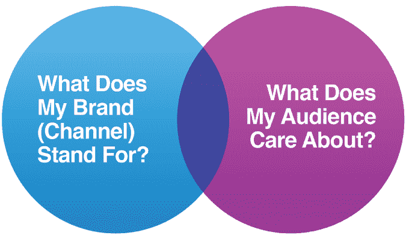

**图 11.1** **有价值的内容**

查德·怀尔德·克莱和维·奎恩特是两位擅长确定观众是谁以及他们会观看什么的创作者。他们过去制作恶搞视频，其中一个视频在 Pen Pineapple Apple Pen 现象的影响下迅速走红。结果，他们发现病毒视频并不一定对你有利。他们从视频的成功中获得了很多订阅者，但很快意识到订阅者通常并不等同于忠实观众。通过病毒视频建立观众和通过内容和个性建立观众之间存在巨大差异。你想要更稳定的观众群，你想要忠实于你的观众。病毒视频吸引的观众类型与那些忠实地关注定期内容和个性的观众不同。

查德和维做对了一件事，那就是阅读他们观众的评论，并根据观众的建议创作新内容。他们注意到，即使是他们制作质量较低的视频，在回应观众要求时也表现出色。但在分析数据时，他们也意识到他们的订阅转化率远低于其他频道，因此他们开始尝试不同类型的内容，看哪种效果最好。最终，他们意识到他们的观众越来越年轻，于是决定制作面向 6 到 12 岁儿童的内容。这一举措取得了成功。他们的频道迅速走红。这是因为他们不断努力了解自己的观众，并改变自己的内容以适应。在这里要重申的是，你必须从内心热爱创作，所以不要为了迎合观众而改变自己的内容，以至于放弃自己喜欢的事情！

## 找到甜蜜点

我最喜欢的一个找到自己观众的例子是德文·斯通。德文是一名律师，开始制作 YouTube 视频来帮助法学生准备 LSAT 考试并度过法学院。他在自己的频道*Legal Eagle*上找到了一批忠实的观众，但他希望自己的频道能够增长。德文联系了我，我和他进行了咨询，给了他一些建议和建议来扩大他的频道。我问德文在美国任何时候有多少法学生，他说大约十万人，所以我帮助他明白他已经达到了市场渗透的门槛，如果他想要超越这一点，他就必须扩大自己的影响力。

德文的观众已经达到了他所创作内容的极限，如果他想要获得更大的观众群，他就必须改变自己的内容，以吸引法学生以外的人群。我要求他重申自己为什么要制作视频，他说他只是想分享自己对法律的热情，帮助人们更好地理解法律。因此，随后的问题是：你如何帮助更多法学院之外的人理解法律？我们得出的答案是利用与法律相关的电视节目和电影，这是主流观众已经喜欢观看的，以“真实律师对……的反应”形式对其进行解构。他已经有了一个这种格式的视频，但他需要制作更多这样的系列视频。他还制作了一部原创的真实犯罪专题。他仍然在吸引原来的观众，但他找到了一种吸引流行文化观众的方式。*Legal Eagle*现在拥有一百多万订阅者和一亿次观看。德文找到了如何将自己的热情与观众结合起来，但真正的甜蜜点是当他加入第三个维度时：主流/流行文化。看看图 11.2 中的文氏图，你就会明白我的意思。

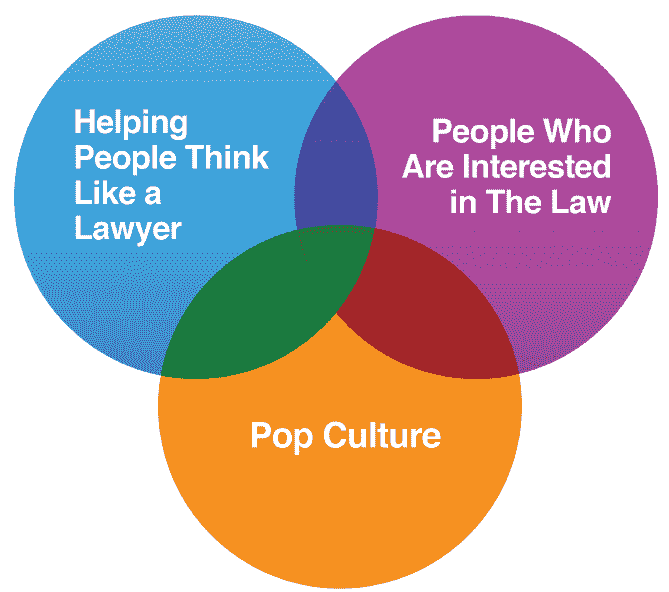

**图 11.2** **可扩展的有价值内容**

让我在这里停下，因为我知道你们很多人在想：“但我的内容是为所有人准备的。”不，不是。如果是的话，那就是你的问题。你必须先找到你的观众。认识你的利基市场的“爱”群体是谁，并从那里扩展到更广泛的观众。所谓的“爱”群体，我指的是你的忠实粉丝。这些是你的追随者。想想格莱特富德的粉丝；他们如此忠诚，甚至有自己的追随者名字，“死忠”。这些人会去每一场演唱会，即使是同一场演唱会，在每个城市，抽出时间离开工作、关系和爱好，只是为了追随这个乐队。当你找到你的在线追随者时，他们会消费你做的任何东西，只因为*你*做了。他们已经被你所转化。

马修·帕特里克，YouTube 上以“MatPat”而闻名，于 2020 年制作了一部视频，讨论了一些对试图在 YouTube 上谋生的创作者来说相当深刻的问题。MatPat 的频道*游戏理论家*显然是为游戏玩家准备的，所以为了让这个与众不同的视频在他的“追随者”中表现良好，他引入了无限手套的类比，以一种他们能理解并愿意继续观看的方式来解释问题。但你知道谁还熟悉复仇者联盟电影和无限手套吗？主流观众。MatPat 成功地制作了这个视频，既为他的忠实粉丝，也为更广泛的观众，并让他们继续观看，因为他们喜欢*他*，因为他使用了一些广泛相关的东西。## 并非所有频道都是平等的。

并不是所有频道在维恩模型中都起作用。你会看到不同的结果，这取决于你的频道类型；这就是为什么在扩展到主流之前，了解你的爱群体是如此重要。如果你有一个教育频道，你不应该照搬游戏频道的做法，然后纳闷为什么他们成功的策略在你尝试时没有奏效。内容对不同的观众产生不同的共鸣。喜欢观看游戏视频的人会对游戏内容有特定的观看行为，对比如烹饪教程的内容有特定的观看行为。反之亦然。

有很多不同类型的内容：如何做、最好的、视频日志、产品评论、烹饪、游戏、音乐、恶作剧、儿童教育等等。如果你的频道是视频日志，你的观众的行为模式会与如何做的观众不同。最终，人们会消费他们关心的内容，所以找出谁关心你特定类型的内容。

小心假设，这意味着食品观众在所有关于食品的内容上都是食品观众。你真的必须将其缩小到一个更广泛的类别，以了解你理想的观众。换句话说，想要找到并关注食谱的人并不希望你添加评论、个性和视觉创意；他们只想要食谱。而另一个频道可能非常适合那些想要娱乐并与制作食物的人联系的观众。你能看出有多具体吗？当你能够确定谁在观看，以及他们在哪里和他们喜欢什么时，你就赢得了。想想 Gordon Ramsay。看他内容的人不是为了食谱，他们是为了娱乐。食物只是他故事中的另一个角色；这不是你今晚要做的晚餐。## AI 也需要了解你的观众

当你能让 YouTube 算法了解你的观众是谁时，它们将努力找到其他观看模式相似的观众，以向他们推送你的内容。记住，YouTube 的第一目标是让观众在平台上停留更长时间，所以如果你调整你的内容以匹配特定的观众，YouTube 将帮助你的内容被那些可能想观看的观众看到。AI 会将相似的视频放在一起，以推荐给志同道合的观众，因为这样做有效。你越快地制作内容以适应一系列视频，它就越快地被推荐并被正确的观众发现。然而，为了在其中脱颖而出，使用策略来获得高观看时间和 AVD。我会在第十六章中告诉你如何做到这一点。

我真的相信在 YouTube 上你可能想做的任何事情都有受众。加拿大自称为“最咸”的创作者 Jackie NerdECrafter 在她停止试图按照传统方式做事并开始做自己时找到了她的观众。“我以为我必须试图变得漂亮，这样我才能吸引人，因为我太平凡了，”她说。“所以我开始化妆，但我对化妆品过敏，在视频中流眼泪。当我意识到即使涂了眼线我也会收到负面评论时，我就放弃了。”

Jackie 拥抱了她的真实性，展现了她的个性和她的错误，这时增长发生了。她将她的增长归因于做自己；事实上，她认为这就是为什么她的频道起飞，而其他在她之前的女性频道没有。她们试图变得完美；她是真实的。

Jackie 说：“当我在 YouTube 上发布了我的第一个视频时，它有 30 次观看。我想，‘天哪，30 次观看；太棒了！这 30 个人是谁？’”她真的在乎那些人是谁，她想在一个能够继续制作他们会观看和喜欢的内容的层面上了解他们。无论你有 30 个观众还是 30,000 个，这都应该是你的目标。问问自己他们是谁，他们可能想看什么。## 但是… *我* 如何了解我的观众？

这可能听起来很疯狂或不可能，但我喜欢在找到我的利基之前弄清楚我的观众是谁。找到正确的观众是多么重要。不要急于创作内容，因为如果你做得对，你的观众的行为会改变你的内容。这就是我们可以谈论整个先马车后马的类比的地方。人们经常快速创作内容，而没有完全了解他们在为谁创作，这是导致沮丧的一个很好的配方。我喜欢很好的食谱，但不喜欢这个。了解你为谁创作。你的内容将自然被消费和分享，不会导致沮丧，所以退一步，先了解你的观众。

### 角色分解

为了实现这一点，我在获得所需数据之前进行了一些有根据的猜测。我称之为角色分解。角色是你的观众，你的化身，你的目标受众。你希望尽可能了解这个人。这在一开始就做起来很棘手，但你可以做一些假设，直到有数据来帮助你。

**图 11.3** **角色分解**

看一下图 11.3 中显示的角色分解。如果你想了解你的观众，以便制作他们会观看的内容，你必须了解他们的人口统计学、心理学和行为学特征，无论是在线还是离线。我会进行两次这样的分解：一次是针对男性观众，一次是针对女性观众。

首先是人口统计学。在考虑其他任何事情之前，先考虑年龄和性别，然后考虑你的观众的收入范围、教育程度、地理位置、关系状态和子女状况。你不认为了解你的观众是 25 到 35 岁之间的单身男性占多数会有所帮助吗？如果他们是女孩？属于 Z 世代？中产阶级？我知道有些创作者认为他们在为十几岁的女孩制作内容，但当他们举办现场活动时，绝大多数参与者实际上是 8 到 9 岁。这个事实让他们感到惊讶，但他们改变了他们的内容，真正迎合了年轻观众，他们的频道表现出色。

在人口统计学之后，看看你的观众的心理统计学。人口统计学是关于一个人的外部特征或事实，而心理统计学是他们的内部特征。心理统计学分解了一个人的信仰、价值观、态度、动机、生活方式选择、恐惧和脆弱性。这是驱使他们的东西。这是他们的目标和愿望；这是他们热衷的事情。人口统计学是无聊的事实；心理统计学是有趣的地方，因为你可以找出你的观众到底是谁。他们不再是一个数字；他们是一个人。现在你可以在一个你以其他方式无法做到的层面上与他们联系。

看到数字背后的人的一个很好的例子是当名人与粉丝一对一联系。你看过那些视频。我最近的一个最喜欢的视频包括比莉·艾利什给一个 13 岁的白血病患者发送了一段个性化的视频。比莉不仅在生病的女孩心中巩固了一个终身的粉丝，也在像我这样的人心中深深触动。想想这个举动是如何影响比莉的“爱”团体以及他们对她的忠诚度的。

在查看人口统计学和心理统计学之后，你可能对你的观众有一个很好的猜测，但如果你不知道他们实际上做了什么，那一切都没有意义。你必须知道他们如何在现实世界和在线上过日常生活。YouTube 的算法无法像你一样考虑观众的心理统计学，但它真正擅长的是观察观众的在线行为。事实上，它看到了我们作为人类看不到的数据。即使有超过 20 亿活跃的登录观众，它仍然可以观察每个观众以了解他们的行为。具体来说，人工智能观察观众在点击视频时做了什么和没做什么。它观察观众搜索什么，点击什么，没点击什么，看了五秒钟就离开了，看了整个视频的时长，点击下一个视频等等。人工智能连接了观众之间的非结构化数据和相似之处。### 你的观众生活在微时刻

然而，你需要更多地了解你的观众每分钟的日常行为。这就是谷歌所说的“微时刻”。谷歌整理了一份关于人们如何与在线内容互动以及它如何影响他们现实生活的优秀指南。要点是，人们总是附近有他们的移动设备，他们一天要检查 150 次，而且大部分时间都是在这些时刻里度过的。这些时刻是由意图定义的：他们想知道某事，去某处，做某事，或者买某物。品牌需要迅速回答这些查询中的任何一个，因为将内容以有用的方式呈现给他们的机会只会持续一会儿。

以下是每种微时刻的一个快速例子：

+   **我想知道的时刻：** 你上网搜索一个随机的事实。这在日常对话中经常发生。有一个问题出现了，有人说，“谷歌一下。”于是你上网找到答案，然后离开。

+   **我想去的时刻：** 这里可能最常见的是类似“找到我附近的意大利餐厅”这样的搜索。你想去附近的某个地方找特定的东西。

+   **我想做的时刻：** 你需要更换车辆的空气滤清器，所以你在 YouTube 上搜索如何做。

+   购买时刻：今天早上你的烤面包机坏了，你需要立刻订购一个新的。你已经准备好购买。

想想你自己每天的手机习惯。你是拿出手机去搜索一些东西，然后悠闲地浏览整个网站两个小时，还是当你脑子里突然冒出一个想法时拿出手机，点击看起来最相关的第一个结果，然后在几秒钟内确定你是否会留在那个网站？当你找到你想要的东西时，你把手机放回去，继续你之前的任务。五分钟后，你拿出手机，给朋友发短信，检查社交通知，然后把手机放回去。十五分钟后，手机再次出现，告诉你最近的一家评价很好的墨西哥餐厅，然后放回口袋。在餐厅里，你打开手机拍了一张午餐的照片，发送或发布，然后把手机放回去。我们生活在微时刻中，无论是在线还是离线。

我们都生活在这个二元世界中，但我们的习惯不同。例如，计划去欧洲旅行时，有些人会提前几个月计划，研究最佳的旅游和餐厅，提前预订酒店和旅行团。其他人则会在看到便宜的机票时临时决定旅行，并在路上解决细节。我的女儿艾莉就是这样。她和我一起去柏林出差，我让她负责我们的住宿和活动安排。在我结束演讲后，我问她计划是什么，她当时就拿出手机，在一个改造后的地铁洗手间里找到了我们最喜欢的汉堡店。食物不是垃圾，而是美味的。她的在线行为决定了我们实时的活动和之后的去向。如果我妻子卡罗琳和我一起出差，她会在我们收拾行李前几个月就计划好旅行的细节。

人物分析深刻地适用于你创作内容的方式。了解你的头像的细节和习惯，这样你就可以给他们他们想要的东西。

让我们用一个假设的例子来进行人物分析。还记得我说过不能把所有“食物”观众都归为一类吗？ Gordon Ramsay 的观众不同于想要食谱的观众。所以假设我们想为食品观众制作内容，但我们想针对“美食家”。美食家是一个完全不同的群体，不同于想要食谱的人。谁符合美食家的模式？我这里只是做一些假设。从人口统计学上来说，我假设他们的年龄在 25 到 40 岁之间，女性居多，收入在 4 万到 12 万美元之间，大多数人生活在大城市，高中毕业后有一定的教育程度。在地理位置上，我假设他们中的很多人生活在 YouTube 观众前三名的州：加利福尼亚州、得克萨斯州，然后是纽约州。

接下来，我们将考虑这些观众的心理特征：他们不一定是厨师，但他们喜欢社交时享用美食。他们喜欢拍摄食物照片并发布到 Instagram。他们喜欢向朋友推荐好吃的地方。他们喜欢被娱乐，而不仅仅是被喂饱。他们通常是九点到五点的工薪阶层，这种活动或爱好给他们带来快乐。

在他们的在线消费方面，他们倾向于漂亮的缩略图和良好的娱乐。他们可能会订阅 Gordon Ramsay 和类似的频道。他们在 Netflix 上观看烹饪节目，比如《蛋糕老板》和《英国烘焙大赛》。他们喜欢“美食色情”。

他们的离线行为与千禧一代的习惯相似：他们可能会从非常稳定的工作中抽出时间去做他们想做的事情；他们可能会度长假；他们不太愿意早早结婚生子。

现在是黄金时刻：在线和离线行为之间的融合。他们会拍下他们的食物照片并在社交媒体上发布。他们在餐馆吃饭然后在 Yelp 上进行评论。他们喜欢找到隐藏的当地比萨店并在网上告诉朋友。当他们参加派对时，他们会谈论他们去过的地方，并根据这些对话做出未来的决定。他们更有主见。他们更有可能观看《蛋糕老板》来赞同或反对评委。

记住，我们只是在猜测。通过对你的主题或你认为适合你的观众的人进行一些谷歌搜索，你可以做出更加理性的猜测。你创建的内容越多，观察到的模式越多，你就会越擅长猜测。然后，随着我们获得更多数据，我们可以根据这些信息做出决定，因为数据不是一个猜测游戏。你将能够在视频分析和评论中看到所有的人口统计和在线行为。当你有了分析数据，你就可以去收集更多信息，并将其带到下一步，收集关于你观众在线行为的外部信息。你了解得越多，就能更好地迎合他们。

通过对我们的观众进行角色分析，我们大致定义了我们所假设的观众是谁。接下来，我们将进行研究，验证或驳斥我们刚刚做出的假设。在下一章中，我们将介绍如何通过侦察和研究来锁定你的观众。这是我总是很兴奋分享的极客乐趣部分；大多数创作者都不知道他们在内容策略中错过了什么，他们对他们发现的见解感到震惊。我向你保证，你将发现关于你的内容和你的观众的事情，这将改变你的策略，并帮助你创造更好的内容。你会学到制定计划有多重要——这是你成功的基础。

世界上有很多不同类型的人。他们是谁以及他们在线下和线上的行为取决于他们的成长环境、社会地位、生活方式、个性等等。当你以正确的方式制作视频时，它会吸引某些类型的人，然后这些人会以与具有相似特征和兴趣的其他观众相同的方式消费内容。YouTube 会找到与你志同道合的人，并向他们提供你的内容。

在 YouTube 上看待你的头像有两种方式：作为观看你的内容的人，以及作为分享你的内容或潜在购买某物的人。有人认为这是两种不同的人物，但我认为在确定你的观众是谁以及他们对你的内容的意图时，这是一个有价值的区分。

我的奶奶，愿上帝安息她的灵魂，是一个买家角色。当她去世时，我们不得不整理她在 QVC 上购买的成千上万美元的东西……却从未使用过。一则好的广告总是能让她拿起电话，准备好信用卡。不管好坏，我也是一样：当我看到一则广告向我展示某样东西如何在功能上改善我的生活，即使在之前我从未想过我“需要”那件物品，我也会立刻购买。我的地下室开始看起来很像 Eve 奶奶在 QVC 上购买的东西。

在接下来的章节中，我们将深入研究如何进行研究和制作优质内容，以便更容易找到你的观众，但首先，角色分析是了解你潜在观众的好方法。然后，当你基于观众的特征和行为做出数据驱动的决策时，魔法就会发生。我喜欢使用数据做决策，因为不再是猜测你的观众是谁以及他们在做什么：事实就在那里；数据不会说谎。你最终将能够自信地说：“这些就是我的人。”## 行动练习

创建你的观众人物分析。如果你有频道内容，请检查你的观众信息以完成这些任务。如果你没有内容，你仍然可以将其作为预期的人物分析，直到你有数据可供使用。做两次，一次是男性观众，一次是女性观众。

+   **任务 1：**列出你的观众人物的人口统计学：年龄或世代，性别，收入范围，教育，地理位置和关系状态。

+   **任务 2：**列出你的观众人物的心理特征：动机，价值观，态度，生活方式，恐惧和目标。

+   **任务 3：**列出你的观众人物的在线行为：消费的媒体类型，个人兴趣和娱乐消费的内容，以及他们订阅的频道。

+   **任务 4：**列出你的观众人物的线下行为：购买行为，习惯，爱好以及他们在线下的时间花在哪里。

获取伴随工作手册，并在[www.ytformulabook.com](http://www.ytformulabook.com)找到更多资源。

# 12 侦察和研究

每个企业都知道没有顾客就没有业务。你必须吸引人们进门。这被称为获取。为了获取顾客，需要花费大量金钱和时间进行营销。你也需要花一些时间来想出如何吸引人们进门。你可能没有把你的观众视为顾客或消费者，但你应该这样做。他们是你需要获取的消费者，以取得成功。我会告诉你如何找到你的人，更重要的是，如何留住你的人。你必须知道如何让他们不断回来，否则你会失去他们。我们的目标是尽可能地降低损失或“流失”率，同时不断提高增长率。每个好的企业都做得很好，你也应该这样做。

这将是书中最有趣的章节之一，因为我们将讨论如何战术性地找到你的观众。最有趣的部分是它是有效的。

在这本书的介绍中，我说一个拉屎的独角兽让我写了这本书。这不是半开玩笑的；我是真的。这是背后的故事：我去拜访我的朋友杰弗里·哈蒙，多年来我和他合作过许多项目。我们在专业上真的很互补。他告诉我他可能会参与的一个新项目，广告中会有一只拉屎的独角兽。独角兽吸引了我，但拉屎更吸引了我。这则广告是为一个叫 Squatty Potty 的公司做的，他们面临一个挑战。他们的目标客户是婴儿潮一代，而且他们已经达到了瓶颈。他们知道他们需要接触年轻的、注重健康的头像，并且他们联系了哈蒙兄弟的营销机构寻求帮助。

我告诉杰弗里我真的很想成为这个项目的一部分（谁不想呢？一只拉冰淇淋的独角兽？签我！），所以我们联手开始了创意。我们需要让排便不再让人感到恶心，并且我们必须说服 Squatty Potty 的所有者和他们的《鲨鱼池》投资者这会起作用。最初的计划是使用一个人工制造的大型独角兽来拉冰淇淋，因为它足够大，可以容纳一个冰淇淋机，但是杰弗里的兄弟兼商业伙伴丹尼尔·哈蒙提出了使用 CG 特效和一个小独角兽的想法。

我们需要知道在哪里找到世界上喜欢独角兽的人，并弄清他们在个人层面上是谁，这样我们就会知道如何在我们的信息和传递中与他们联系。每个营销活动的成功都取决于知道购买者是谁，但我想知道更多，不仅仅是谁会购买 Squatty Potty；我想知道什么样的人会在广告中看到独角兽而做出强烈反应。所以我上了 Reddit，这总是一个很好的去找到利基群体的地方，我在寻找喜欢小马宝莉的人，因为我们认为这将是一个会对独角兽做出反应的社区。

每个话题都有一个专门的 subreddit，你知道吗，我找到了一个 My Little Pony 粉丝的社区……他们是成年男性。他们甚至称自己为“Bronies”，并且有自己的 My Little Pony 迷因、术语和服装文化。我永远不会忘记那些服装。我对 Bronies 失去了三天的时间，因为我简直无法相信存在这样一个奇怪的亚文化，我一直深入其中。它让我着迷。我回到杰弗里、丹尼尔·哈蒙和戴夫·范斯，这个项目的首席作家，告诉他们我发现的事情。我们在头脑风暴和创作广告时一直记得 Bronies，因为我们想制作一些能与他们的亚文化产生共鸣的东西——我们希望他们喜欢到足以谈论并与他人分享。戴夫想出了神奇的世界和王子，并写了一个精彩、有趣的剧本。

对我来说，Brony 的发现时刻对我的工作来说是一个重要的时刻，因为它让我意识到找到你的化身是多么重要。灯泡亮了；对我来说，这是一个非常重要的时刻。重要的是要注意，Bronies 并不是我们的目标买家。他们是自然会对视频广告做出反应的焦点群体。他们会为这个广告创造一个反馈循环：他们会找到广告并观看到底，评论并分享。他们会制造轰动，以便那些会购买产品的观众看到广告。他们会启动这个活动，并让它发展壮大。

对于每 1 万次观看，我们知道会得到多少分享和多少人会标记他们的朋友，参与或购买。我负责针对不同的观众人设进行有机推广，这些人会观看、消费、分享和购买。杰弗里从长期获取和保留的角度来看待这个问题。他通过一个标准来衡量买家人设：谁刷了信用卡。在我们之间，我们把所有的基础都覆盖了。就像我说的，我们一起工作得很好。

当广告准备好发布时，我们知道我们有了一件大事。这是一个较长的视频，几乎有四分钟，比传统广告要长得多，但它是原创的，非常有趣。杰弗里和我进行了一次发布战略会议，我们想到了制作一个独角兽拉屎冰淇淋的 gif，并加上标题“世界将在[这个日期]改变”。我们怎么处理它？当然是泄露给 Bronies！我私下与 Brony 社区的一名成员分享了这个动画 gif。俗话说得好……你可以引导 Brony 去水边，但不能让它喝水？他们喝了。他们对这个 gif 非常狂热，当视频在那周晚些时候发布时，它登上了 Reddit 的首页。

在不到 24 小时内，我们的视频获得了超过 2000 万次观看，而且每个小时都在增加。杰弗里和我对此反应感到惊讶。最好的部分是，我们知道每花一美元，我们都会赚取一定的金额。我们通过在其有机分发之上对其进行广告投放来助长这一趋势。它在长时间内保持了销售额，这很棒，因为我们能够在路上进行分析和调整，而且它一直都在起作用。

在广告的第一年，它带来了 2800 万美元的可归因销售额，直到今天，多年后，每次广告播放时都会产生转化。仍然有人没有看过这则广告，尽管它已经几年了，但我们知道他们会购买，因为我们知道这个人设，所以我们可以精确地定位我们需要的人。每天都有新的买家进入市场，当合适的买家出现时，我们就获得了另一个客户。

我以前从未见过像这样的广告一样病毒式传播。甚至被*Boing Boing*称为“互联网历史上最伟大的病毒广告”。这就是我发现了理解基于找到适合内容的正确人的真正秘密。我们找到了会分享广告的正确观众，也找到了会购买产品的正确观众。这就是冰淇淋拉屎的独特魔力。

## 侦察

侦察意味着你处于发现模式。你需要发现自己的 Bronies，可以这么说。你的工作是确定你想要制作的内容类型。你想知道 YouTube 上是否已经有人在做类似的事情，如果是的话，每个频道代表什么，他们的观众关心什么。你想知道在这一领域谁是大创作者——谁有动力和势头。你想弄清楚目标观众是谁，以及他们的反应是什么。

所以让我们来谈谈*如何*：去 YouTube 上列出你感兴趣的领域中的 20 个不同频道。然后去第一个频道的视频，按最受欢迎排序。观看过去一年上传的最受欢迎的视频。然后去下一个频道做同样的事情。你需要把所有这些写下来。当你观看每个视频时，注意下一个推荐的视频是什么。你将能够看到 YouTube 上现在正在起作用的东西。一些频道可能有很多订阅者，但最近没有活动。确保你列出的频道有最近消费内容和/或评论的活跃观众。一些大频道很长时间没有发布视频，所以不要用这些频道进行你的侦察目的。当你按最受欢迎排序时，确保它们在前几个结果中有最新的内容。看看每个视频和频道的观众参与度。查看观众与订阅者的比例，以了解这一领域的市场规模大小。还记得第十一章中的 Devin Stone 吗，他的*Legal Eagle*频道教人们法律知识吗？在你进行侦察时，记住 Devin 是如何吸引比法学生更广泛的观众的。

你正在收集关于你想要创建的相似内容的足够数据。将相似的频道分组在一起有助于你看到模式。当你了解相似的频道以及他们的观众如何与他们的内容互动和回应时，你正在弄清楚你的观众可能是谁。

我不希望你现在就对这些频道进行深入研究。你的目的是收集尽可能多的信息，以便发现你的领域中有什么，以及那些观众会是谁。你将在后面的研究阶段分析所有这些信息。

在 YouTube 上列出清单后，也要在 YouTube 之外搜索这一领域。对你的内容类型感兴趣的人也对互联网上的其他事情感兴趣，你需要了解他们的行为和兴趣。Reddit 是一个很好的地方来找到社区。你会对你的观众感兴趣的事情感到惊讶，这些事情你甚至不知道存在。一旦你有了所有这些信息，你就准备做数据驱动的决策了。

优秀的创作者总是处于侦察模式，即使在取得巨大成功之后也是如此。你不会只进行一次侦察就结束了。关于你的观众，总是有更多的东西可以发现，你的分析数据将不断向你展示模式。当你认真观察你的数据时，你会发现隐藏的宝藏。始终以“为什么？”这个问题来看待数据。为什么你的内容成功或失败。为什么你的观众以他们的方式与你的内容互动。但要小心不要陷入其中：我见过创作者犯的一个大错误是花太多时间在侦察模式上。当你开始挖掘时（读：我对 Brony 世界的探索），很容易陷入兔子洞。获取你需要的信息，然后进入研究阶段。

## 研究

好的，现在你已经准备好深入分析你在侦察中收集到的东西了。回到你的 YouTube 频道列表，点击一个频道，然后再次按最受欢迎的视频排序。忘记频道上的旧视频；你想看看最近有什么效果。选择每个频道 6 到 10 个观看次数最多的视频，并记录标题、缩略图、视频观看次数、喜欢和不喜欢以及视频时长。注意创作者是否使用吸引观众的方法，节奏如何，以及他们的编辑方式。看看你在列表中的不同视频和频道之间看到了什么相似之处。记录视频中的重新吸引观众的地方，呼吁行动，视频描述和评论。

你在这里寻找模式：内容创作中的模式和观众行为中的模式。这种实践完全是关于观众对内容的反应和互动，以及看看你的领域中现在有什么效果。虽然本章的这一部分不长，但研究的过程需要时间。这可能会变得乏味，但不要跳过。如果你想看到模式，你就必须做这项工作。我保证这将是值得的；只要跟着我走。

## 终极独角兽：耶稣

侦察和研究在找到你的社区并将你的内容推向世界时可以提供完美的机会。

我和杰弗里·哈蒙目前正在一起工作的另一个项目完全与拉屎的独角兽背道而驰；那就是耶稣。我对这个项目的热情超过了我以往做过的任何其他项目，而我做过*很多*项目。我们想要创作一部关于耶稣基督生平的电视系列，吸引福音派社区，并具有 HBO 级别的专业素质。杰弗里介绍给我一个名叫达拉斯·詹金斯的创作者，后来他成为了我的合作伙伴，也是关于耶稣基督的系列作品《被选中的人》的编剧和导演。瑞奇·雷·巴特勒、马修·法拉奇和厄尔·西尔斯也加入为所有者。杰弗里不会成为所有者，但他将通过他的 VidAngel 公司来分发这个产品。

在这样一个大型项目中，我们会进行多天的营销封锁会议，但在此之前，我们会进行几次头脑风暴会议，以便更好地了解谁是正确的观众人物：谁会对此充满热情，谁会支持这个项目。我以为这会很容易，因为他们会是和我们一样的人。达拉斯知道我们可以传达这个信息，但对于我们能否让人们投资持怀疑态度。我们必须通过众筹来满足我们项目的需求，他说如果我们能筹集到 800 美元，他会感到印象深刻。

马修曾参与过几个大型的福音项目，对这个领域很了解。达拉斯在这个领域也有很多经验。但从来没有人制作过 HBO 级别的基督教作品。德克萨斯州是在线视频消费的最大群体之一，所以我们把目标锁定在了德克萨斯州和其他南方基督教地区。在我们收集的侦察和研究数据中，我们意识到 X 世代和千禧一代的女性是网上最大的消费者，所以我们的目标买家人设是 25 至 45 岁的女性。我们的目标是社区、学校和教堂的志愿者，热爱耶稣的人。

对于我们的封锁营销会议，我们租了一间 Airbnb，订了食物，然后开始认真对待。我们把焦点放在了我们的受众身上。我们定义了从现在到最终目标的路径。我们必须弄清楚如何筹集资金，以及如何找到那些与我们的内容产生共鸣并将其推广给世界的人群。

我们有种子资金，打算通过众筹来满足这个项目的需求。当时，《神秘科学剧场 3000》和《维罗尼卡·玛斯》是最成功的众筹项目，拥有忠实的狂热粉丝。因此，我们制定了一个目标，要超过这些项目，成为电影和电视史上第一的众筹项目。目标是 1000 万美元。我们知道我们想要与特定的人设（25 至 45 岁的女性，已婚或未婚，信徒，志愿者）产生共鸣。然后我们问，这些人在网上聚集在哪里？答案不是 YouTube。我们确定 Facebook 和 Instagram 是我们可以找到他们的地方。我们围绕这一特定受众开发了我们的信息传递和内容策略，并主要在 Facebook 上针对他们，因为这是最容易与志同道合的人分享我们的内容和宣传活动的平台。

我们推出了讲述耶稣诞生故事的试播集，并在合适的时间推送给了合适的人群：就在圣诞节前。第一集命中了 Venn 图的甜蜜点（来自第十一章），因为它及时、有话题性，并且可以触达我们理想的观众，同时也能触达更广泛的流行文化观众。

我们用一部关于耶稣的节目打破了有史以来的众筹记录。你甚至可以说这就像是从天上降下的吗哪，如果你是圣经类型的人。我们一些最大的捐助者说他们捐钱是因为有人推荐给他们——那个人通常是符合我们目标人设的人（我们的买家策略奏效了！）。在短短几周内，我们就能够获得数以万计的 Facebook 粉丝。

我知道，为了让我们有机会大规模增长，我们需要在其他平台上培养我们的受众。我花了两年的时间说服达拉斯完全接受成为我们项目的“影响者”面孔，那时一切都改变了。人们认同他和他的激情、个性和真诚。当我们在《被选者》的 YouTube 频道上直播时，达拉斯开始与我们的化身交谈，YouTube 找到了与之匹配的观众，并向他们推荐我们的内容。我们在 14 天内获得了 146,886 名订阅者。是的，14 天，确切的数字。每一个都对我们很重要。

在本章的两个示例中，人口统计和内容方面都无法更为对立，我实际上很喜欢这一点，因为它证明了这种方法是行得通的，无论你的内容是什么，你的受众是谁。与目标受众交流，然后扩大范围，让你的内容触达更多人群。接下来的章节将向你展示如何真正利用这一点。

这里的要点是，你对你的观众了解和关联得越多，为他们创造内容，YouTube 就会越能连接这些点，给他们他们喜欢的口味的冰淇淋，可以说。也许是独角兽屎味的，也许是耶稣味的。我们的侦察和研究使我们能够形成一个热爱并传播我们的信息和内容的人群。当你做足够的侦察和研究时，就会发生这种情况；这就是回报。这就是你在这本书中做的一切的原因。

这里有一个警告：这不是一步到位的过程。你不是在一开始就进行侦察和研究，然后把它从你的待办清单上划掉。你必须不断地回头看你的数据并重新评估。数据越多，你就会看到越多的模式，你就能更好地根据需要调整你的策略，做出更好的关于你的内容的决策。

## 行动练习

执行侦察步骤，更好地找到你的观众，并了解他们在 YouTube 上消费的内容：

+   **任务 1：**研究至少 10 位在你的领域成功的创作者。

+   **任务 2：**注意他们有什么共同之处。观看他们最成功的视频，并注意视频创作和编辑模式。

+   **任务 3：**看看他们是否以及如何与他们的社区互动，无论是在视频评论中还是在社区选项卡上。阅读他们最受欢迎的视频的评论。

获取配套工作手册，并在[www.ytformulabook.com](http://www.ytformulabook.com)找到更多资源。

# 13 内容为王

1980 年 5 月 26 日。

那个日期将永远铭记在我的脑海中，因为那天有些事情改变了我，自那以后我就再也不一样了。

这一章是关于改变人们的时刻。这是我工作中最热衷的事情——弄清楚我们的信息或“内容”如何对他人产生最大的影响。一些最伟大的修辞专家，从亚里士多德到希特勒再到甘地，都通过他们的信息改变了世界，无论是好是坏。我们在生活的方方面面的每一次互动都归结为传递信息。信息传递是我们 YouTube 战略的重要组成部分。它帮助我们让人们做我们想让他们做的事情，并实现我们的成功目标。

1980 年 5 月 26 日，我六岁。我的两个叔叔去看了一部几天前上映的新电影，他们非常喜欢，以至于他们需要一个理由再次花钱去看。所以他们问能否带他们的侄子达瑞尔去。多么好的主意！我们到了电影院，找到了座位，片头开始了标志性的星球大战字幕。这是《帝国反击战》——原始星球大战三部曲的第二部电影。现在，我不是轻易说这句话，但《帝国反击战》是有史以来人类存在的最好的电影。这是内容的最佳体现……即使在六岁时我也知道。摄影和故事对我来说就像魔法。但电影中有一个史诗般的时刻，你们现在都知道，就是达斯·维达揭示他是卢克·天行者的父亲（哦，顺便说一句，卢克的手也被砍掉了）。在拍摄时，只有少数人甚至知道这个场景会出现在剧本中：马克·哈米尔（卢克·天行者）、詹姆斯·厄尔·琼斯（达斯·维达的配音）、电影创作者乔治·卢卡斯和导演欧文·科尔什纳。哈米尔说他甚至直到拍摄这个场景之前都不知道剧情转折，科尔什纳威胁他说“我们会知道是你”如果剧情泄露了。

这个震撼的场景深深印在我的脑海中。这一刻改变了我的生活。我变得痴迷于一切与星球大战有关的东西（甚至是令人尴尬的内容，比如卢克和莱娅的激情之吻，以及《星球大战节日特辑》），包括所有的电影、海报和其他纪念品。我渴望拥有所有这些收藏品，但一个有着九个兄弟姐妹的穷孩子买不起。我的父母买了《帝国反击战》的 VHS，从那时起我已经看了 16482 次这部电影（尽管不再是 VHS）。（对于孩子们来说：VHS 是插入录像机并播放电影的，就像 DVD 插入 DVD 播放机一样。如果你不知道 DVD 播放机是什么……我也没办法帮你。）## 有影响力的广告

快进几年。1984 年，我正在看电视，一则 Wendy's 汉堡广告播出。我已经是一个广告迷，即使在 10 岁时，但这则广告让我印象深刻。有三位老太太在看一个大面包，谈论它有多大，当她们打开面包时，里面只有一个小汉堡肉饼。其中一位老太太说了经典的广告词，“牛肉在哪里？！”我笑个不停。这是很棒的营销！我告诉我的兄弟、父母和所有我认识的人这则广告对我的影响；它是如此有趣和与众不同。当然，那时我们没有 DVR 或互联网，所以我等在电视机旁，手指按着录像机的录制按钮，这样我就可以向大家展示我在说什么。这是 80 年代的分享按钮或在帖子上标记某人的方式。

那一年晚些时候，Dunkin' Donuts 的广告“该做甜甜圈了”对我产生了类似的影响。在广告中，面包师弗雷德一边进出门，一边说着口号“该做甜甜圈了”，最后，在广告结束时，他在同一时间进出门，让自己措手不及。时间仿佛折叠在一起，他看到了两个自己。我笑了。多么奇妙的惊喜！那时候，我被这样的广告所吸引。我想知道它们为什么有效。我想学习如何创造同样出色和有效的内容，传达信息和影响力。

1987 年，公益广告成了我少年时期的痴迷。它们以一种独特的、前所未有的方式，产生了如此强烈和震撼的效果。像“这就是吸毒的结果”和“没想到吧？”这样的广告具有震撼效果。在第一个广告中，一个人拿着一个鸡蛋说，“这是你的大脑。”然后他拿出一个热的煎锅说，“这是毒品。”然后他把鸡蛋壳打开在煎锅上，说，“这就是吸毒的结果……有问题吗？”观众看着鸡蛋被煎熟，我被这个信息在如此简短的视频中产生的力量震撼了。这则广告不到 30 秒，我永远不会忘记。当然，当这则广告播出时，YouTube 还不存在，但今天在 YouTube 上重播时，我发现了评论，比如“这就是我做数学时的大脑。不是吸毒……是数学。”

美国交通部的“没想到吧？”公益广告也产生了类似的震撼效果。在一个视频中，它开始像是在宣传一辆面包车，列举所有的规格和卖点，同时一个家庭在儿子足球比赛后上车。突然，另一辆车撞上了面包车的侧面，儿子坐的位置。屏幕变黑，显示“没想到吧？没人会想到。系好安全带……”这是非常有力的广告，信息传达得清晰明了。

我还开始在 20 世纪 80 年代和 90 年代观看《周六夜现场》（*SNL*）的小品，它们对我来说是如此有趣和令人难忘。我用 VHS 磁带录制了这些小品，这样我就可以反复观看并与家人和朋友分享。有一次，当我需要录制一台节目时，我不小心拿起了一盘放在电视旁边的 VHS，上面录着我哥哥乔的学校项目。那是一个可爱的视频，乔在视频中演示了如何挤奶……直到我把它录制了。什么内容如此重要，以至于值得牺牲珍贵的家庭记忆？那是一个名为“Colon Blow”的小品，一个纤维谷物的恶搞，最后警告说“可能导致腹部膨胀”。我的家人永远不会让我忘记这件事。其他喜欢的小品包括“爱情马桶”，一个给亲密无间的恋人的组合马桶，“哎呀！我拉了裤子：老年人的内衣”，这就不用多说了。回想起来，我喜欢把这些广告看作是我在 Squatty Potty 的冰淇淋拉屎独角兽广告上的前奏。我能说什么，我对厕所幽默的偏好很深。

当然，每年 2 月都会迎来备受期待的广告盛会——超级碗。我和任何足球迷一样，都急切地期待着超级碗的广告。我录制了比赛期间的每一个商业广告。1984 年，雷德利·斯科特的苹果广告在第十八届超级碗的第三节向世界介绍了麦金塔电脑。1949 年，小说家乔治·奥威尔写了《1984》，这本书描绘了一个在腐败政府控制下的反乌托邦社会。由于现在是 1984 年，斯科特创作了自己的版本——一则大胆宣称其产品将解放人民的广告。广告中一个运动员女性向一个巨大的电视屏幕奔跑，电视屏幕正在向一群被洗脑的人播放信息。她手里拿着一把大锤，她朝着巨大的屏幕砸去，就在当局追赶她之前粉碎了它。然后广告上显示：“1 月 24 日，苹果电脑将发布麦金塔。你会明白为什么 1984 年不会像《1984》一样。”这是如此自信的宣称，如此精彩的信息传递。（有趣的事实：《1984》作者乔治·奥威尔的遗产和小说的电视版权持有者给苹果和他们的广告公司发了一封停止侵权的信，声称侵犯版权。这则广告在全国只播放了一次，但赢得了奖项，并被誉为十年来的电视广告。）

我想找出像这样的史诗广告中的元素，这样我就可以制作自己的广告。我想成为那个想出超级碗广告点子的人，人们在之后谈论的那个人。我真的和我的家人和朋友们做了调查，看看哪些广告是他们最喜欢的，为什么。最终，我上了市场营销和广告的学校，这对任何人来说都不是意外。

就像这些广告和《周六夜现场》的小品一样，所有好的视频都遵循一个模式：它们用一个吸引人的开头吸引你的注意力，用重新吸引策略保持你的注意力，并在最后留下一个回报或意外的惊喜，就像《帝国反击战》中伟大的达斯·维达揭示一样。在我年轻的时候进行广告调查的日子里，每次调查的结果都反映出，那些遵循特定叙述模式以保持观众参与并在最后留下令人难忘的回报的视频是明显的赢家。## 到底什么是内容？

短语“内容为王”以前已经被使用过，但这是强调这个说法有多么正确的最好方式。从我六岁开始的职业生涯可以看出，内容可以改变人们的生活。它的信息激励、教育、震惊，并且从根本上改变人们。当我们在 YouTube 上谈论“内容”时，人们最大的错误之一是认为“内容”等同于“视频”。视频确实是其中的一部分，但内容还包括标题、缩略图和其他元数据。当然，你的视频应该做得好，但你必须同样重视甚至更多地关注视频的标题和缩略图，因为它们是观众决定是否点击观看的关键因素。你将在第十五章中学习如何制作好的标题和缩略图。

当你让他们点击后，你就可以做有趣的事情：制作视频！不对，是制作好的视频。你必须知道什么样的视频才算是好的视频。这是简单的循环逻辑，但它有效。就像克里斯·法利在经典的《周六夜现场》中说的那样，“当你住在河边的货车里时，你就有足够的时间住在河边的货车里。”我们听到你了，法利。当你知道如何制作好的视频时，你就会制作好的视频。## 叙述模式：叙事

所有好的内容都有好的叙事元素。人们会记得一个好故事，即使是几十年前听过的。在好的叙事和好的内容中，叙述都遵循相同的模式，无论你是在制作关于食物、旅行、教育还是恶作剧的视频。它适用于孩子、千禧一代和婴儿潮一代。这就是故事弧，我最好的方式是参考电视上最成功系列之一《宋飞》的一集来为你解释。这一集的标题是“咖啡馆”，于 1991 年播出。图 13.1 显示了故事弧的概述。

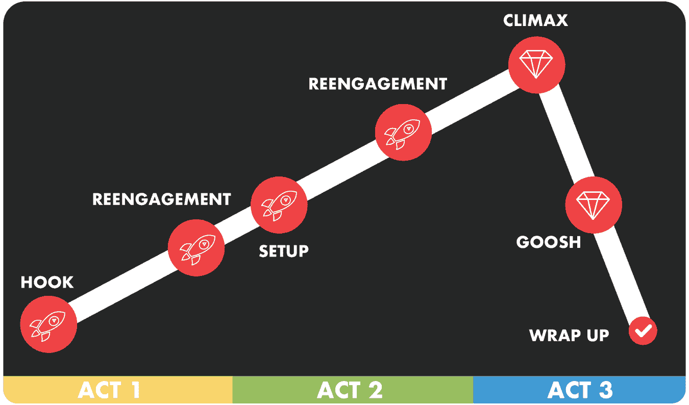

**图 13.1** **故事弧**

### 钩

喜剧演员杰瑞·塞菲尔德是一位出色的讲故事者，尽管他的节目通常被称为“关于无聊的节目”。九季中的大多数集都以杰瑞在舞台上进行独白式的单口相声表演开始，他讲笑话预示了接下来的故事情节。它的目的是在一开始就吸引观众，并介绍这一集的主题。在“咖啡馆”独白中，杰瑞说每个社区或城镇都有一家店总是换手：“它先是皮具店，然后是瑜伽店，然后是宠物店。”他开玩笑说这就像百慕大三角——没有人能在那里经营成功的生意。这个独白就是“钩”，也就是我们故事弧中的第一个元素。这个钩引起了观众的好奇心，让他们想知道这一集或视频会讲什么。### 重新吸引

接下来，杰瑞转向重新吸引的元素。这一集已经开始了，杰瑞对乔治说：“自从那家餐厅开业以来，我还没见过一个人进去。可怜的家伙。”他和乔治有一些来回对话。乔治抱怨好人遭到不公正的待遇，而杰瑞则推测餐厅老板可能有家人在巴基斯坦等着他寄钱。乔治在这一场景中编织了这一集的两个新故事情节：好人的困境，以及女朋友想让他喷古龙水并参加智商测试。他们在这一场景中做了很好的铺垫，为进一步讨论和笑话铺设了这些话题。

杰瑞擅长重新吸引他的观众，所以他不会失去观众。在这一集中，他在公寓里用望远镜看着店主。他鼓励路人进入餐馆，因为他为店主巴布感到难过。他在整集中展现了“好人”形象。伊莲娜（杰瑞在节目中的另一个朋友）问杰瑞是否进了餐馆，杰瑞说他没有，因为他害怕自己会因为太好而最终与这个人合作。然后乔治拿着 SAT 学习指南走进来，伊莲娜嗅了嗅他，乔治恼火地回答说，“我喷了些古龙水，行了吧？！”

### 铺垫

故事情节的第三个元素叫做铺垫。这是视频中你为即将到来的高潮做准备的部分，也是与观众重新接触的一个点。在杰瑞的铺垫中，他最终进入餐馆支持巴布。他认为自己是一个好人，因为他是顾客，甚至给店主一些建议，将他的多元文化、折衷的美食餐馆改成专门的巴基斯坦餐馆。杰瑞对即将到来的事情感到兴奋，因为他认为他的“好人”想法将是巴布即将成功的原因。这是一个很好的铺垫。在这一点上要小心，不要直接进入高潮，因为你必须继续挑逗观众。这是杰瑞通过回到他的望远镜并为自己帮助巴布而重新激发期待的地方。作为观众，我们看到巴布已经关闭进行装修，我们想知道杰瑞的建议是否会在即将到来的高潮中得到验证。

### 高潮

现在杰瑞准备向我们展示故事情节的高潮，因为他已经在几个场合为此做好了铺垫。他在巴布重新开业的巴基斯坦餐馆里。巴布显然对杰瑞很生气，因为他听了他的建议，花了时间和金钱进行装修，但没有效果。餐馆空无一人。杰瑞的“好人”自负激怒了巴布，高潮是巴布怒气冲冲地冲出房间，对着杰瑞喊道，“你是个坏人！你是个非常非常坏的人！”杰瑞惊讶地坐着，他的好人形象被击垮了。餐馆因此关闭。

### Goosh

故事已经结束了，但如果你想留住那些观众，不要认为一切已经结束了。真正优秀的内容有一个叫做“goosh”的奖励元素。我从马特·米斯那里学到了 goosh，他是 BYUtv 喜剧节目*Studio C*的联合创始人和首席编剧。这就像樱桃一样，*Studio C*做得非常出色。在*Seinfeld*的一集中，杰瑞和他的朋友们在餐馆前的人行道上交谈。伊莲娜透露了她的智商得分，让乔治感到难过，然后杰瑞问大家想吃什么。杰瑞建议墨西哥菜，乔治想要意大利菜，伊莲娜想要中餐——一种折衷的美食。然后杰瑞说，“你知道什么会很棒……”把一切都带回到了杰瑞开口之前就在那里的原始餐馆。乔治和伊莲娜瞪着他，观众得到了最后的笑声。这就是你隐藏你的宝藏的地方；这是你能提供的最大价值，甚至超过了观众来看的内容。如果你一直如此，你的观众会期待这样，这将保持你的留存率，因为你的观众不会离开，因为他们知道如果他们看到视频的最后，还有一些东西是为他们准备的。

漫威电影宇宙的电影以其惊喜结局而闻名。当任何一部漫威电影结束并出现字幕时，没有人会离开影院。为什么？因为每个人都知道字幕结束后会有一个额外的场景。漫威的额外场景解决了电影中的情节，提供了喜剧效果，或者暗示了未来的漫威电影。无论其目的是什么，观众都喜欢它，他们离开影院时心中留下了那个惊喜时刻，他们可能会告诉朋友。如果你想制作一个真正优秀的视频，你必须要有惊喜。### 结语

在视频结束之前，还有最后一件事要结束故事情节：总结。在《宋飞传》中，几乎每一集都是以杰瑞总结他在剧集开始时向观众介绍的原始笑话而结束的。在这个例子中，杰瑞谈论了超级英雄，最终的好人，他们隐藏自己的身份，以免人们因为他们拯救世界时发生的附带损失而批评他们。他在为自己的“善举”辩护，尽管最终并没有给任何人带来好处。这是一个有趣的方式，在最后几秒钟内结束故事，吸引观众的注意力。

如果你看过《宋飞传》，你基本上就看过了所有的剧集。它们按照可预测的叙述模式组合在一起，因为这样做很有效。每个故事情节都吸引观众，并在整个过程中重新吸引他们，编织多条情节线，最终汇聚在一起。有一个清晰的铺垫，一个不可预测的高潮，以及额外内容或隐藏宝石的惊喜。这种模式适用于任何类型的视频，如果你遵循这种模式，你就为自己创造了一些非常棒的内容。## 使你的内容脱颖而出

我希望这一章能让你对 YouTube 有全新的认识。当你观看视频时，你会训练自己分析每一个元素，寻找叙述模式。你会学会故事叙述的重要性，以及如何与观众建立情感联系。但我也希望你能认识到视频中的所有细节。这些细节可以帮助你创作真正引人注目的内容，比如摄像机角度和移动、时间流逝和变焦、模式中断、音乐、反应和编辑技巧。让我和你分享一个真正懂得如何使内容引人注目的创作者的例子。

我曾与 YouTuber MrBeast 合作过很多 YouTube 视频和其他项目，我可以告诉你，他的成功并非偶然。他对内容中的每一个细节都非常深思熟虑和有条理。他计划视频的所有元素，包括标题、缩略图、故事情节、摄像工作，以及制作新视频时创作者可能考虑到的其他一切细节。MrBeast 创建了多个标题和缩略图组合，并为每个视频的不同场景拍摄了多个选项。他的故事情节清晰，吸引人，重新吸引观众的能力超强。他进行变焦、平移，并从不同角度拍摄。他在编辑时始终考虑重新吸引观众，进行快速剪辑和快速节奏，因为他知道这对他的观众有效。

他也保持故事情节简单。这种内容创作技巧被大多数 YouTube 创作者高度忽视和低估，但这正是伟大创作者与大众的区别所在。如果 MrBeast 无法用一句话解释一个视频概念，他就会认为它太复杂，然后放弃。其中一些视频可能会让他赚很多钱，但如果不通过一句话测试，他就不会使用它。他会把这些被拒绝的视频制作成一个他展示自己反应的合集视频。这样就不会浪费时间、金钱和内容。

MrBeast 知道如何制作引人注目的内容。 举例来说：他拍摄了一个名为“我开了一家免费汽车经销商”的视频（注意标题少于 50 个字符，易于记忆，简单解释），他说的第一件事是：“我买下了汽车经销商的每一辆车。” 这句话以粗体字显示在黑屏上。 我们已经完全知道这个视频将会讲什么：MrBeast 买了一堆车，他将把它们送出去。 简单的概念，精湛的执行。 MrBeast 接着展示了自己购买汽车的过程，在现实生活中花了一段时间，但视频时间只有大约五秒。 在这个开场片段中，摄像机角度多次切换，有一个快速的时间流逝，以及包括面部表情在内的喜剧效果。 内容已经引人注目。 然后，MrBeast 走过停车场，清点了他新购买的车辆，并将挡风玻璃的定价改为荒谬的低数字。 吸引人。 这一切发生在 45 秒内。

这个视频将近 17 分钟长，如果你在 YouTube 上找到它，你会想从头到尾观看。 MrBeast 是一位重新吸引观众的策略大师——他使用喜剧和情感缓解、摄像和编辑技术来保留他的观众，并最大化他的叙述模式。 MrBeast 的保留时间控制得恰到好处。 他列出了第一辆车的售价为三美元，但当买家坐下来签署“文件”（这是一叠填字游戏和单词搜索），他说：“我们进行了 33%的折扣销售，所以现在是两美元。” 与此同时，他一直在使用变焦、快速剪辑、音效和屏幕上的文字来不断重新吸引观众。

这里有一个重要的观点：这个视频似乎之所以有效，是因为它引起了轰动——MrBeast 购买了 12 辆汽车，并记录了他的愚蠢行为来把它们全部送出去——但在这种轰动和愚蠢之外发生了一些事情。 我们看到了收到免费汽车的人们的幸福和感激之情，我们也看到了 MrBeast 对帮助他人感到非常高兴。 这是真实的，MrBeast 原来是一个真正善良的人。 当你的观众在情感上产生共鸣时，你就讲了一个好故事。

在汽车赠送视频结束时，你会发现自己微笑、笑了，甚至可能哭了，所以当 MrBeast 发出购买他的商品以便继续在世界上传播善行的号召时，你真的会想点击。 无论你是点击商品按钮还是下一个 MrBeast 视频，他都抓住了你。 他精湛的叙事和内容创作策略奏效了。

如果你拿起笔和纸，带着内容创作技巧的心态来狂看 MrBeast 的频道，你会得到一个非常长的流行实践清单。 你可以用任何优秀的内容创作者来做到这一点；他们都精心而慷慨地使用这些技巧，有充分的理由：它们有效。 问问自己你已经使用了哪些元素，以及你是否能更好地使用它们。 然后注意一下你没有使用但需要在未来的内容创作中实施的元素。  ## 销售内容

你们中有些人可能会想：“但我不是用 YouTube 来扩大观众群体；我是用 YouTube 来销售。” 无论你是制作视频来建立观众群体，还是制作广告来销售产品，公式都是一样的。 尽管当你希望你的观众购买某样东西时，你要以解决问题的公式来制作内容。 你必须解释一个你的观众能够产生共鸣的问题，当你提供解决方案时，你要以可信度来支持它。 最初的直销大师是电视购物节的人，Ron Popeil，他创造了人们至今仍在引用的短语“但等等，还有更多！” Ron 遵循了制作优质内容的公式，通过故事将其组合在一起，即使他的最终目标是让人们拿起电话购买产品。 他用一个快速的引子和很多人能够产生共鸣的问题来吸引观众。

在 20 世纪 50 年代初，Ron 为他的食品切碎机 Chop-O-Matic 拍摄了史上第一部黄金时段广告。他从一个视觉吸引开始，展示了“有史以来最伟大的厨房器具”的便利和速度（口头上也有吸引）。他继续告诉大家，Chop-O-Matic 将使他们的蛋糕烘焙、糖果制作和冰淇淋圣代制作变得更加容易。这些特定的食物制作任务并不是随意挑出来的。Ron 曾在产品演示中询问人群，哪些厨房任务最麻烦，大多数答案都归结为为了这三个原因切碎坚果。所以他首先解决了最大的问题。随着视频的进行，他继续使用问题-解决方案策略，展示了从芹菜到冰的任何东西都能迅速、轻松地切碎。他声称这个切碎机的最大特点是它可以快速切碎洋葱，从而保护你的手和眼睛。不再流泪！

Ron 在广告中不仅吸引了女性，也吸引了男性，先打动了他的头号顾客（妻子和母亲），然后是备用人群（男性）。视觉销售本身就很有效，再加上无懈可击的脚本、折扣价格和额外的食谱书，Chop-O-Matic 成为了一次绝佳的营销活动。它赚取了数百万美元，并开启了 Ron 极其成功的职业生涯。他的内容，就像所有优质内容一样，吸引了注意力，简单解释，达到高潮，并在最后有回报。为了促成销售，他提出了一个问题，提供了解决方案，并一次又一次地证明了自己的可信度。

## 它适用于各个领域

你可能会想知道所有这些内容元素是否真的可以适应任何情景。毕竟，*Seinfeld*的一集持续 20 多分钟，而 MrBeast 的视频几乎有 17 分钟。你怎么能把所有这些元素放进一个更短、更专注的演示中呢？让我们回到温迪的广告，它只有 30 秒长，但仍然具有所有优质内容的元素：

+   **吸引**: 三位可爱的老太太在快餐柜台前。柜台上有一个大汉堡。在她们身后，沉闷的餐桌看起来非常像沉闷的办公隔间。这种对比是如此引人入胜，立刻吸引了你的注意。

+   **重新吸引**: 女士们看着柜台上的汉堡包，开始评论面包有多大多蓬松。

+   **设置**: 广告进行到第十秒时，一位女士拿掉了顶部的面包，里面露出一个小小的汉堡肉饼。另一位女士说：“牛肉在哪里？！”

+   **高潮**: 广告进行到第十五秒时，画面切换到一个厚实汉堡的特写镜头，配音告诉你温迪的“谦虚地”称这个汉堡为单人份，它比汉堡王的美国大麦更有牛肉。

+   **幽默**: 在 25 秒的时候，一位女士举起巨大的面包放在耳边，听着它，就像是一个空的贝壳，她试图听到一个不存在的海洋。与此同时，另一位女士说着关于明显缺少的餐厅员工，“我觉得那里没人。”这是一个很有力的喜剧组合，同时也强调大多数汉堡店并不在乎你是否想要更好的汉堡。

+   **总结**: 在结束的几秒钟里，播音员说：“你想要更好的东西。你是温迪的人。”公司想要帮助你和可爱的老太太们，同时让你发笑。这不会让你感觉很好吗？

简单的故事情节可以用一句话解释：温迪给你更多的牛肉。

## 留下持久的印象

制作出优秀内容背后有一个模式，无论是上世纪 80 年代的 30 秒广告，17 分钟的汽车大甩卖，还是一集“无主题的节目”。最伟大的内容创作者是擅长讲故事的大师，他们知道如何对观众产生持久的影响。他们通过遵循模式和实施策略来吸引、重新吸引、玩弄情感、兑现承诺、带来意外的惊喜和回报，并在离开之前提供额外的内容。如果他们真的很棒，他们会让你渴望更多，并且想要分享。这些核心原则是普遍适用的，无论长度、目标受众和目的是什么。## 行动练习

+   **任务 1：**回到你在第十二章行动练习中列出的清单。使用图 13.1 来分析视频，看它们是否使用了故事情节。识别吸引人的地方、重新吸引、设置、高潮和结束。

+   **任务 2：**使用故事情节创建你的下一个视频。

获取配套工作手册，并在[www.ytformulabook.com](http://www.ytformulabook.com)找到更多资源。

# 14 反馈是女王

内容可能是王，但反馈是女王。你的王国可能只靠其中一个或另一个勉强维持下去，但你需要两者都在王位上，你的帝国才能茁壮成长。你知道如何制作优质内容。现在你需要学会如何释放反馈的力量来真正成长。

我们需要定义反馈，因为它涉及到你的 YouTube 频道。大多数人听到反馈这个词时，可能会想到人类的输入。你会从你的伴侣、老板、妈妈、朋友和朋友的妈妈那里得到积极和消极的反馈。你确实应该从人类那里得到关于你内容的反馈，但我也在谈论来自 YouTube 的数据反馈。让我们一起来谈谈这两种反馈。## 人类反馈

首先，人类反馈。当涉及到你的 YouTube 频道时，你实际上不应该向你的妈妈或朋友寻求反馈。如果你的妈妈像我妈妈一样，她会告诉你你的视频很棒，即使它是上传到互联网上最糟糕的视频。或者也许你的妈妈是那种对你做的每件事都挑剔的人，即使你的视频是互联网上发生的最好的事情，她也会挑剔。无论哪种情况，她都不是询问的正确人选。为什么？因为她不是你的观众。

这就是为什么你不应该开一个新的 YouTube 频道，然后缠着每个 Facebook 朋友和 Instagram 粉丝去观看你的新视频。这不是获得正确的订阅者和观众的方法。他们的观看行为与你理想的头像不同。他们的口头反馈会听起来像是，“太棒了，兄弟！”或“看起来很棒！”或“天哪，你的发型和化妆，就像，完全完美！”

很多创作者认为加入一个 Facebook 群组会是获得良好反馈的好地方。你必须小心 Facebook 群组，因为它们往往听起来就像你的妈妈；人们要么只是充满鼓励，要么当他们根本不知道自己在说什么时，就充满建议或批评。相反，加入或创建一个受信任的、相关领域的大脑团队。你可以每周通过远程在线会议聊天，或者如果你住在一个有类似创作者的地方，你也可以面对面见面。我每周都和一些我信任的人组成一个大脑团队，向他们请教意见并得到良好的反馈。我们讨论新项目、算法、遇到的问题、彼此之间的合作，以及所有关于 YouTube 的事情。

我的团体辅导项目包括所有参与者的私人反馈小组。我使用 Discord，但也有很多在线会议空间的选择，比如 Mumble、Zoom、TeamSpeak、MeetUp，甚至 Google Hangouts。做一些功课，加入或成立一个适合你的团体。如果你最好的选择是成立自己的团体，考虑一下你信任或希望成为的领域内的创作者。或者从 Facebook 小组中筛选出好的人并询问他们。问问也不会有坏处。我喜欢我的私人 Discord 小组，因为他们分享承诺和激情，这是一个可以坦诚讨论和接受反馈的安全场所。他们也喜欢这样。一些很棒的想法都来自于他们在反馈小组中的对话。

我曾指导过一个名叫史蒂夫·叶格（他的频道叫*Shot of The Yeagers*）的 YouTuber。我告诉他的第一件事就是找到另外两三个 YouTuber，每周见面讨论策略并交换想法。史蒂夫住在犹他州，那里有一个庞大的 YouTube 社区，多亏了德文·格雷厄姆，又名“devinsupertramp”，以及其他 OG YouTuber。德文和其他人成立了一个名为“UTubers”（犹他州 YouTuber）的团体。我告诉史蒂夫去参加每月的会议，并寻找一些创作者一起合作。他说：“德拉尔，我只有 100 个订阅者，没有人会想和我合作。”我告诉他我知道另外三个频道对他来说是理想的选择（一个有 1000 个订阅者，另一个有 5000 个订阅者，还有一个有 15000 个订阅者）。尽管他有所保留，但他还是去找了他们，两个较小的频道对开始成立一个智囊团感到兴奋。拥有 15000 个订阅者的频道放弃了这个机会，认为他们太大了，不愿意和新手见面。

史蒂夫和其他两个频道开始每周见面。他们制定了想法，讨论了视频，更重要的是，分享了数据。他们还开始合作制作视频。有真正的协同效应。这三位创作者的频道都迅速增长。今天，史蒂夫的*Shot of The Yeagers*频道拥有 490 万订阅者，他还拥有其他四个频道。*The Ohana Adventure*有 330 万订阅者和其他四个频道。*The Tannerites*频道有 200 万订阅者和其他四个频道。但是记住那位拒绝他们的创作者吗？他们只有 45000 个订阅者。获得面对面的反馈和鼓励是真正的力量。我强烈建议你在你的地区找到志同道合的创作者并定期见面。像史蒂夫一样成立一个团体。

MrBeast 发布了一个名为“你能放进圆圈的任何东西我都会付钱”的视频。这个视频的点击量并不像 MrBeast 的视频通常会有的那么高。所以他改变了视频的缩略图，将圆圈中的物品减少，视频表现得更好了，但仍然不如他想要的。他向我们的智囊团寻求人类反馈，有人建议他把圆圈留空。

所以他再次回去，把缩略图上的所有物品都拿掉，显示圆圈是空的。观众对这个缩略图反应非常好，视频也迅速走红。每当他上传视频时，MrBeast 都是一个专业的人，能够实时观看他的分析数据，并根据 YouTube 的数据反馈或同事的人类反馈进行调整。他根据 YouTube 实时给他的反馈进行了调整，使 CTR 增加了 6%。

## 数据反馈

除了从合适的人那里获得反馈，你还必须听取 YouTube 分析数据的反馈。反馈引发了公式中“分析和调整”的部分。我再次强调：如果你不研究你的分析数据，并根据你看到的数据进行调整，你在 YouTube 上永远不会成功。术语“调整”很重要，因为这是你在途中做的事情。这意味着有一个需要立即解决的问题，因为如果你拖延修复它，你最终会远离你想要到达的目的地。

不太确定如何在实时分析中进行调整？让我用一个故事来说明。我到世界各地演讲或与客户面对面工作。因为我经常旅行，我更喜欢从我当地的机场出发。然而，有一次我在伦敦有一个演讲工作，我想要一次直达航班，这意味着我需要开车额外两个小时到内华达州的拉斯维加斯国际机场。我带着儿子撒切尔一起去，这样我们就可以在伦敦和巴黎一起度过他的生日。我们的 10 小时返程航班让我们在深夜降落在拉斯维加斯，我受到时差和想家的困扰，急于回家。所以我在高速公路上尽可能地飞驰，然后遇到了一个施工区和相应的降速限制。

现在，我已经告诉过你关于长途飞行、时差和想家的事情了，对吧？嗯，这些事情让我不想放慢速度。路面平整笔直，所以即使有几个标志警告我在工作区的罚款会翻倍，限速现在是 45，我还是继续飞驰。没过多久，我看到了那些可怕的红蓝闪光灯在我身后。被抓住了！我给自己挣了一张沉重的罚单和一个参加防御驾驶学校的座位。如果让撒切尔开车，我们会更好，而他当时甚至还不够年龄拥有驾照。

一个月后，我在高速公路上遇到了同样的情况，从欧洲回家：急于回家，道路平坦畅通。然而，这一次，除了同样的施工区标志之外，还有一些额外的东西。那是一个闪烁的标志，上面写着“限速 45...你的速度 65”。这个标志给了我实时反馈来进行调整。是的，我本可以看看我的里程表，看看我是不是以每小时 65 英里的速度行驶，但我没有。我不能忽视闪烁的标志，因为我知道在施工区超速的后果。所以我放慢了速度，没有被抓住。

YouTube 就像那个闪烁的限速标志一样给出了实时反馈。每次你上传新视频，你都会在分析中得到反馈，帮助你立即调整不太好的地方。人工智能对你的流量来源非常敏感。它追踪印象和点击。点击对你的调整策略至关重要。点击率（CTR）让你实时看到视频上发生的事情，这样你就可以根据需要快速转变。

### 四个 W

YouTube 在 YouTube Studio 中为创作者提供了令人惊叹和宝贵的工具。这些工具帮助我们真正了解观众的内在和外在，并量化我们视频的成功和失败。YouTube 分析帮助你分解指标中的元素，以便你可以进行调整。YouTube 的开发团队在这方面做得非常好。似乎每周都会添加一个新的指标或工具来简化他们的报告。我对这些强大的分析工具和见解感到非常激动。数字和图表对一些人来说是令人生畏的，所以他们干脆远离他们的 YouTube 分析。不要让“分析麻痹”阻止你学习。了解你的数据是 YouTube 公式的重要组成部分。

首先，退一步，不要过分复杂化我们试图分析的内容。我们需要反馈，这将帮助我们接触和连接观众。我们需要考虑基本的信息收集问题，我们将用四个 W 来提问：谁，哪里，什么，何时。

我们从*谁*（观众）开始。这不仅仅是简单的人口统计数据。我们可以在你的频道分析中分解你的观众，显示你的独特观众，他们观看了多少视频，你的订阅者增长或减少，你的观众何时在 YouTube 上，以及有多少观众是打开了铃铛通知的订阅者。你可以看到你的观众的年龄、性别，以及他们中所代表的顶级国家和语言。见图 14.1 和 14.2。

第二个 W 是*在哪里*。您的流量来源报告可以在“到达”选项卡下找到。它将帮助您发现观众观看视频的位置：是在 YouTube 内部，还是来自外部来源或网站上的嵌入。请参见图 14.3。您可以看到哪个流量来源带来了最多的观看次数、可见度和观看时间。了解 YouTube 喜欢推荐哪种内容（浏览功能、推荐视频）将有助于更好地理解您的内容策略，并帮助您提高观众数量。这绝对是 YouTube 上最被忽视的指标之一，但对于您的增长策略至关重要。

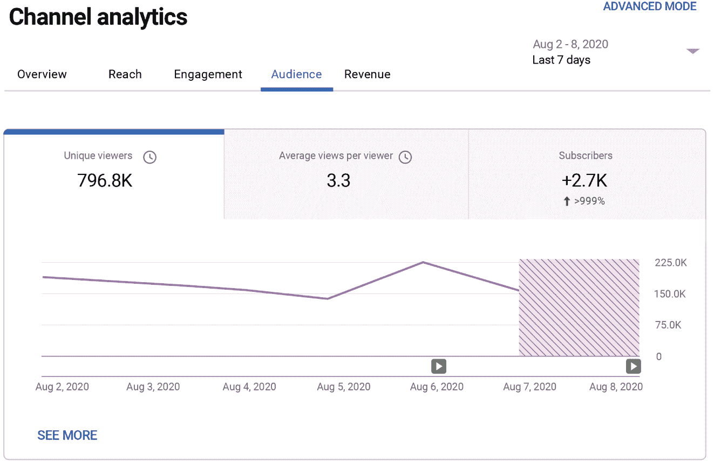

**图 14.1** **谁：独立观众**

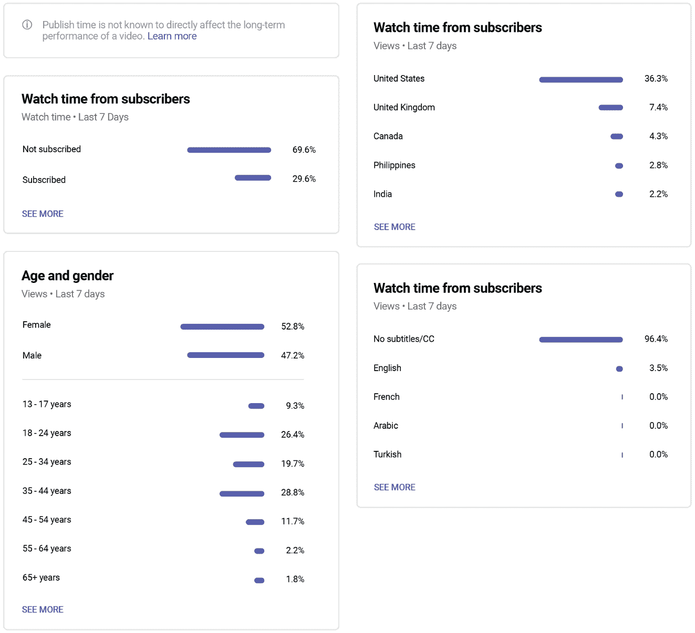

**图 14.2** **谁：观众人口统计**

**图 14.3** **在哪里**

第三个 W 是*什么*。什么是观众正在观看和点击观看的视频。它包括印象、观看时间、点击率、平均观看时长（AVD）和平均观看百分比（AVP）。请参见图 14.4。

最后是*何时*。我将何时分为三个部分：实时、日期范围以及您的观众何时在 YouTube 上。实时指标显示您的视频在过去 48 小时以及过去 60 分钟内的表现。这些是实时分析。图 14.5 显示了日期范围，图 14.6 显示了观众何时在 YouTube 上。

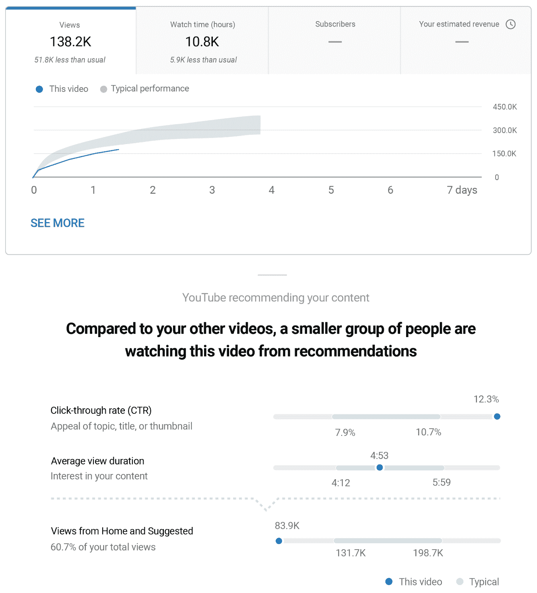

**图 14.4** **什么**

有了这四个 W，您可以开始看到观众对您的内容做出的反应。这将为您提供您需要的数据，以便在不使事情过于复杂的情况下进行调整。

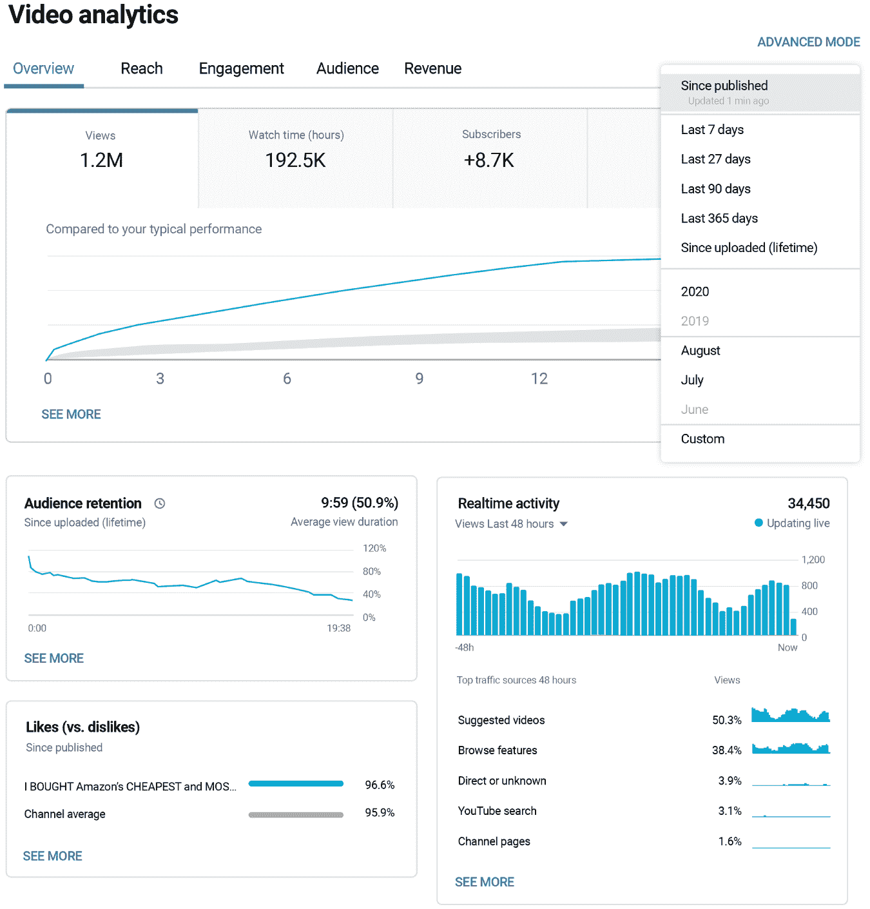

**图 14.5** **何时：日期范围**  ## 人类+数据反馈：一个成功的组合

我的一个辅导学生，约翰·马莱基，有一个木工和金属工作频道。他的缩略图过去只显示一个物体——他工作的美丽成品。约翰非常犹豫是否要把自己放在缩略图中，但我说服他试一试，因为数据显示，带有人脸的缩略图表现更好。

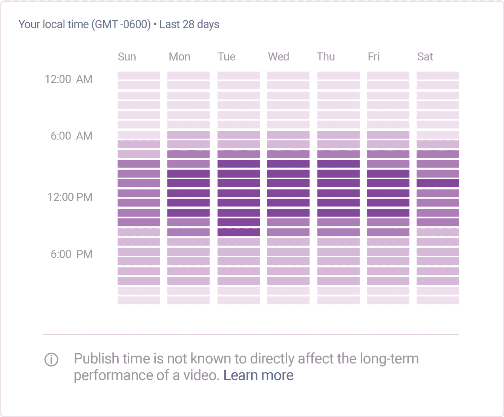

**图 14.6** **观众何时在 YouTube 上**

作为前 NFL 前锋，约翰认为自己太大了，不适合出现在图片中。然后他决定不管怎样都要尝试；他开始制作更多以个性为基础的视频，并将自己放在缩略图中。观众开始点击更多并观看时间更长。约翰制作了一个关于 DIY 熔岩桌的视频，缩略图只显示了桌子。上传到他的频道后的三天，他的点击率低，只有 1.6%。所以他换了一个缩略图，上面有他和桌子。他之前的一些缩略图显示了约翰倒东西，获得了很多观看次数，所以我们认为他应该在这里使用这种策略。他把“熔岩”倒进了一个桶，一个箭头指向成品。然后我们观察他的点击率——它立即飙升到了 8.9%。一个本来可能是他表现较差的视频现在成为了表现最好的视频……全部都是因为约翰寻求了人类反馈和数据反馈，并从两者中做出了调整。请参见图 14.7。

**图 14.7** **约翰·马莱基点击率**

如果您从未实时观看过您的分析数据，不用担心。如果您从未根据数据反馈调整过您的内容，也不用担心。好消息是，您现在可以开始做到。

在接下来的几章中，我会向你展示具体的方法。我们将涵盖 CTR 和其他指标，如 AVD、AVP 和每位观众的平均观看次数。我们还将讨论您的内容策略以及如何对视频进行分类。您将能够创建出色的内容，并做出明智的、数据驱动的决策，以帮助内容表现最佳。这是一个强大的、主导渠道的组合！  ## 行动练习

+   **任务 1：**在您所在地区寻找其他 YouTube 创作者。看看是否已经有任何线上或线下的聚会，然后请求加入。

+   **任务 2：**如果没有，请创建自己的智囊团，并定期会面。

+   **任务 3：**查看您在过去 90 天发布的视频。写下您的表现最佳的视频，并使用四个 W 分析每一个。寻找它们之间的模式。

+   **任务 4：**验证您在第十一章行动练习中确定的观众角色。他们是否和你想象的一样？他们有什么不同？

获取伴随工作手册，并在[www.ytformulabook.com](http://www.ytformulabook.com)找到更多资源。

# 15 标题和缩略图：成功始于点击。

YouTube 成功最重要的指标是什么？

这是我每年都经常被问到的问题之一。答案很简单，大致是这样的：一切都始于点击。如果人们不点击，他们就不会观看，无论您的视频有多么精彩，就是这样。您如何让观众点击？您赢得他们的注意。让观众点击是我看到创作者和品牌最大的挑战。您必须让人们在所有干扰之外专注于您的内容。

我儿子 Logan 决定竞选高中学生会主席，所以他让我帮他做市场营销。当然，我很高兴帮忙；我喜欢新的活动和谈论策略，但这次是为了我儿子。我们谈到了用信息或口号吸引人们注意的重要性。它需要容易记住和简单解释和分享，而且需要脱颖而出。他说：“爸爸，你知道我讨厌引起注意。我讨厌聚光灯。”这是真的；从小孩子的时候起，Logan 总是不喜欢引起注意。我稍微推了他一下，说也许他需要走出自己的舒适区。但然后他说：“我不想假装。我就是我。” *砰*。一个主意突然袭来。他的竞选口号将是“没有口号，只有 Logan。”它有效地吸引了人们的注意，并且容易记住。这个口号提醒他的同龄人，他们喜欢他是因为他是谁，这最终赢得了选举——而不是竞选活动。

在早些章节中，您了解到 YouTube 的工作是预测观众会观看什么。AI 对平台上观众参与的一切都非常敏感，实际上它是从印象开始的。当观众能够看到标题和缩略图至少一秒钟时，就会产生印象。这可能发生在 YouTube 首页、订阅源、搜索结果或建议源（接下来）。如果观众在一秒钟内跳过标题和缩略图，那就不算是印象。如果他们点击了，那就记录了您的点击率（CTR）。一个重要的注意事项：印象和 CTR 数据越高越好。这意味着 YouTube 正在向更广泛的观众推荐您的视频。它推荐得越多，您将获得更多的印象。您获得的印象越多，您的 CTR 就越低。所以当您的印象和观看次数增加时，不要惊慌您的 CTR 百分比下降。这是件好事，因为 YouTube 正在向您“正常观众”之外的更多观众展示它。

在 YouTube 在创作者工作室中提供 CTR 数据之前，我就知道这是非常重要的，只是基于我对算法如何运作的看法。广告活动的成功率非常关注 CTR 数据。我开始在 AdWords 中为我的最大的客户进行缩略图和标题的分割测试。我们输入我们的受众人口统计数据和兴趣，并创建广告，看哪一个的点击率最高。当我们更换了那些获胜的标题和缩略图并将它们放在 YouTube 上时，视频就会爆炸！我开始恳求 YouTube 的开发团队提供创作者这些数据。我知道这是一个巨大的因素，所以我继续花费大量时间、金钱和精力学习哪些标题和缩略图有效，因为这是吸引人们观看或购买的唯一途径。

让我给你举个例子。当杰弗里·哈蒙、丹尼尔·哈蒙和他们的团队和我一起制作 Squatty Potty 广告时，我们为标题创意制作了一个谷歌文档，并添加了我们能想到的每种变体。头脑风暴中没有“愚蠢”的想法，因为任何东西都可能激发出一个伟大的标题。我们需要弄清楚什么会引起人类的好奇心并让他们点击。因为更多的点击会带来更多的人采取行动购买。我们知道我们必须测试我们的选择，所以我们做了 165 种标题变体，看观众对它们的反应。我们每个人都有自己喜欢的，但我们必须根据数据做出选择——数据不会说谎！而且我们真的很想做对，因为我们在这个广告活动上押了很多赌注。成功是我们唯一的选择。看哪个标题和缩略图带来了最高的点击率的最佳方法是运行 Facebook 的参与广告。我们为 Facebook 创建了几个广告，以弄清我们的目标受众如何回应，对不同的标题和情景进行 A/B 分割测试。

有趣的是，我最初想到的标题最终成为了最终的标题，“这只独角兽改变了我的排便方式”，但是花了几百美元才知道这是表现最好的标题。灵感来自于查看丹尼尔的标题列表并从中进行头脑风暴。这就是合作和一起头脑风暴的力量。在选择标题之后，我们需要开始测试缩略图。我们还尝试了 20 种不同的缩略图，并将它们与我们的前五个标题选项一起使用，再花了几百美元进行额外的分割测试，并根据数据做出最终决定。我们的最终点击率比没有测试时高出 10 倍。十倍。请考虑一下这一点。

吉米·唐纳森，“MrBeast”，已经成为了一个标题和缩略图创建的巫师，以获得最佳的点击响应。我喜欢吉米为他制作的每个视频创建最佳标题和缩略图的过程。如果他想不出一个有吸引力的标题和缩略图，他就不会制作视频，无论视频创意有多好。相信我，我曾试图说服他。大多数创作者认为只有在拍摄视频之后，就在上传之前，“我应该为标题和缩略图做些什么？”这是一个巨大的错误，它可能会让你的视频潜在成功付之东流。要认真考虑人们想要点击什么。这是至关重要的，因为如果他们不点击，他们就不会观看。这就是为什么吉米在制作每个视频之前都会制定战略。我们确实花了几天时间想出正确的标题和缩略图。不是几个小时，而是几天。让这个事实让你停下来思考你的标题和缩略图创建过程和优先级。把它作为一个优先事项。你不需要像 MrBeast 那样走极端，但你应该考虑你潜在的观众，以及什么会激励他们点击。这也会在你制作视频时帮助你。观众至上！

在大学生物课上，我学到了关于大脑和视觉皮层的知识，我对此着迷。当我能看到它在广告中的实际应用时，我的兴趣增加了。我花了很多时间试图弄清楚它如何应用于吸引人们的注意力。总结一下，大脑的视觉皮层是处理视觉信息的地方。视觉皮层有四个区域，分别称为 V1、V2、V3 和 V4。还有一些特殊的视觉皮层区域，可以非常快速地处理视觉信息。这些被称为“先注意”区域，因为它们能更快地处理信息。让我向你展示一下它是如何工作的。

让我们做一个快速的练习，叫做“眨眼测试”。闭上眼睛，然后睁开一毫秒，看看图 15.1。换句话说，只是眨眼，然后闭上眼睛几秒钟。

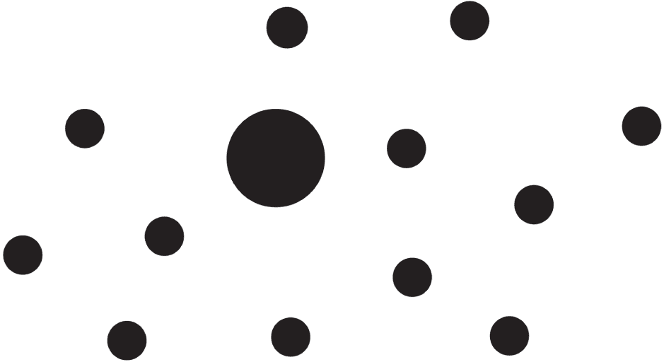

**图 15.1** **大小和形状**

注意你的眼睛被吸引到了哪里。是被吸引到了更大的圆圈吗？

让我们再试一次，看看图 15.2。

你的眼睛被吸引到了不同方向的斜线吗？

这些例子非常简单，但它们有效。科学太棒了！你无法在黑白书中获得这个过程的全部力量，因为它在彩色图像中效果最好。缩略图中颜色的视觉效果非常重要，我甚至为这本书创建了一个免费的在线课程。你可以在[ytformulabook.com](http://ytformulabook.com)找到最好的彩色缩略图示例，以及我详细的缩略图培训。

**图 15.2** **方向**

视觉皮层的注意力区域不是我们使用的唯一的视觉/大脑连接。大脑的另一个区域可以用来吸引缩略图的注意力，那就是颞上沟面部区（FFA）。大脑的这一部分对人脸敏感，并且靠近处理情绪的大脑区域。这在缩略图中作为一个明确的触发器，因为大脑有专门用于处理面部的回路。当我女儿艾莉四个月大的时候，我正在阅读一项关于婴儿大约三个月大就能认出面孔和情绪表情的研究。当然，我必须进行测试。我对婴儿艾莉进行了六种面部表情的测试，看看它产生了什么情绪。参见图 15.3。

**图 15.3** **表情**

几周来，我对我的宝宝进行了“疯狂”的面部测试。我惊讶地发现，即使是一个四个月大的婴儿，每种面部表情都会产生不同的情绪反应。我想我给我的女儿留下了终身的伤疤（对不起，艾莉！），但这是为了科学。直到今天，我还会通过短信给我的女儿发疯狂的表情。了解人脑对图像的反应可以在设计缩略图时给你带来巨大的优势。

Netflix 拥有一些地球上最好的缩略图。他们花了很多钱来完善吸引观众注意力的科学。我经常浏览 Netflix，看看真正吸引我的注意力的缩略图。我从来不点击观看，只是浏览。这让我妻子卡罗琳很烦。她会说：“我们要看点东西吗，还是我要看你整晚看缩略图。”我对出现的内容很着迷。我还会去卡罗琳的账户和我的孩子们的账户，看看他们看到的内容有什么不同。我经常研究缩略图。我甚至创建测试账户，只是为了看到其他类型的缩略图和推荐的内容。在为客户进行研究时，我会要求他们列出他们的观众会观看的 20 部电影，然后我在 Netflix 上选择它们，看看 Netflix 的人工智能推荐了哪些内容和缩略图。这总是给我一些关于哪种颜色和图像位置真正与特定人群联系在一起的想法。

想象一下，在屏幕上闪现 12 张图像，仅用一小部分秒。你认为你能处理每张图像吗？麻省理工学院的一组神经科学家发现，人脑可以在眼睛看到的图像中处理整个图像，时间仅为 13 毫秒。

有一篇名为“图片的力量”的 Netflix 研究文章强调了图像对于帮助消费者选择观看内容的重要性。在他们的研究中，Netflix 发现与电影相关的艺术作品占人们在浏览时的 80%以上的注意力。标题的注意力次之，持续时间不到两秒。这不是一个很长的时间来用文字说服观众这就是他们想要观看的内容。图像是最重要的。而且它必须很好，因为我们在眨眼之间就看到了东西，并且做出了即时的判断，甚至自己都没有意识到。作为内容创作者，我们只有毫秒来吸引人们的注意并吸引他们进入我们的内容。如果我们不能迅速吸引他们，他们已经转而看其他能吸引他们点击的东西了。我们如何吸引他们的注意？通过好奇心。

好奇心是一种基本的人类行为——我们被编程成学习机器。这是一个自然的人类本能，从我们出生的那一天起就一直伴随着我们。直到我女儿艾莉三岁时总是问问题，我才真正意识到这一点。她问了一些经典问题，比如，“为什么天空是蓝色的？”和“婴儿从哪里来？”但我个人最喜欢的是，“妈妈，为什么爸爸这么吵？”好奇心是我们认知功能的基本要素。

好奇心引起点击。你的缩略图和标题组合应该让正在浏览的人停下来足够长的时间来考虑点击。例如，当我看到一个人在水下举着一个装满杠铃的照片时，它吸引了我的注意，所以我迅速看了一下标题，“你能在水下卧推 1000 磅吗？”我就上钩了。见图 15.4。

**图 15.4** **卧推**

我不得不点击那个视频。我无意中花了接下来的一个半小时消费了创作者泰勒·奥利维拉的内容。泰勒制作了可点击的缩略图和引人入胜的标题，一次又一次地激起了我的好奇心。此外，他的视频内容也没有让人失望。让我们来介绍一些基本的设计原则，这些原则将提高你的点击率百分比。

### 三分法

为了确保你的图像吸引人眼球，保持简单和平衡。观众会因为觉得美感到位而更加与平衡的图像产生联系。一个看起来静态的图像总是看起来不那么有趣。一个初学者摄影师在摄影课上学到的第一种技巧就是“三分法”。这是一种有效的技巧，通过将图像水平和垂直地分成三分之一来构图平衡的照片。图像的主题位于这些分割线的交叉点上或沿着分割线之一。三分法的分割线有效地将图像分成九个部分，如图 15.5 所示。

**图 15.5** **三分法**

研究表明，当人们看到一张图像时，他们的眼睛自然会转向交叉点之一。这样大脑更容易快速处理。了解这样的自然过程是很好的，这样你就可以学会如何与之合作，而不是对抗。图 15.6 展示了三个三分法的例子。再次，为了获得全面的效果，闭上你的眼睛，然后在看图 15.6 时睁开它们。注意你的眼睛自然首先聚焦在什么地方。

在拍照或设计缩略图时，总是要问这些问题：

+   这张照片的焦点是什么？

+   你在网格中放置焦点的位置在哪里？

说了这么多关于“规则”，不要让它在你制作缩略图时每次都让你感到压力。正如他们所说，规则是用来打破的，不是每次，但有时你可能会在没有网格的情况下拍摄到更好的照片。如果需要的话，你可以随时使用后期制作工具进行编辑，裁剪和重新构图以使你的图像适应网格。

**图 15.6** **第三规则的三个例子**  ### 色彩心理学

我看了一个关于一个名叫 Cayson Irlbeck 的 10 岁男孩的 YouTube 视频，他出生时是色盲的。色盲是被广泛误解的。很多人认为这意味着某人只能看到黑白，但事实并非如此。它意味着大脑无法处理不同的颜色深度。在关于 Cayson 的视频中，他的爸爸想要给他一个惊喜，所以让他在一个美好的日子出去。天空是明亮的蓝色，草地是青翠的绿色，但 Cayson 并没有看到这样。他的色盲大脑看到的是蓝色或紫色的天空和红色的草地。然后 Cayson 的爸爸给了他 EnChroma 眼镜。这些眼镜让色盲者能够正确看到颜色，这是 Cayson 以前从未经历过的。他戴上眼镜，眼泪开始流下来。他的爸爸也哭了，两个人都为了喜悦而抽泣。我希望每个人都能看到 Cayson 的脸。我很感激生活在一个有色彩的世界里。

1665 年，艾萨克·牛顿爵士在剑桥大学研究光和色彩。他观察到光是如何反射成各种颜色的。在一个阳光明媚的日子，牛顿用窗帘遮住了他的窗户，只留下一个小孔让一束阳光进入房间。然后他在光束中拿着一个大玻璃棱镜。他能够看到完整的色谱。这导致了更多的棱镜实验，不仅是他，还有无数研究色彩和光的科学家。

颜色在影响决策中起着巨大的作用。我们称之为色彩心理学，它可以成为一种有力的说服工具。我生活中每天都穿着黑色 T 恤，但不要让这愚弄你，让你以为颜色对我无关紧要。当涉及到 YouTube 内容，特别是缩略图图像时，我知道颜色可以决定你视频的成功与否。缩略图中的颜色选择不当将对视频的可点击性产生负面影响。Satyendra Singh 在《管理决策》杂志上发表的一项研究表明，单单颜色就可以对决策产生高达 90%的影响。90%？如果这是真的，那么在制作缩略图时牢记颜色至关重要。颜色对于赢得点击至关重要。

每个人在小学都学过色彩轮。当我学习它时，我不知道它会对我的职业有多大帮助。对比或互补颜色在色彩轮上是相对的，可以作为强大的组合一起使用，使你的图像脱颖而出。请记住，你仍然可以用灰度进行对比，但这会感觉像 Cayson 的色盲一样单调。我将在图 15.7 中以灰度显示示例，但请记住，你可以在免费的在线课程中以彩色查看它。

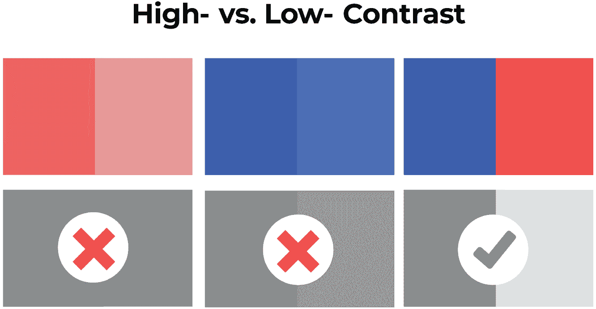

**图 15.7** **黑白对比**

颜色是你的缩略图图片创建过程中的一个重要工具，因为它对观众的思维和行为有很大影响。这一过程已经被营销人员和广告商研究和分析，因为它有助于预测人类行为。了解它意味着你可以使内容更有影响力。处理颜色的视觉皮层 V1 指导观众的眼睛看向哪里，做什么，以及如何解释某件事。它还可以为内容增加背景。它帮助我们决定什么是重要的，什么不是。这正是为什么作为内容营销人员，你需要了解颜色对人们的意义。## 缩略图策略

我们已经讨论了缩略图为什么如此重要的一些科学原理：创作者如何用摄影技术和正确的颜色组合来吸引观众的注意力。现在让我们深入战略。你如何利用这些信息来获得优势？

2012 年之前，YouTube 会自动选择创作者视频的一个随机片段，并将其设置为缩略图。如果视频的创作者不喜欢自动图片，他们必须重新上传，直到他们喜欢 YouTube 选择的选项。我知道，因为我以前就是这么做的。我知道缩略图图片对我的点击率有多大影响，所以我不厌其烦地重新上传，直到我喜欢缩略图为止。

YouTube 在 2012 年推出了合作伙伴计划（YPP），并悄悄地添加了新功能来帮助他们的 YPP 创作者。属于合作伙伴计划的创作者在这些功能上有很大的优势，其中之一就是能够上传自定义缩略图。YouTube 向他们的 YPP 成员发送了一封电子邮件，鼓励他们使用这一新的自定义缩略图功能。这些被选中的 YPP 成员——当时并不多——现在在一般的 YouTube 公众中拥有了巨大的优势。很快，他们中的许多人意识到他们可以制作轰动的缩略图图片，以获得大量的点击和观看。

这就是“点击诱饵”策略对 YouTube 造成最严重影响的时候。YPP 创作者使用了明亮的颜色、箭头、情绪激动的面部表情和大胸部镜头等诱饵技术来吸引观众点击他们的视频。他们是在欺骗和误导。观众上当了，点击了，但很快他们就意识到视频内容并没有展示缩略图中所宣传的内容。YouTube 从新的自定义缩略图功能的数据趋势中注意到了问题，因此他们开始使用不同的指标来通知他们的推荐视频。这有助于减少点击诱饵问题（有关此问题的更多信息，请参见第二章）。注意：如果你的视频内容兑现了承诺并没有误导观众，点击诱饵也是可以的。

我看到自定义缩略图改变了 YouTube。作为一名营销人员，我观察到了一些关于缩略图的东西，在广告中我以前从未见过。人们真的很擅长学习缩略图设计策略来吸引更多的点击。这些都是任何创作者或品牌都可以使用的简单策略，我会在图 15.8 中向你展示如何使用它们。

数据显示，最好的缩略图包括一个物体和一个人。当你深入研究我们之前提到的 Netflix 研究发现时，它显示观众喜欢有人物的缩略图。缩略图应该能够在没有文字的情况下讲述一个故事。你可以通过人物的特写和复杂的情感来有效地做到这一点。图 15.8 展示了 YouTube 上一些最常见的缩略图类型。请记住，这些示例是黑白的，而颜色真的能让这些东西更加突出和有意义。我鼓励你去[ytformulabook.com](http://ytformulabook.com)上进行详细的缩略图培训。

| 面部优先 在面部优先的缩略图中，你的面部表情是最重要的。与某人建立联系的最佳方式是通过眼睛。所以确保你的脸离得很近，你的眼睛明亮动人。[图 15.8]a |
| --- |
| 面部和物品 如果你有一个要展示的物品，这个策略是吸引观众的好方法。你脸上的情感反应和一个有趣的物品将真正使你的缩略图脱颖而出。[图 15.8]b |
| 物品优先 有时物品是节目的明星。在这种情况下，你的物品应该位于正中间。非常大，非常醒目，非常明亮。确保观众不会对要看什么产生困惑。[图 15.8]c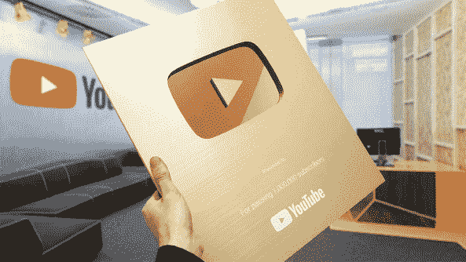 |
| 两个面孔 如果你打算在缩略图中放两个人，你应该把脸放在框架的左边和右边，物品放在中间。不要忘记表现情感！[图 15.8]d |
| 三面板 三面板缩略图非常适合展示进展。你的眼睛从左到右移动，所以一定要把“之前”放在左边，“之后”放在右边。记住，进展可能意味着时间，但也可能意味着改变。不同的颜色也可以帮助增强这种缩略图的效果。[图 15.8]e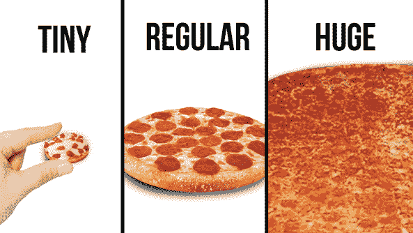 |
| 两面板 两面板缩略图是展示进展的另一种方式。完美的例子是“之前和之后”。你也可以将其构思为“对或错”，或“真实或假”。对比是这种缩略图中重要的部分。这种类型不仅适用于物品，也适用于人的面孔。[图 15.8]f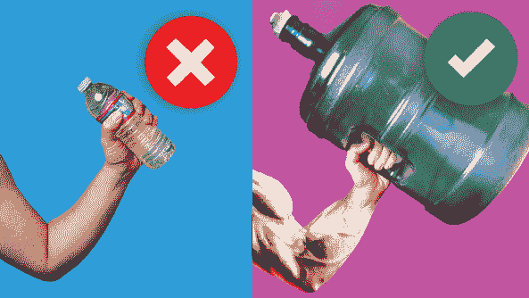 |
| 文字增强 文字在适度使用时可以非常有力量。文字只应该用来帮助观众理解或引起他们的好奇心。保持文字简单。如果你不能只用缩略图讲述一个故事，就用文字来澄清。[图 15.8]g |
| 剪贴画 使用红色箭头、圈圈、手势和表情符号来引导观众的目光，让他们关注缩略图中的特定人或物品。[图 15.8]h |
| 透视 我们的大脑对极端情况特别感兴趣，尤其是当涉及到非常大的事物或非常小的事物时。在你的缩略图中展示与你相关的规模可以帮助使你的缩略图脱颖而出。[图 15.8]i |
| 有序杂乱 如果你有很多同样的东西，你可以使用“有序杂乱”的策略。将自己放在一个统一杂乱的背景中可以帮助你脱颖而出。确保你的背景中有一个模式，而不仅仅是杂乱——你最不想要的就是一个杂乱的缩略图。[图 15.8]j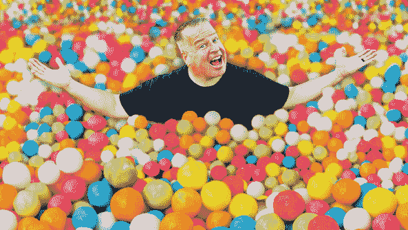 |
| **展示行动** 这些缩略图创造了“我想知道接下来会发生什么？”的效果。好奇心赢得了点击，这种缩略图策略应该总是引起好奇心。人们喜欢动作电影和动作镜头，所以当你可以的时候，展示行动。 | 图 15.8k |
| **颜色吸引眼球** 每种颜色都与一种情感相关联，因此您如何使用它会影响观众对您的缩略图的感受。使用正确的颜色组合也可以帮助吸引观众。一些策略是使用互补颜色或颜色在色轮的对立面。这种对比会让您的缩略图真正突出。 | 图 15.8l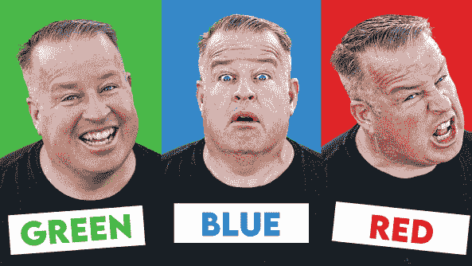 |

**图 15.8** **缩略图类型**

当你设计你的缩略图时，永远记住，现在大多数 YouTube 观众都是在移动设备上观看。你希望确保你的缩略图在移动设备上观看时看起来清晰。很多创作者在电脑上设计，但你需要在移动设备上查看，看看大多数观众看到了什么。问问自己这些问题：有没有太小的物体？还有一些你无法轻易区分的东西吗？然后做眨眼测试，闭上眼睛再睁开，看看什么首先吸引了你的注意力。超级提示：我总是想看看我的缩略图与其他缩略图相比是什么样子。要进行模拟比较，截取搜索结果并用 Photoshop 将你的缩略图与结果列表放在一起。这对于了解观众将如何看到你的缩略图非常有用。

### 正确的缩略图

要正确制作缩略图，甚至在拍摄视频之前就要计划好创意。问问自己，“我怎么样才能不用文字解释正在发生的事情？”然后浏览缩略图头脑风暴清单，想出你可以使用两种或三种不同方法为这个特定视频设计图像的方法。通常需要结合这些策略来吸引观众。记住，你在缩略图中投入的情感越多，它就会越有趣，越容易点击。然后在拍摄视频之前进行一次拍照。从不同角度拍照，并记住简单才能卖座。

这里还有一个额外的建议：不要截取别人的缩略图，意图复制到你的缩略图上。这是不对的！你头脑风暴得越多，你自己的创造力就会越容易流动。### 缩略图审核

你应该选择每个缩略图概念的两到三种变体，因为你需要测试或快速更换选项，如果你的 CTR 不好。一旦拍摄完成，图像经过编辑准备就绪，你可以浏览你的缩略图选项，并问问自己：

+   哪张图片更容易点击？

+   它实际上描绘了视频内容吗？

+   它能让观众兴奋或感到好奇吗？

+   *你*会点击那个缩略图吗？### 流量来源和缩略图

我已经知道为不同阶段的观看者消费创建了几种缩略图。我意识到这非常书呆子和战术，但我对印象积累的地方（流量来源）和 CTR 基线非常敏感。在我工作过的一些最大的视频中，我们设计了能够在浏览功能（YouTube 首页和订阅源）上获得更多点击的缩略图，然后我们会将该缩略图更换为另一种专为建议视频（接下来）的更高 CTR 而设计的缩略图。是的，即使在那个细粒度上也有差异。我通过使用这种策略看到了三倍的观看次数增加。如果你仔细观察那些 CTR 数字，它可以帮助你。## 视频标题

Netflix 的研究告诉我们，一旦我们用缩略图吸引了观众的注意力，我们有 1.8 秒的时间用标题留下印象，所以我们不要浪费它。这可能是观众是否观看你的视频或转而关注下一个吸引他们注意力的事物的区别。那么，什么样的标题才算好呢？

在第十一章中，我们谈到了如何确定你的观众。我们谈到了学习他们的线下和线上行为。这在标题方面非常重要，因为你不想使用会使你的观众感到断开和困惑的词语或短语。我记得有一次，我的儿子 Kelton 和他的哥哥 Logan 谈论和朋友一起玩滑板。Kelton 告诉 Logan 他成功完成了一个“酷炫的技巧”，以及这有多“酷”。我妈妈，一个婴儿潮一代，当时在房间里，她转向我说：“Kelton 没事吧？他生病了吗？他的朋友在吸毒吗？”笑了几分钟后，我不得不向她保证 Kelton 很健康，他的朋友也没有吸毒。他使用的词语对她来说意义完全不同。

当他们看缩略图和标题时，你必须考虑观众做出的潜意识分裂决定。在那一瞬间，他们的大脑会问：

+   这个视频是我在找的吗？

+   我真的想看这个视频吗？

+   这个视频值得我花时间吗？

不管你喜不喜欢，你的 YouTube 标题都会影响观众的点击决定。

### 你的标题需要满足“为什么”和“什么”

你的视频标题的目标是加强缩略图。它为最初吸引观众注意力的内容提供了额外的背景信息。使所有标题对人类可点击，并尝试预测你的观众会如何回应。标题应该易于记住，易于解释，易于分享。我想带你做一个我称之为宏观和微观的练习。这个练习在解决我职业生涯中的问题方面非常有帮助，但更重要的是，它有助于理解人们的意图和行为。

首先让我们看看宏观层面，“为什么”。观众为什么来 YouTube？他们为什么在主页上滚动？他们为什么在 YouTube 上搜索视频？他们为什么观看这些视频或不观看那些视频？2017 年有一项名为“YouTube 的价值”的研究，试图验证人们为什么来到这个平台的一些假设。我总是对谷歌与 YouTube 相关的任何新研究感到兴奋，但不管是不是发烧友，每个 YouTuber 都需要看一下图 15.9 中显示的研究。

YouTube 观众的“为什么”很简单，归结为四件事：娱乐、教育、灵感/动力和减压/放松。这就是人类的本性。

微观层面是“什么”。他们需要学什么？他们问题的解决方案是什么？他们会发现什么有趣？什么会激励他们？什么会帮助他们减压或放松？最重要的是，什么会鼓励他们点击？你的价值主张是什么，可以让人们点击并观看？

**图 15.9** **YouTube 的价值**

记住，这是关于人们来 YouTube 满足他们的“为什么”。关键词或短语将在标题中使用，以吸引他们点击。这也是视频的主题。关键词或短语是他们大脑中实际采取行动的最终触发器。正确的关键词或短语有助于决策过程，并使视频更具吸引力。这是关于人们，而不是算法。

缩略图和标题是我在内容策略中花费最多时间的地方，因为我需要知道什么能让观众点击。我在哲学上与大多数 YouTube 教育者不同，因为搜索量不是我的主要关注点，而只是我用来做决定的许多因素之一。我宁愿不花几个小时做关键词研究，而是用这些时间专注于观众的“什么”和“为什么”，学习人们如何对我的内容做出反应，并发展出一个像我们在第十章中讨论的 YouTube 第六感。我花时间来测试我的标题和缩略图，使它们易于记住、易于解释和易于分享（我强调这个概念已经是第三次，因为它非常重要）。我想花时间思考这个视频或项目如何产生一个水塘时刻（人们将用这个时刻来与家人、朋友和同事讨论视频）。

我试着想象观众在观看视频后会如何谈论它，甚至在脑海中创造虚构的对话……“你看到那个 MrBeast 的视频了吗？他吃了世界上最大的一块比萨？”如果标题容易记住，易于解释，并且易于观众分享，你就给你的视频更好的成功机会。这是很有力量的。确保你花时间想象观众会如何谈论你的视频，看看它是否通过了测试。如果没有，想出另一个标题。如果通过了，那就上传它，并验证人们是否通过查看数据来回应，看看点击率是否增加。

宏观和微观练习将帮助你深入了解你的观众人物和内容，正如我们在第十一章中讨论的那样。了解观众想要什么或他们关心什么，在他们做出快速点击决定时，会给你一个优势。

### 制作可点击的标题

要制作一个可点击的标题，你必须满足“为什么”，提供“什么”的价值。这是大多数创作者多年来都在努力的事情。这可能是让人们与你的内容产生联系的一个主要障碍。我总是会就标题想法进行头脑风暴，就像我们在 Squatty Potty 广告中所做的那样。然后我会修改标题，使其更具吸引力和可点击性。

以下是一些关于如何使标题更具吸引力和可点击性的提示和示例。假设我刚刚创建了一个名为“Derral 42”的新 YouTube 频道。我的内容将涉及太空、探索和宇宙的奇迹，因此我的标题示例也相应地遵循这些内容。（顺便说一句，42 不是我的年龄！如果你是我的观众人物，你会理解我对 42 的引用。所以，不要惊慌。）

***使用主动语态。** 在 YouTube 上使用主动语态标题是有效的，因为它们清晰、简洁，并且易于理解。你会看到这些提示中的示例使用了主动语态。使用主动语态标题还会自然地产生一种紧迫感。我将在这个列表的后面谈到紧迫感。

***保持相关、流行和时事。** 利用趋势和当前事件有助于标题成为正确观众的糖果。例如，在 2020 年夏天，SpaceX 因首次近十年将 NASA 宇航员送往国际空间站而成为新闻。因此，如果我围绕这一热门话题创建了一个视频，我的标题可能是：

+   SpaceX 帮助 NASA 宇航员再次变得酷

+   埃隆·马斯克帮助 NASA 宇航员再次变得酷

***使用问题（开放式和封闭式）。** 人们使用 YouTube 作为搜索引擎，他们会提出具体的问题。你可以查看观众对你的主题有哪些常见问题，并查看 YouTube 和 Google 搜索结果中的自动填充内容。我总是试图寻找一些东西——事实、地点或人物——来放大问题并引起好奇心。我的频道的视频标题可能是：

+   你会在火星上生存吗？

+   你能在火星上生存吗？埃隆·马斯克的天才计划

+   为什么火星的日落是蓝色的？

**在清单视频标题中包含数字**。这绝对是最强大的标题和视频策略之一，因为它让观众清楚地知道可以期待什么，有一个明确的时间限制，并帮助观众记住。我的新频道的清单标题可能是：

+   7 个人类需要殖民火星的重要原因

+   关于黑洞的 5 个极端事实

**陈述问题并提供解决方案**。问题总是引起人类的情感。如果您能提供一个可靠的解决方案，这可能会放大点击的愿望。标题将承诺展示解决方案可能是什么。我的频道视频可能的问题/解决方案标题包括：

+   太空垃圾场...这就是我们如何清理它！

+   埃隆的卫星互联网一团糟。这就是你解决它的方法！

**制造紧迫感**。作为人类，我们有错失恐惧，或者“FOMO”。您希望能够提供观众现在就想看到的信息。制造紧迫感会触发人类对被排除在外的恐惧。我的频道的一个紧迫标题可能是：

+   我们需要立即殖民火星，否则就太迟了！

**使用可信赖的来源**。这可以帮助那些需要验证的观众点击。例如：

+   NASA 表示冥王星不是行星

**针对观众**。当您在视频标题中称呼观众时，他们更愿意点击，因为这让他们觉得视频是为他们制作的。此外，这也为标题增添了另一层暗含的情感背景。对于我的频道，我可以使用：

+   中国和俄罗斯将在火星上击败 SpaceX

+   太空旅游：您现在可以预订！

**使用情感戏剧或极端词语**：人们对车祸、火灾和打斗总是好奇。大多数人天生喜欢戏剧、八卦、打斗、受伤、争议、性暗示、不当行为和对立力量。在视频标题中展现内在戏剧性可以引发情感反应。我的频道的戏剧标题可能是：

+   埃隆·马斯克称杰夫·贝索斯为模仿者

+   不是地球制造的，五角大楼透露了 UFO 的发现

**利用标题或词语的大写**。所有标题都应该将每个单词的第一个字母大写，有时您应该使用全大写。使用全大写是吸引标题的最简单方法之一。这里需要注意：有时全大写会让人感觉像是在大声喊叫。在使用全大写时要谨慎，这样您就可以强调关键词，而不会让人感觉您一直在大声喊叫。请注意我在前面的标题示例中以及以下标题中如何使用全大写：

+   火星上有生命吗？尼尔·德格拉斯·泰森认为是这样的

+   地球不是平的

用引人注目的词语放大。放大关键词或短语，使您的标题更具吸引力。使用诸如：终极，最糟，最佳，更快，疯狂，疯狂，哇，或者我哭了等词语。教育频道的良好放大词包括：DIY，简单，逐步，简单，惊人，快速和现在。

## 标题生成的可下载工具

在我的职业生涯中，我发现了一些真正可以加快关键词和短语生成标题过程的工具。这些工具为我节省了成千上万小时的研究时间，并帮助我进行头脑风暴。我在免费课程中有一个特别的部分，向您展示我的关键词和标题过程。访问[www.ytformulabook.com](http://www.ytformulabook.com)获取课程。不要陷入 SEO 的兔子洞；使用这些工具为您提供数据和关注“为什么”和“什么”。

***TubeBuddy***显示您的搜索词排名，搜索量（每月搜索次数），关键词的竞争以及相关搜索，以帮助您深入挖掘。TubeBuddy 为我节省了很多时间！这是我在研究和优化阶段最喜欢的频道管理工具。我还喜欢 TubeBuddy 用于测试的工具。免费下载 TubeBuddy，请访问[www.Tubebuddy.com/go](http://www.tubebuddy.com/go)。

***VidIQ Boost***旨在帮助您为视频找到主题和关键词。它具有我使用过的最强大的 YouTube SEO 功能和竞争分析工具。他们还有一个功能，可以帮助您优化视频并提升其效果。免费下载 VidIQ，请访问[www.vidiq.com/go/](http://www.vidiq.com/go/)。

***Kickass Headline Generator***是我最喜欢的头脑风暴工具之一。您可以输入主题、期望的结果、不希望的结果、受众、内容中的要点和有用的辅助工具，它将根据您的参数自动生成视频标题。在[www.sumo.com/kickass-headline-generator/](http://www.sumo.com/kickass-headline-generator/)下载此工具。

***Portent Content Idea Generator***不像 Kickass Headline Generator 那样强大，但您可以输入一个主题或话题，它会提出可点击的标题创意。我更多地用于头脑风暴和不同思考。在[www.portent.com/tools/title-maker](http://www.portent.com/tools/title-maker)下载它。## 行动练习

+   **任务 1：**使用本章学到的知识，为您的下一个视频构思 10 个新的标题创意。将其缩小到三个可能的标题。确保您的标题易于记住、简单解释和分享。

+   **任务 2：**为每个标题构思三到四个可能的缩略图创意。使用 YouTube 和 Google 图像提出创意，以使创意更加强大。选择一个缩略图策略并勾画出来（不用担心成为艺术家）。

+   **任务 3：**从您的大师小组中获得这些创意的人类反馈。

在[www.ytformulabook.com](http://www.ytformulabook.com)获取配套的工作手册并找到更多资源。

# 16 吸引观众的注意力，让他们观看更多。

您已经创建了一个令人惊叹的标题和缩略图，并吸引了观众的点击，制作了优质内容，获得了反馈，并知道您的观众来自哪里……那么，接下来呢？接下来，您专注于一件事：保留、保留、保留。保留简单地意味着，如果有人点击了您的视频，您必须让他们继续观看，以使您的内容发挥最佳效果。

有一个想法一直在流传，即人类的注意力持续时间已经低于金鱼。据说这个数字是 8 秒。这个理论来自于 2015 年的一项研究，但一个快速的事实核查让你感到疑惑：到底是谁想出这种东西的？一篇题为“揭穿注意力持续时间神话”的*BBC*文章，作者是西蒙·梅宾，揭露了金鱼理论中的所有漏洞。它引用了开放大学的心理学讲师吉玛·布里格斯博士的话，她认为“平均注意力持续时间”的想法是相当无意义的，因为注意力是任务相关的。她说：“我们如何将注意力应用于不同的任务在很大程度上取决于个体在那种情况下所带来的东西。”

无论人类的注意力持续时间是否变短，我们可能都会同意一件事：我们生活在一个充满干扰的世界中。我醒来时有 66 条新短信，11 条 Slack 消息，4 条语音邮件，128 条 Facebook 通知，数千封电子邮件。手机已经改变了我们管理世界的方式，无论是好是坏。我们可以随时随地获取世界信息，并且可以做出超级的反应。但这意味着我们永远不会断开。也许你正在开会或与某人进行真正的对话，或者在吃晚餐或阅读一本书放松一下，而与此同时，你的手机正在振动或发出通知声。疯狂的是，有时你的手机实际上并没有做任何事情，但你已经被训练得如此习惯，以至于你认为它做了。这种情况经常发生在我身上。这些“幻觉”响声或振动是如此普遍，以至于这种情况已经被称为“幻觉振动综合症”，蒂姆·洛克在 WebMD 上写的一篇文章中提到了这一点。## 尊重您的观众承诺

在这么多选项争夺人们的注意力——Facebook、Instagram、Snapchat、TikTok、YouTube、Twitter、电视、新闻、短信、超链接、广告，以及无数其他的东西——作为内容创作者或企业，要在这些噪音中脱颖而出是很困难的。因此，当一个人选择点击你的视频时，他们其实是在微观上承诺拒绝其他一切，选择接受你的内容。尊重这种承诺。即使金鱼的注意力持续时间传闻并不真实，你也只有很短的时间来吸引观众并让他们继续观看，以免他们离开去寻找更有吸引力的东西。这就是为什么抓住你的内容质量如此重要。这就是为什么你应该花更多时间制作能吸引观众的可点击视频。

## 参与和脱离触发器

当我查看一个频道的分析数据时，我会寻找视频之间的模式，看看人们究竟在哪里保持参与，脱离，以及为什么。然后我们知道要重新创造什么来提高平均观看时长。这里有一点非常重要的事情要注意：每个频道都是不同的。每个频道都有不同的观众，所以你不能比较图表或期望相似的模式。乔·罗根的 YouTube 频道有惊人的观看时长，因为人们会一直观看他的视频，然后再观看更多。不要担心乔·罗根或者追赶数字时代的潮流。只要明白，观看你内容的人越多，你就会有更多数据可以使用。

你的目标是找到模式并改进未来的内容。在视频上传后的第一个小时、第一天、第一周、第一个月以及更长时间内检查你的平均观看时长。问问自己在视频中最吸引人的部分发生了什么。你使用了行动号召吗？你说或做了一些有趣的事情吗？你添加了一个结束屏幕，建议另一个视频，或者使用了有趣的拍摄或编辑技术吗？你说了一个触发短语吗？触发短语可以重新吸引或脱离你的观众，所以确保你做前者。说一些像“别错过视频结尾的额外提示”这样的话，而不是“现在就到这里了”。

我总是在分析时问为什么。为什么人们在这里参与了，或者为什么人们离开了？你要么让他们感到愉快，为他们带来价值，要么他们与你失去联系然后离开了。不断地与人们联系和参与，你会成长。如果你与人们断开或脱离联系，你的频道将停滞或消亡。这很容易解释但很难实施。分析需要时间和耐心。你必须致力于专注于你的数据。让自己对分析过程的痴迷超过你对观看次数的痴迷。我的学生、客户和我都会在月初和月中深入研究我们的分析数据。这让我们能够看到我们的视频表现如何，以及我们可以从参与和脱离触发器中识别出的模式。

## 如何阅读指标

YouTube 让监控频道上发生的一切变得很容易。要监控观众观看你视频的时间有一个叫做平均观看时长（AVD）的指标。如果你有一个 10 分钟的视频，YouTube 说你的 AVD 是 2:30，这意味着平均来说你的观众会观看你视频的 2 分 30 秒。如果你在想，这不是一个好的 AVD。用于保留的第二个指标叫做平均观看百分比（AVP）。这是人们在离开之前平均观看视频的百分比。所以如果你的 AVP 是 63%，这意味着平均来说你的观众会观看视频的 63%然后离开。

AVD 和 AVP 并不完全匹配，因为人们观看视频的方式不同。例如，我以 2 倍速观看所有视频。所以在一个 10:00 的视频中，我的 AVD 将是 5:00，但我的 AVP 将是 100%。对于长期的频道增长，这两个指标至关重要。标题和缩略图会让你获得观看次数，但 AVD 和 AVP 会让你获得观看时间和正确类型的观众。你能让观众观看的时间越长，他们就会变得越投入，这将转化为忠实的观众。目标是平衡这两个指标并一起增加它们。YouTube 提供了多个指标来帮助实现这一点。以图 16.1 到图 16.3 作为解释。

在图 16.1 中显示的“曲棍球棒”效应发生在观众进来后很快就离开。当你的标题和缩略图与观众在视频的前 15 秒内期望看到的内容不符时，就会发生这种情况。

在图 16.2 中显示的“慢燃”效应发生在观众进来后慢慢离开视频的过程中。你希望这条线尽可能平坦，这样你就更接近最理想的图表。

图 16.3 显示了相对观众保留率。这是你的视频与你所在领域内长度相似的其他视频进行比较。你可以分析你的视频与其他类似视频的表现，并分析什么吸引了你的观众的注意力。

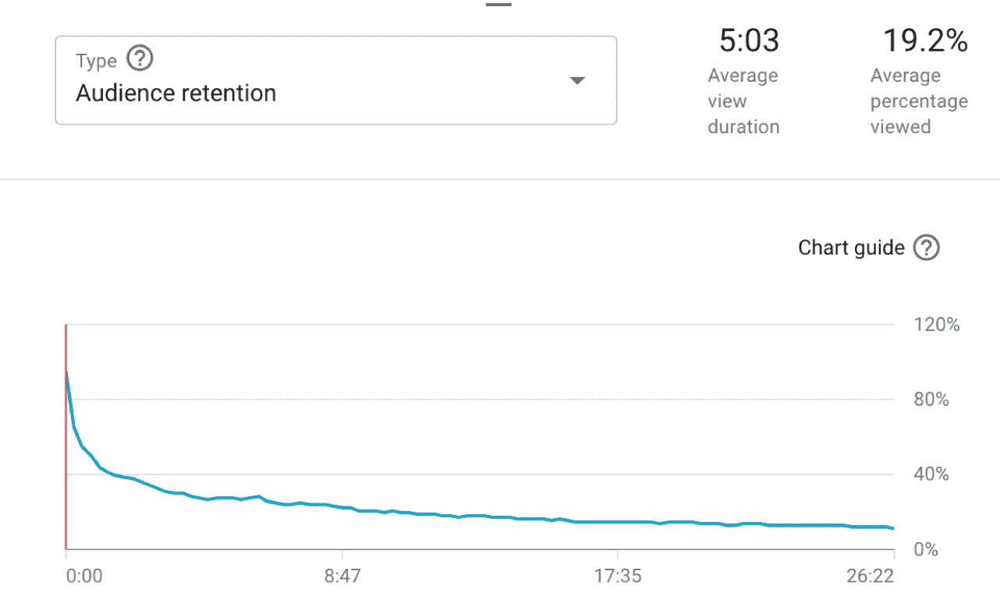

图 16.1 曲棍球棒

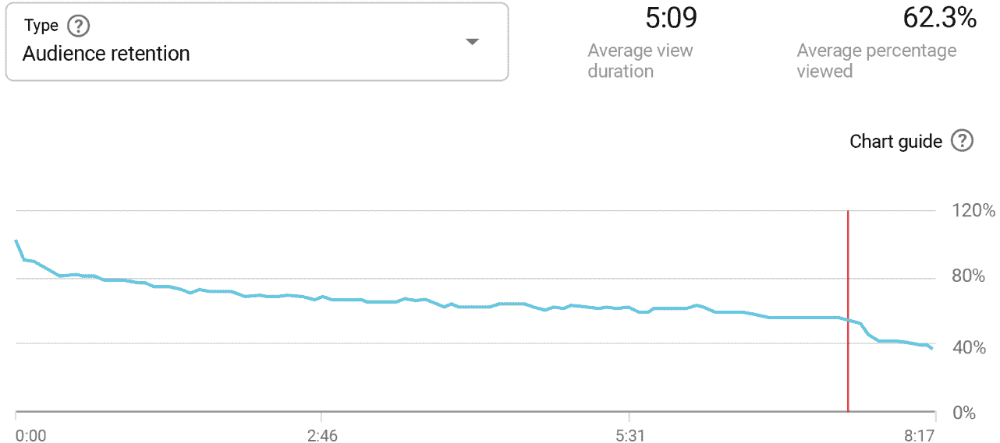

图 16.2 慢燃

再看一下图 16.1 到图 16.3。注意那些小“颠簸”。有时候颠簸是微妙的，但它仍然存在。 “上升”点是你的内容在观众中表现良好的地方。分析视频中发生的事情，这样你就可以做更多的内容。然后看看“下降”点，并分析你的内容中发生了什么导致人们离开。在相对观众保留率图中，看看视频末尾附近的下降。这是结尾开始的地方，人们离开了。（结尾是视频中的“总结”部分，在这部分中，视频中的人可以发出号召行动，并添加屏幕结束元素，比如链接到其他视频或网站。）你有类似的保留率图吗？找出原因。是不是有一个触发词或短语让他们离开了？你是否给他们承诺的回报，所以他们没有理由留到最后？你能从中学到什么？这些是你在查看这些数据时需要分析的事情。这将帮助你在未来的视频中改进并与你的观众建立联系。

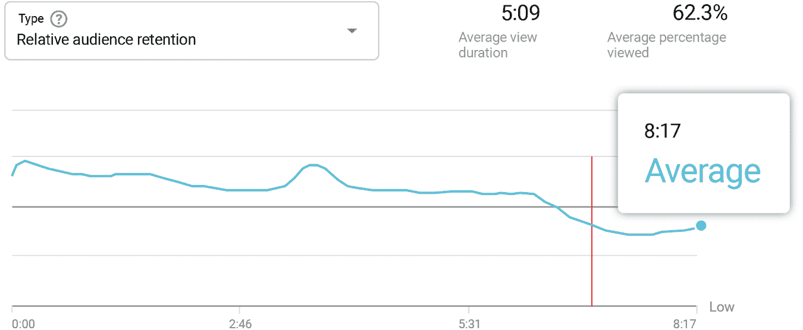

图 16.3 相对观众保留率 平均每位观众观看次数

要知道你与观众的连接有多好，你需要研究你的平均每位观众观看次数，或者 AVPV。AVPV 是观众在你的频道上观看任何视频的平均次数（在频道分析中）或者这个特定视频（在视频分析中）。这个指标让你深入了解你的内容是否真正与你的观众产生了连接。

当你专注于观众并创作有趣的内容来建立联系时，你可以增加观众在一段时间内观看视频的数量。把这看作是人们会一遍又一遍观看的电视剧，比如《办公室》或《老友记》。努力让你的视频变得如此出色，以至于人们与你，这个角色建立了联系。在你的频道指标的 28 天观看中，看看你在那个时间段内发布了多少视频。然后注意观众实际观看了多少视频。你甚至可以看到单个观众观看了多少百分比。这是了解谁在重复观看以及为什么的好方法。50%规则。

在你的保留率图上，找到 50%的观众离开视频的地方，然后观看你的内容的那一部分，试着理解为什么人们在那一点离开。你刚刚失去了一半的观众。这不是一件好事。你希望尽可能多地留住观众到视频的最后。所以如果你能找出失去一半观众的地方，你就能找出你下一个视频应该改变或避免的地方。寻找模式，看看在类似视频中是否相同。

看看你的结尾和尾声。也要保持简短，目标是让观众快速观看另一个视频，最好是你的。要有口头的行动号召和一个相关的另一个视频的链接。你可以将它作为描述，置顶评论，或者作为一个尾屏元素 - 这取决于内容。通过测试自己和看看类似的创作者成功做了什么，找出在你的领域中哪种方法最有效，然后去做。大多数创作者不会深入挖掘为什么和在哪里失去了观众。当你深入挖掘时，你可以为未来的视频修复你做错的地方，这样你的内容将有更好的保留率。更好的保留率给了 AI 更多它需要的东西，以找到类似的观众来推动你的内容。你越了解你的内容，你就会有更好的内容策略。当你能将 50%的标记移动到内容的更远点时，YouTube 会更多地推荐你的视频，因为它将有更高的 AVD。## 30%规则

在看完 50%的掉队后，再回去看看你失去了前 30%观众的地方。通常是在视频的前 30 到 60 秒。找出是什么触发了这一掉队，这样你就可以根据数据调整。再次实施像我上面列出的 50%规则中的策略，重新吸引观众。如果你在内容的关键点包括时间戳，你会看到一个更有吸引力的图表，观众会去看那些特定的元素。## 保持价值主张

2015 年 6 月，我和我们的团队一起参加了一个撰写 Squatty Potty 拉屎独角兽广告的撤退。我们完成了最终的剧本，觉得它很棒，但我们意识到它会比当时的任何广告都要长得多。一般来说，大多数非信息广告是 15 秒、30 秒或 60 秒。长广告可能是一分半。我们的广告超过了四分钟。在制作过程中，我们认为可以削减内容以使其更易消化，但当我们进行编辑时，我们知道我们已经有了一些很棒的东西。

我们请了一些我们领域内值得信赖的人来观看我们的广告并给我们反馈。这些人是成功的视频营销人员或内容创作者。每个人都告诉我们广告太长了。但是根据我对人们如何与内容互动的观察，我发现只要价值主张保持不变，人们就会保持参与。它必须在每一步都提供价值，我认为我们的长广告做到了。其他广告直截了当，做销售推销，然后离开。我们的广告不同。我们知道我们可以让人们继续观看，因为独特的内容，即使他们不打算购买我们的产品。优质内容会让人们留下，即使是金鱼也会被吸引。如果这不是真的，Netflix 的连续观看就不会存在。

杰弗里·哈蒙和我在几天内反复讨论我们应该做什么。我们拉来他的兄弟丹尼尔帮助我们决定行动计划。丹尼尔是创意总监，他也认为我们的东西一直都很好，不需要删减任何内容。但丹尼尔建议我们通过一些声音设计来增强视频的吸引力，以确保保持观众的参与度，所以他花了三天时间和音频编辑一起调整。我们还将视频加速了 5%，使其刚好不到四分钟。我们启动了广告活动。在第一个完整的月份，有 92.6%的人最初点击视频的人留下观看到了最后。我们有更多的分享、参与和销售，因为我们让人们观看了视频，即使视频很长。

乔恩·尤沙伊是 Instagram IGTV 的产品营销经理，曾是 YouTube 的创作者产品营销负责人。他在 2020 年入选福布斯 30 岁以下 30 岁以下的 30 位营销和广告人士。他还有一个与职业相关的卡通系列叫《每个元音》（你注意到他的姓氏里有“每个元音”了吗？太聪明了）。我和乔恩谈到了保持价值主张的概念，他说了关于在每个视频中为观众找到价值的最有力的事情之一。他说：“你应该为每秒观众消耗你的内容而花费数小时的创意努力。”你必须提供质量和价值，因为消费者对内容的期望比以往任何时候都要高。

## 信息第一

然而，我需要提醒你：不要对你的内容死心眼。努力和精力投入到编辑中，不要害怕删减不起作用的部分。情感上要与你的内容保持距离，这样你才能客观地看待它，当你不得不删减某些内容时，它不会让你感到难过。例如，在同样的 Squatty Potty 广告中，我的朋友 YouTube 创作者贾里德·梅卡姆有一个场景，他是一个精灵，转动传送带来移动冰淇淋。杰弗里说我们需要把贾里德的场景从广告中剪掉。我和他争论，因为这个场景对我来说太有趣了；它是一个很好的模式打断。杰弗里坚持自己的想法，我很高兴他这样做，因为当我们剪掉这个场景时，广告真的变得更好了。杰弗里遵循销售规则，“信息第一，内容第二”，这是 100%正确的。永远不要为了喜剧或其他任何事情而牺牲你的内容或品牌的信息。不仅会偏离品牌，你也可能失去参与度。对于销售来说，信息永远是第一位的，内容是第二位的。但对于娱乐来说，内容是第一位，信息是第二位。

## 模式打断

当你在 YouTube 上观看视频时，注意自然的中断。注意当你开始感到无聊或分心的时候。在你自己的视频中也要这样做。当你开始断开连接的时候，就是你想要实施模式打断的时候。模式打断可以重置你的思维到视频中的行为或情境。你可以用一些新信息来预告视频后面要发生的事情来打断模式。你可以通过说或做一些有趣的事情来打断模式。你可以添加对比，比如其他的片段，添加声音效果，甚至简单地拍手或改变你的声音。最强大的技术是改变摄像机的位置，使用不同的角度或变焦。查看你的视频在指标上的高峰和低谷，并在低谷中添加模式打断来重新吸引观众。

MrBeast 是我见过的最擅长打破模式的人之一。去看看他频道上的任何最新视频，你就会明白我的意思。他的兄弟 CJ 刚刚开始自己的 YouTube 频道，所以他希望我对他正在制作的视频给予反馈。CJ 做得很好，内容很棒，但视频很长，有一段时间，我说有些失去参与度。他需要一个模式打破。MrBeast 微笑着说他告诉 CJ 在视频的同一时刻做同样的事情。伟大的 YouTube 思想是相似的。

## 精通参与

您创建内容的时间越长，关注低谷的时间越多，您就越能够识别何时需要重新吸引观众。但您必须成为一个积极的观众，并注意人们何时对您的视频失去兴趣。注意是什么吸引您，以及什么让您对视频失去兴趣，这样您就知道如何使用参与策略。始终牢记您的吸引点和叙述方式，以保持观众的兴趣。如果您不确定何时在观看视频时添加模式打破，好消息是 YouTube 给了您数据来找出答案。查看数据以了解您何时需要重新吸引观众。

YouTube 的＃1 目标是预测观众想要观看的内容。当他们观看更多时，它会积累更多的观看时间和 AVD。人们只需要尽可能长时间地留在 YouTube 上。因此，如果您的内容做到了这一点，算法会予以奖励。创作者们总是想确切地知道 YouTube 想要多少观看时间，但没有硬性数字。YouTube 只是想要更多。更多的观看时间。更多的 AVD。因此，在创作内容时要牢记“更多”。

## 行动练习

+   **任务 1：**在 AVD 和 AVP 方面回顾您的三个最佳视频。

+   **任务 2：**使用 50%和 30%的规则进行分析。现在您知道了这些，您会如何使您的视频与众不同？

+   **任务 3：**注意您的视频中的颠簸和下降，并看看是否能找到规律。

在[www.ytformulabook.com](http://www.ytformulabook.com)获取伴随工作手册并找到更多资源。

# 17 创建 YouTube 内容策略

YouTube 的增长统计数据变化如此之快，以至于我在本书中提供的任何数字在您阅读时可能已经过时。根据 Omnicore 的数据，目前的统计数据显示有超过 3100 万个 YouTube 频道。不是视频，而是频道。（视频数量远远超过 50 亿。）显然，这些数以百万计的频道拥有各种各样的主题或主题。任何您能想象到的东西都有一个频道。以百万计。这些频道的数量之多，加上它们固有的多样性，使得一种适合所有的内容策略听起来荒谬且不可能。

在第十三章中，您学到了故事叙述的一般策略和全面有效的叙述模式。对于制作内容的策略也是如此：有些方法是行之有效的，无论您拥有何种类型的频道。如果您希望频道增长，内容策略应该是您的首要任务。在本章中讨论内容策略时，我们将分为两部分：

1.  为您的观众制定战略

1.  利用算法制定战略

YouTube 的增长取决于您了解您的内容如何与观众产生共鸣，以便您可以创作更多类似的内容。这包括您的元数据和重新参与。增长还取决于您对数据的理解。YouTube 给了我们很多数据，有时可能会令人不知所措，难以解读和利用，因为我们要制作更多的视频。所有这些数据都是好事（谢谢，YouTube！），所以请尽量不要感到沮丧。我将帮助您了解如何利用流量来源和数据关系来实现战略优势。目标是找到如何恰到好处地结合第一部分策略和第二部分策略，因为当您这样做时，您的内容将为大规模增长做好准备。

## 第一部分：为您的观众制定战略

作为创作者，你的第一要务是为你当前的观众和订阅者提供一个流畅和可预测的体验。你希望为他们创造一种安全感，“同一时间、同一地点、同一频道”的感觉。他们需要每次回来时都能认出是你。要有可预测性。一个一致的频道是一个成功的频道。你的观众应该在等待并期待着你的下一个视频，因为他们知道你的时间表并期待着你。

### 创作

YouTuber 们总是想知道要创造什么样的内容。他们经常问我这样的问题：

+   我应该制作什么样的视频内容才能更好地吸引我的观众？

+   我如何制作不同或独特的内容？

+   我如何在保持忠于品牌的同时脱颖而出？

+   我如何才能规模化地创作在线内容？

关于规模的艰难真相在于：创作者/品牌无法创造所有需要的内容来满足消费者对视频的贪婪需求，尤其是在移动设备上。时间、金钱或资源都不够。诀窍是逐渐创建内容，并随着时间建立一个引人入胜的库。这可能听起来对于传统的制作思维来说是令人望而却步的。但要实现规模化生产需要重新思考庞大的制作流程。你不需要花哨的制作场地和设备来扩大规模；事实上，如果你创造引人入胜的内容，你完全可以使用智能手机并取得成功。

创作可能意味着你制作一个吸引人的视频。但在考虑你的观众关心和愿意参与的内容时，要考虑他们可能正在经历的微时刻。当人们转向他们的设备寻找答案、发现新事物、做决定、娱乐或购买东西时，就会发生微时刻。你可以在第十一章中找到更多关于 Google 微时刻指南的内容。制作满足你观众需求的内容，无论是娱乐、信息、启发、回答和/或销售。此外，考虑使用视频来进行故事编制，让观众成为其中的一部分，而不是仅仅讲述一个没有参与感的故事。

有数百万个频道，要求“与众不同”可能听起来像是一个笑话。在 YouTube 上可能会感到拥挤，尤其是在受欢迎的内容类型中。即便如此，总有办法让你的内容与众不同。例如，烹饪频道*Six Sisters Stuff*的 Kristen 知道烹饪频道不胜枚举。可能有数百万个烹饪频道。Kristen 通过专注于简单的 Instant Pot 食谱在其中找到了自己的位置，她的频道非常成功。我听过关于你的类型难以突破的各种借口。其他人已经在你的类型中找到了与众不同的方式，所以动动脑筋，做些研究，你会找到方法的。

但是如何在不改变自己的情况下脱颖而出呢？简短的答案是要有创意，而不牺牲一致性。总有办法脱颖而出！是的，一些创作者选择出卖自己以脱颖而出，但你不必改变自己。### 合作

Dan Markham 想为他的频道*What's Inside*制作一个足球视频。他从 eBay 上购买了三个不同年份的世界杯足球，以进行比较。他知道如果有一名真正的足球运动员踢球会让视频更有趣，所以他与另一位 YouTube 创作者 Garrett Gee 合作，Garrett 是一名前大学足球运动员。Garrett 曾在俄罗斯生活，碰巧那一年世界杯就在那里举行，所以他也有一些有趣的、相关的文化输入。在视频的最后，Dan 按照他的标志性问题“里面有什么？”切开了足球。他在世界杯比赛期间发布了这个视频，他和 Garrett 的频道都获得了大量的观看次数。事实上，这推动了 Garrett 的特色视频获得了超过一百万次的观看——他的第一个观看次数超过一百万的视频。

合作可以推动本来不会发现你频道的流量。我们在第十九章中深入讨论了合作的好处，所以不要错过。我给出了几个例子，布鲁克林和贝利·麦克奈特，一对成功的双胞胎视频博主，与 BYUtv 的*Studio C*喜剧频道进行了一些成功的合作。他们的合作策略为当时规模较小的*Studio C*频道带来了很多曝光和很多收入。当然，这也帮助了布鲁克林和贝利。你的观看时间、订阅者和收入也可以从合作中获得重大提升，所以在你的内容策略中为它们留出位置。### 精选

要拥有一个成功的 YouTube 频道，你必须有组织。制作一个内容日程表。定义你的目标观众。提供一个价值主张，并在标题、缩略图和视频本身中兑现承诺。在你所做的一切中保持品牌的一致性。但不要被你的日程表和清单淹没；保持简单。优先考虑那些不应该被忽视的事情，但当事情发生时，要留有余地，因为它们总会发生。

制作内容日历。它将作为每周的大纲：

+   你发布的内容以及何时发布

+   你的目标观众是谁

+   你正在使用哪些社交渠道

我无法告诉你你的日历应该是什么样的，因为当然，每个频道都是不同的，每个创作者也是不同的。但我制作了一个通用的内容安排模板，你可以根据自己的频道进行定制。访问[www.ytformulabook.com](http://www.ytformulabook.com)获取模板和额外的培训。你应该根据自己频道的印象、点击率和观看次数来确定你的最佳安排。我的一个客户每天发布两个视频，而另一个每周发布一个视频。NASA 科学家转型为 YouTuber 的 Mark Rober 每月发布一个视频，他的频道做得很棒，因为他的月度内容很棒。利用可用的工具帮助你了解你的流量来自何处，以帮助你制定策略。作为一个友好的提醒，始终优先考虑推荐策略，因为它占 YouTube 流量的四分之三。

不要过分考虑你的 YouTube 内容营销策略。对于品牌营销人员来说，他们在知道应该制作什么内容和如何制作内容之间经常存在着脱节。不要浪费时间过分复杂化：视频是消费者在移动设备上想要的，所以要优化移动设备。制作那些符合你的热情和你的观众需求的视频。### 知道观众来自何处

YouTube 非常关注观众，那告诉了你什么？那就是你也应该关注。在制作新视频之前，你是否考虑过你的观众来自哪里？即使是那些拥有数百万订阅者的人，也需要更好地了解自己的观众。你需要知道他们是如何观看你的内容的。我的经验法则是首先优化移动端，因为人们通常在移动设备上观看 YouTube。移动流量占每日观看时间的 70%。大多数创作者在制作新视频时并未考虑这一点。查看你的流量来源，看看人们是从哪里来观看你的内容。如果他们是从移动设备来的，而你在电脑上，切换到移动设备，重新体验观看视频的方式，就像你的观众体验一样。当你从观众的角度看 YouTube 时，你会对他们的行为和对他们有效的方法非常敏感。当你观察他们的观看方式时，你可能会注意到一些可以改变以优化他们的观看体验的事情。

当你创建新视频时，要知道你正在为哪个流量来源优化这个特定的视频，因为这将改变你的创作方式和处理方式。有时候，通过搜索栏自行找到视频的观众会很有效。有时候，与其他创作者或企业合作会很有效。有时候，通过视频描述、卡片和结束屏幕、播放列表、社区帖子和故事来触达他们会很有效。然而，YouTube 上 75%的视频观看量来自 YouTube 的推荐。算法会跟随观众来了解推荐什么。如果你能发展出一个忠实的观众群体，算法会关注他们的兴趣，并会推荐更多你的内容——如果你已经做好了连接你的内容的工作。让我们更仔细地看看如何通过为算法制定策略来连接你的内容。## 第二部分：制定策略，利用算法

正如你在本书中学到的许多次，AI 观察观众的模式和行为来预测他们想要观看的内容。因此，你的第二项任务是帮助 AI 理解哪些内容是相关的。如果你不做第一部分，为你的观众制定策略，第二部分就永远不会发生。

你实施的一致性策略不仅让观众满意，还给了 AI 一致的信息，它会识别并将相似的内容分组在一起。AI 会将你的相关视频推荐给彼此，并推荐给它发现对它们感兴趣的观众。当你用这些视频创建了一个模式或者你创建了一系列视频时，你让 YouTube 更容易识别你的内容。AI 喜欢可预测的数据模式和相关内容。在为算法制定策略时，首先要看的一个好地方就是你的搜索流量。

### 搜索

搜索自互联网问世以来就存在了。“搜索”意味着人们去网站的搜索栏输入查询。他们不仅仅输入一个或两个关键词，他们擅长于具体地询问他们需要的答案。例如，有人可能会搜索“如何在游泳池中使用化粪池？”而不是搜索“游泳池化粪池”。对于我的每一个客户，我都让他们列出在他们的利基或业务中人们经常问的问题。你也需要这样做。不要担心现在把列表按照特定顺序排列，只需写下你自己的常见问题解答。这对所有的企业和 YouTube 创作者都适用。

曾经，我有一个客户列出了大约 40 个他们最常被问到的问题。四十听起来像是一个很棒的列表，对吧？好吧，为了充分利用这个练习，你必须远远超出常见问题解答。所以在他列出了 40 个问题之后，我让他想想他曾经被问过的每一个可能的问题，并让他把它们都加到他的列表中。最终他列出了 250 多个问题。现在你可以根据哪些问题最常出现来对列表进行排序。然后你就可以创建回答潜在观众在搜索中可能会问的所有问题的内容，给予最常问的问题优先考虑。如果你的内容出现在搜索结果的顶部，观众更有可能点击你的视频，你也更有可能获得另一个观众。你还需要考虑到 YouTube 是由谷歌拥有的，所以你的内容也需要在谷歌搜索中显示，因为你的流量可能来自那里。

接下来，我希望你列出一系列人们*应该*问你的问题。这些是你的 SAQs，或者应该问的问题。你的 SAQs 和 FAQs 应该交织在一起。怎么做呢？比如说你制作一个视频来回答你经常被问到的问题。在这个视频中，你还应该引入一个与当前 FAQ 相关的 SAQ。这种策略能满足观众的好奇心，给他们比他们期待的更多，同时提供一个流畅的观看体验，易于理解并且有价值。另外，另一个很好的策略是创建另一个视频（或两个或三个……），思路与之前相同的问题。然后你可以建议他们接着观看，无论是口头建议还是在视频结尾，或者两者都有。还有更高的可能性是 YouTube 可能会将其放在推荐视频中。这是保持观众参与并观看更多你的内容或购买你的产品的好方法。当你这样做时，AI 会非常高兴，并且会通过推送你的内容给其他类似的观众来奖励你。

我喜欢把搜索看作是你的内容世界的入口。大多数创作者和 YouTube 教育者都专注于搜索和排名，但对我来说，我把它看作是带来额外流量的漏斗。当你的内容获得初始流量时，你可以将其转化为消费流量，这意味着你已经将第一次观看者转化为你内容的重复消费者。马修·帕特里克，或者“MatPat”，是一个在各种类型中都很成功的 YouTube 创作者。他很好地利用了搜索作为一个漏斗。例如，如果你搜索“视频游戏是否会导致暴力？”MatPat 的视频“视频游戏是否会导致暴力？这很复杂”在搜索结果中排名靠前，包括一些严肃的科学和新闻频道。但重要的是你点击他的视频后看到的东西——他的其他几个视频建议接下来观看。现在他有了一个新的观众在消费他的内容。他在他的类型中也做了同样的事情，比如“原力是如何运作的？”和“Yoshi 是什么？”（这些实际上是你可能会问的一些最重要的问题。任何与星球大战或超级马里奥兄弟有关的东西都应该是你需要知道的清单的首要内容。）

这对企业也适用。剃须刀公司吉列制作了一个视频来回答“如何刮胡子”的问题。他们制作了一整套视频，为人们可能遇到的任何剃须问题提供解决方案。这些视频的主题从学习基础知识到更高级的剃须技巧都有。回答人们的问题，并确保你的内容连接在一起，这样观众就可以直接点击下一个。即使你的受众群体发生变化，你也会有新一代观众发现你，因为他们正在寻找问题的答案。

YouTube 的推荐占了 YouTube 所有观看量的 75%。你有没有注意到这不是我第一次使用这个统计数据？（提示：注意一下。）你希望你的内容出现在 75%的观看量来源的地方。YouTube 在三个地方推荐视频：通过主页和订阅的浏览，热门标签，以及与当前播放的视频和接下来的视频一起推荐的推荐视频。热门标签显示了具有更广泛吸引力的地理特定热门话题。根据流量来源的不同，采取不同的内容策略。每个流量来源的算法都有指标，可以知道内容是好还是坏。YouTube 会将表现“好”的视频放在可能获得最佳回应的地方。

一些创作者认为发布尽可能多的内容给他们最好的被看到的机会。虽然在某些情况下这可能是正确的，比如对于儿童内容和游戏内容，但对你自己的内容可能是有害的。多个视频上传得太接近意味着算法必须选择一个来推送。当它选择一个时，另一个会发生什么？交通堵塞。一个通过了，但其他的都停滞不前。

浏览流量专用算法会跟踪观看者点击和不点击的内容，以便在下次你来到 YouTube 时知道该在浏览页面上放什么。最近我点击了一个视频，因为它在浏览页面上被推荐给我，缩略图很吸引人，我不得不点进去满足好奇心（而且，我的儿子布里奇和撒切尔已经要求我观看了）。视频名字叫做“工作故事（sooubway）”，是*TheOdd1sOut*频道的。看完这个视频后，我迅速沉迷于这个创作者的内容。所以下次我登录 YouTube 时，你猜推荐给我的是谁？当然，还是那个频道，而我甚至还没有订阅他们。（别担心，詹姆斯，我现在是订阅者了。）

YouTube 首页的浏览是获得视频观看量最快的途径。这非常吸引人，理由很明显；你不必等待很长时间才能获得大量观看量和动力。如果这是你的内容策略，要警惕的是很容易疲惫不堪。如果你首先关注浏览，你也需要有一个推荐视频的策略。大多数日常视频博主没有推荐视频的策略。通过多年观察和与许多日常视频博主合作，我发现最佳的浏览排程是每周三次。很多视频博主认为，为了取得成功，他们必须每天发布新视频。以那样的频率，任何人都有可能疲惫不堪。幸运的是，事实上，视频之间留有一些自然的间隔更有利于观众有时间观看内容，也有利于 YouTube 找出要推送内容给谁，以及在那个视频之后推荐什么视频。

与其每天辛苦工作，不如想办法把你的内容联系在一起。做一系列视频，这样人们就必须观看全部内容才能得到完整的故事。或者你可以有一个重复的主题。这将帮助你建立更大的视频库，增加你在黄金推荐流上增长的机会。这样你就不会完全依赖浏览流量来支撑整个频道的重量。

让我告诉你一个内容策略包括拥有大量视频库的频道。世界摔跤娱乐，或 WWE，每个月获得 14 亿到 15 亿的视频观看量。他们已知一天上传 24 到 50 个视频。这种疯狂的排程会让浏览不堪重负，但在推荐流上效果很好。如果你的频道有接近 5 万个视频（WWE 就有！），YouTube 会把你的新内容放在推荐流上。不过不要忘记把这个新内容与你的旧内容联系起来。与你的旧视频有数据关系的新内容会给它们带来新鲜感，即使它们可能已经几年了。你的内容在 YouTube 上停留的时间越长，你就越能积累观看量。这个策略可能非常有利可图。

我们有一个频道，每周上传三次视频，直到我们的视频库里有 1,200 个视频。我们停止上传整整一个月，但仍然从我们的视频库中获得观看量和收入，仅仅因为那里有大量的内容可以继续被推荐。

WWE 的高级 YouTube 运营总监艾米·怀利（Amy Wiley）对他们公司的战略给出了很好的见解。艾米说，如果有另一个频道将观看量发送到您频道的视频中，了解这种关系对您是有帮助的。您可以去他们的视频中看看为什么您的内容会被推荐。您可能会看到一些您没有涉及但与您品牌很好地配合的话题，您应该涉及。或者您可以与该视频的创作者进行潜在的合作。有一个月，WWE 从另一个频道的单个视频中获得了 200 万次观看。艾米说：“这展示了算法的力量，以及成为 YouTube 生态系统一部分的力量。”她说得很对。您必须找出如何让算法将您的内容视为系统的一个有益部分。

WWE 非常擅长关注其他频道上的运作情况，并修改他们自己的内容以匹配。例如，他们知道过去的臂力量比赛很受欢迎，但不会认为它是当前的趋势。然后他们注意到臂力量比赛正在复兴。因此，WWE 制作了一些臂力量比赛的视频片段。它获得了超过 2300 万次的观看。这个话题并不在他们的关注范围内，但通过关注该领域其他人的做法，他们将相同类型的内容添加到自己的战略中，这确实取得了成功。

### 数据关系

每个上传到 YouTube 的新视频都会获得一个数字 ID。我们在第二章中谈到了内容 ID 系统以及为什么它是必要的。这个 ID 就像是一个数字指纹。此外，当你创建一个播放列表时，该播放列表也会获得一个 ID，将视频添加到现有播放列表中也会获得 ID。当你将视频放在一个播放列表中时，这种让观众连续观看的策略非常有效，因为观众会按特定顺序观看它们。此外，YouTube 会注意到被分组在一起的 ID。因此，如果有人正在观看从播放列表中链接的视频，那么算法会更有可能将相关视频推荐到推荐栏中。这并不是每次都会发生；它是基于观众接下来的行为。但是，如果有一小部分观众按顺序观看播放列表中的视频，这会增加 YouTube 基于您的数据关系和观看关系推荐内容的机会。

编织您的内容战略，使您的视频在主题和性质上相关。这将增加您的视频被推荐的可能性。这就是关键所在，您的观看次数将会飙升。这就是我所说的“金发女孩区”。你还记得那个金发女孩在三只熊的家里喜欢一切“刚刚好”的故事吗？就像那样。一个既迎合观众又迎合算法的内容战略会给您的视频提供最好的被推荐和被观看的机会。

在视频结束屏幕和相关视频上放置表现最好的视频是创建视频之间数据关系的另一种好方法。即使只有 2%的观众观看到视频的最后并点击了您的推荐，从算法的角度来看，这也是很多。YouTube 可以找到其他有着相同类型数据关系的 2%观众，并向这些潜在观众推荐该视频。如果这些潜在观众参与并喜欢您的内容，那么 YouTube 将继续推荐不仅是这个视频，还有更多来自您的库的内容。这一小百分比会刺激 AI 对您的内容进行另一次审视，它将继续寻找具有相似观看模式的观众，并向他们推送您的内容。每一次推送都是有帮助的。

### 视频描述

视频的描述通常被忽视，因为它不会产生快速或大规模的结果，但使用这个功能可以在一些小的方面帮助你。除了为搜索提供良好的关键词和视频摘要外，描述还可以添加到其他视频和播放列表的链接。大多数人不会打开描述，但有些人会。尽管这个百分比很小，但观众在视频上的任何额外活动都会为 AI 连接数据创造观看模式。当他们点击下一个视频时，这两个视频之间的关系会加深。这也会为你的频道带来更多的观看时间。每当这些少数人点击你的描述链接并观看更多视频时，YouTube 都会奖励你。此外，点击描述的观众通常是你内容上最活跃的观众，因此 YouTube 会更密切地观察他们的行为。

### 播放列表和 YouTube Mix

播放列表可以成为保留和吸引活跃观众的强大工具。作为创作者，你有能力为你的订阅者和观众创建连续观看的播放列表。观众可以几乎不间断地观看你的视频，因为下一个视频不是 YouTube AI 建议的，而是你添加到播放列表中的下一个视频。对于 1985 年之前出生的人（或者如果你看过电影《银河护卫队》），这就像制作一张混音磁带，你可以把自己选择的歌曲录制到一张磁带上。这是通过创建按你决定的顺序消费的内容来改善观看体验的好方法。它帮助观众知道在那一系列视频中应该观看下一个视频。我喜欢播放列表，因为播放列表观众为你的频道带来了最多的观看时间。我已经基于播放列表创建了许多成功的内容策略。播放列表强调了观众与你的内容的旅程。

让我给你举个例子，说明 YouTube 的内容如何可以制作成系列。假设我有一个科技评论频道，我会介绍最新的科技产品。我可以制作一个关于“新 iPhone 传言和猜测”的视频，谈论其特点和预测。这对这种类型的频道来说是一个很棒的视频。然后我可以制作一个关于新 iPhone 发布的视频。另一个视频可以是我第一次使用新手机的情况。另一个视频可以是拆解手机，展示其内部组件。还有一个视频可以是在使用手机 15 天后列出所有的优缺点（不是拆解的手机，而是第二部手机）。你可以把所有这些视频放在一个播放列表中，让新观众可以一次性观看，就像它们本来就是要一个接一个地观看的。

大多数创作者不会像这样使用播放列表；他们只是把视频放在 YouTube 上，没有任何规律。通过创建一个按顺序观看并为观众量身定制的播放列表，你正在创造一个可以获得最佳观看时间的环境。这意味着 AI 通常会开始推荐按照这个顺序观看这些视频。

YouTube 的发现团队注意到了播放列表的观看数据，并决定为观众制作他们自己的终极混音或播放列表。AI 很擅长预测观众观看的视频，因此他们测试了一个名为 YouTube Mix 的新功能。YouTube Mix 是一个 AI 为观众量身定制的不间断播放列表。这个功能为 YouTube 创造了惊人的观看时间。

### 社区帖子和故事

YouTube 社区选项卡是一个旨在帮助创作者在他们上传到频道的视频之外与观众互动的功能。社区帖子的类型包括投票、基于文本的帖子和图片。这是一个很好的地方来推广旧视频或商品或其他你销售的产品。这也是一个很好的地方向你的观众询问关于不同视频的想法。创作者们发现这些想法对于迎合他们的观众想要的东西非常有帮助，这是他们自己没有想到的新视频创意。社区帖子可以在频道的选项卡中找到，通常位于播放列表和频道或商店之间。如果你没有看到，那是因为 YouTube 认为你的内容面向儿童，或者你还没有达到订阅者的最低要求。

故事是短小、仅限移动设备的视频，让你更随意地与你的观众联系。故事在七天后过期。它们出现在主页上，看起来像其他平台上的故事，随着新故事的出现，滚动视图向右移动，并放置在滚动条的左侧。故事动态就像为你的品牌悬挂横幅或广告牌。

YouTube 将你的社区帖子和故事推送给订阅者和非订阅者。我看到创作者们通过使用这些功能大幅增长。这些是基于订阅者的推荐，这意味着算法的目标是将社区帖子和故事推送给已经看过你的内容但未订阅你的频道的观众。这也意味着算法将把帖子和故事推送给潜在的新观众和订阅者。

### 帐篷杆

为了加快能见度，使用“帐篷杆”策略。想想帐篷杆是如何支撑帐篷的一侧的。帐篷顶部有一个“尖峰”效应。尖峰代表着一个事件或与群体的一般知识相关的东西。这可能是一个假期。它可能是一部大电影的首映日。它可能是超级碗或世界杯足球赛。围绕其中一个帐篷尖峰来对齐你的视频主题和内容，以加速你的频道在与那件事情相结合的能见度。

例如，当我与杰里德·肖尔斯合作时，他是 BYUtv 喜剧短剧频道*Studio C*的联合创始人和导演，我们查看了一年中将发生的地区、国家和世界各地的事件。另一位联合创始人马特·米斯也是首席编剧和演员。他提出了一个他一直想要制作成视频的想法，就是一场足球比赛。所以我们看了一下男子 NCAA 足球锦标赛落在日历上的时间，是 11 月中旬，我们定下了视频发布的目标。我们在视频中使用了耶鲁大学和北卡罗来纳大学这两所大学作为对手。马特写了一个很棒的剧本。守门员马特扮演“斯科特·斯特林”，不幸地一次又一次地被足球击中脸部（借助一些出色的视觉效果、良好的剪辑、软足球和精彩的化妆）。

在 NCAA 锦标赛前三天，我们在 subreddit 上发布了斯科特·斯特林视频。看过的足球迷知道这是假的，但他们喜欢它，因为它太有趣了。而且因为它是足球。这种曝光和动力帮助帖子登上了 Reddit 的首页，并在其他地方在线上分享和转发。我们在不到 24 小时内获得了 1200 万次观看。它使这个小频道一举成名。几天后，有传言称守门员因受伤而死亡。当然，这是不真实的，但它继续为我们制造了轰动。这种视频发布策略击中了双重帐篷：我们将其定时在美国国家足球锦标赛周围，但同时也吸引了全球足球观众。

让我们回到我们在合作中谈到的足球视频。丹·马克姆利用他的足球朋友加勒特的帮助制作了一个有趣的关于世界杯足球的视频，最后他在视频的结尾剖开了足球。你已经知道这是一个成功的合作策略，但丹的内容发布策略对我们来说也是非常重要的。丹在一月份拍摄了这个视频，但世界杯比赛直到六月份才开始，所以他只是让视频保持原样。

六月份，他开始关注谷歌的热门页面。在比赛的第一天，“世界杯”真的很热门，所以丹知道现在是发布他的足球视频的时候了。他在美国的时间是凌晨 1 点上传的，这在国际上是一个好时机。那一年美国足球队甚至没有进入比赛，但是国际上对这一事件的炒作为丹的视频和他合作的 YouTube 创作者加勒特·吉带来了很多观看量。

帐篷是一个非常聪明的策略，可以添加到你的整体内容策略中，特别是因为内容通常是常青的，这意味着每当那个事件再次发生时，内容都会得到提升。挖掘你的视频档案，看看你已经制作的内容是否适合帐篷策略，然后制作新的内容，通过数据关系连接这些视频。我保证这对除了足球以外的主题也适用！

### 视频桶

一旦你掌握了基本的内容策略，你就可以准备将其提升到下一个级别，我称之为视频桶或内容桶。桶是相关视频、关键词、行为和受众特征的关联分组。每个桶都是吸引目标受众的类似主题或主题。把“桶”看作“类别”的等价物。

想象一下你有一个桶。你把一份美食放在桶里，然后把它放在你的前廊上。与此同时，你的邻居摆出了一排不同颜色的桶，每个桶里都装着不同的美食。每天，一群邻里的孩子走过你的街道，选择要去哪家的美食。你认为他们会选择哪家？你会选择哪家？可以肯定地说，我们都会选择那家有各种不同美食的房子。

经常浏览 YouTube 的人也想要多样性。尽管他们可能喜欢你频道上的一个惊人视频，但他们不想每次访问时都看它。这就是为什么有各种“桶”供选择很重要。如果你只提供饼干视频，你的观众就不会再回来看更多饼干了，因为有时他们想要一个甜甜圈、一根巧克力棒或一瓶苏打水。

当我还是个孩子的时候，我喜欢一个叫《A-队》的电视节目。《A-队》是一群越战老兵，他们被诬陷犯了一桩他们没有犯的罪。所以他们逃离监狱，并决定成为帮助好人摆脱坏人的雇佣兵。每一集的情节都是一样的：好人陷入麻烦，A-队出现，团队制定疯狂计划，混乱发生，最后，他们以某种方式完成了不可能的任务。每一集结束时，一个叫史密斯上校的角色会说：“当计划成功时，我喜欢它。”每一集都有一个疯狂的高潮，他们总是在修改计划。

在第二季中途的某个时候，我对这个系列感到厌倦。他们的收视率下降了，因为每个人都对它感到厌倦。每一集都感觉一样。基本上是相同的情节线，只是不同的角色。你可能对内容有一个很好的想法，但如果你过度使用它，它就会停止起作用，就像《A-队》一样。

一旦你了解了自己属于哪个利基，你就可以将自己的频道分解成视频桶。将内容分成不同的类别有助于观众准确地知道他们将在特定类型的视频中得到什么，当你提供时，他们就会得到回报。然后你可以在每种类型的视频上重复这个过程。如果你做得对，你的流失率会很低，这意味着你会失去更少的观众。明确一点，拥有类别或桶并不等同于拥有一个多样化的频道。多样化的频道行不通。桶是相关的类别，而不是随机的。缩小你的利基，但不要太狭窄，以至于观众失去兴趣，因为你没有多样性。

例如，MrBeast 是一个视频桶大师。他对自己的标准非常高，因为他创作新内容。如果它不符合他的视频桶之一，即使是一个很棒的视频，他也不会放在他的频道上。他的桶包括极限挑战、最后一个 ____ 赢、你宁愿、和 24 小时挑战等类别。MrBeast 的流失率非常低。

当你创建内容桶时，你会意识到这是一个很好的系统化频道节目的方法。这将帮助你安排时间，这样你就会知道自己将要做什么。创建编辑日历，安排内容，并轻松地撰写副本，知道你应该涉及的各种主题。这将为你节省大量的时间和压力。

话虽如此，不要对你的桶太死板。主题可以根据当前的工作情况而起伏变化。如果某些事情停止起作用，尝试一个新的桶。无论如何，你都应该一直在尝试。如果你不这样做，你将停滞不前，最终像 A-Team 一样被取消。### 如何选择你的桶

选择你的频道桶真的很有趣。去看看你的视频，寻找它们之间的模式。特别要考虑你的表现最好的视频，并确保为它们创建一个桶。将相似的视频分组并为每个桶命名。参考你在本章前面制作的 FAQ/SAQ 列表，确保你涵盖了重要的主题。

我在第十章介绍了 Kristina Smallhorn。她是路易斯安那州的一名房地产经纪人，她来找我帮助她的频道。她一直在根据关键词和 SEO 创建内容。我帮她将她的表现最好的视频分类到桶中，并告诉她为这些桶创建更多的内容。她将元数据和视频结构联系起来，不久，她的频道就起飞了。一个好的桶策略就是她需要将她的频道提升到下一个水平。看看她在实施桶策略后随时间出现的峰值，显示在图 17.1 到 17.5 中。

**图 17.1** **28 天**

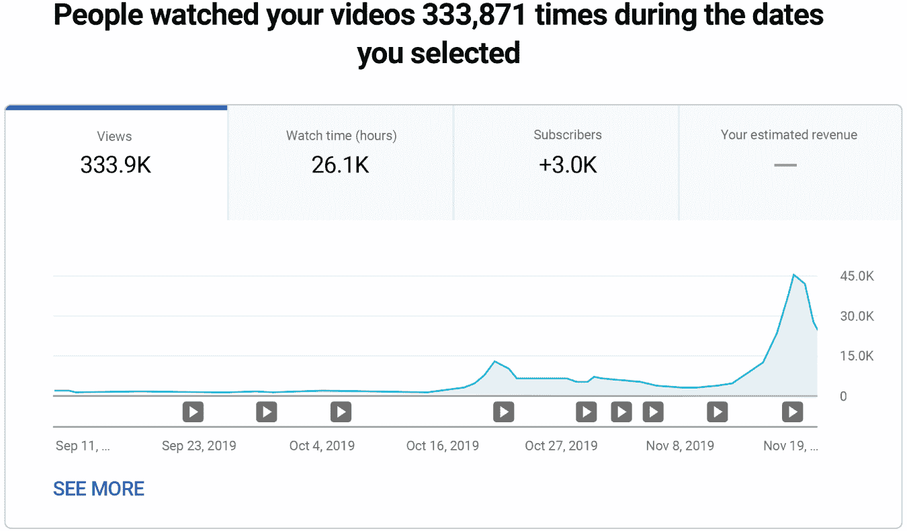

**图 17.2** 90 天

**图 17.3** 4 个月

**图 17.4** 6 个月

看看图 17.5 中的第一个小颠簸（箭头指向它）。这是在图 17.1 中看起来很大的峰值。你可以看到，桶策略会随着时间的推移和你在该桶中发布更多视频而不断增长。

**图 17.5** **1 年**

### 如何创建桶

如何将视频“放入桶中”？一旦您按主题或主题对内容桶进行了标记，请确保分组在一起的视频具有相似的元数据。它们应该具有相似的标题，关键字，描述和标签。视频的结构也应该类似。框架，节奏和编辑应该遵循特定的模式。

YouTube 过去只推荐精确的内容匹配作为建议。但他们发现，为了让观众在 YouTube 上停留更长时间，他们需要让观众遵循三条路径之一：兔子洞，类似视频和个性化的观众。 “兔子洞”推荐会让观众深入一个主题或一种类型的视频。类似视频的推荐包括高度相关但不像兔子洞类型那样相关的视频。这些视频有自然的关系，无论是查看数据还是主题数据。个性化的观众类型会根据观众过去的观看和订阅模式，推荐观众已经参与但与他们当前观看的内容无关但他们可能会观看的内容。

您希望您的内容相关，以便算法会一起推荐它。您事先建立的连接使 YouTube 更容易找到您的内容并将其放在人们会看到的地方。如果您只有一个桶，您的内容可能会起飞，但最终会减速，因为 YouTube 没有足够的内容可以以多种方式推荐。人们喜欢各种各样的东西，不仅仅是每天都是饼干，记住吗？这就是为什么桶在今天的 YouTube 上运作得如此顺利。

举个真实世界的例子，让我们看看我的一个客户 Devin Stone 的频道*Legal Eagle*。Devin 是华盛顿特区的一名民事诉讼律师，他的使命是帮助普通人解释日常法律和法律问题。他了解他的视频桶，每当他制作新视频时，它总是符合其中之一。Devin 的桶包括以下内容，并在图 17.6 中显示：

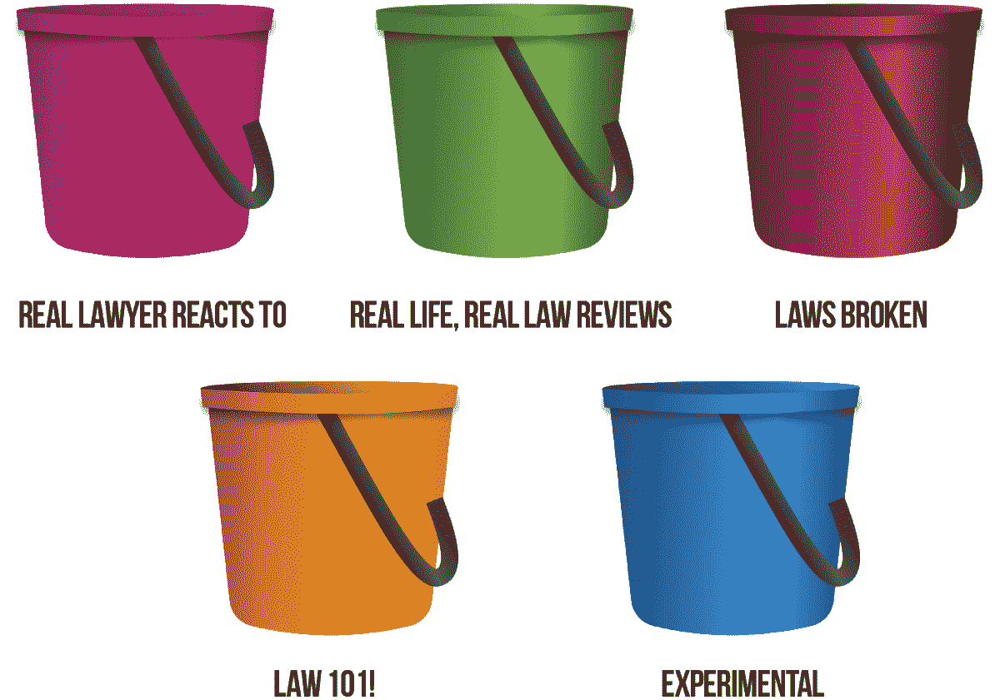

**图 17.6** ***Legal Eagle*桶**

+   真实律师对 _____ 做出反应

+   真实生活，真实法律评论

+   真实律师回应 ____

+   违反的法律 ____

+   法律 101！

+   真实律师对抗

+   实验

去看 Devin 的一个视频，然后滚动到建议的反馈。接下来的视频很可能是另一个*Legal Eagle*视频，与正在播放的视频属于同一类别。第二个位置可能被他的频道库的播放列表占据，第三个位置可能是当前桶内的另一个视频。在第十一章中，我解释了 Devin 如何找到了如何触及比他一直在创作的法学生更广泛的受众。桶为他改变了游戏，帮助他触及更多的主流受众。

当您将内容写下并将其分成类别时，更容易进行头脑风暴。当列表就在您面前时，新的内容想法更容易袭来。您还可以看到您可能缺少内容的地方。您也可以创建适合多个桶的视频。事实上，跨界是很棒的。MrBeast 做了很多“挑战”类型的视频，很容易命中多个桶。这很棒，因为您可以使用关键字将桶连接起来，以获得更多推荐您的内容。

有一个全面的内容策略会比一个单一主题的奇迹更能吸引观众的注意力，这是有道理的，不是吗？在创建内容桶列表时，您可能会发现您的频道并不像您想象的那样多样化。您可能会意识到您只有一种类型的桶。您可能会发现您有一个并不真正起作用的桶。您可能会看到一个明显的疏忽，并能够创建一个给您的频道带来您一直想要的提升的新桶。

所有这一切的目的是使你的内容创作策略更容易、更有效地吸引和保留观众。一个好的分组策略提供了吸引忠实观众的所有元素。忠实观众成为忠于你品牌的社区的一部分。YouTube 内容创作者还能想要什么呢？## 保持简单

YouTube 创作者很容易陷入内容策略的困境。是的，计划很重要，实施利用数据的策略也很重要，但有时答案是保持简单。只要记得为观众和算法制定策略，你就会没问题。优化移动端，并在你的内容之间建立数据关系，这样 YouTube 就会继续向观众推荐你。不要忘记本章标题的第一部分：创造。保持内容新鲜和有趣始终是最好的策略。## 行动练习

+   任务 1：查看你的视频库，并将相似的视频分组在一起。

+   任务 2：按主题为这些视频分组贴上标签。这些就成为了你的分组。

+   任务 3：使用四个 W（第十四章的行动练习）分析你的视频分组。

+   任务 4：通过查找点击率和平均观看时长最高的视频标题和缩略图，分析每个分组中的模式。

+   任务 5：计划、创建并上传一个新视频，该视频将属于你的某个分组。

获取配套工作手册并查找更多资源，请访问[www.ytformulabook.com](http://www.ytformulabook.com)。

# 18 围绕你的内容建立社区

在我的职业生涯中，我看过*很多*在线内容，有些令人惊叹，有些令人痛苦。我想知道为什么有些内容表现良好，而有些则不尽人意。这让我学会了观察有效模式。我开始注意到某些品牌或人的内容几乎每次都很成功，所以我深入研究了原因。当然，视频的制作质量很重要，但我发现最重要的是与观众的关系，而不是视频本身。当内容围绕着忠实的社区建立时，其表现一直比其他内容更好。

社区就是一切。人类需要彼此；我们渴望以各种方式建立联系。我们需要归属感。我们想成为比自己更大的一部分。我们喜欢成为团队的一部分，成为乐队的粉丝团成员，在会议和体育赛事上与志同道合的人见面，并在网上与其他人交谈。这些社区可以像国家一样广泛，也可以像喜欢小马宝莉的男性自称“Bronies”（请参阅第十二章中的有趣故事）一样具体。你可以加入一个小型的本地服务俱乐部，在假期帮助有需要的家庭，或者加入拥有数百万成员的国际扶轮社。有一本关于建立在线社区的精彩书籍，名为*Superfans*。这本书是我朋友帕特·弗林写的。帕特的见解在开发和激活在线观众方面非常准确。我强烈建议你在阅读本书后阅读这本书。

作为 YouTube 创作者，无论我们的频道属于哪种类型，我们都需要建立自己的社区。但是如何做到呢？建立社区需要什么？当我与客户合作时，我总是让他们在创建更多内容之前制定建立粉丝群的计划。当然，你必须有内容让他们分享，但你要确保你为他们专门创作内容。如果你不先了解他们，就无法做到这一点。你如何了解他们？在之前的章节中，我们谈到了观众角色和真正理解你的观众的需求。一旦你了解了你的观众，你就准备好将他们转化为围绕你的内容忠实的社区。

为了帮助解释，让我告诉你我和我的合作伙伴是如何围绕一部名为*被选者*的关于耶稣基督生平的电视剧建立忠实粉丝群的，而这与宗教无关。我与每个客户合作都要求他们阅读一本名为*原始品牌*的书，它教授了社区建设的基本原理。这本书是帕特里克·汉隆在 2006 年写的，至今在每一次趋势和技术变化中都保持着相关性。

当我的新搭档达拉斯·詹金斯和我联系上时，我们谈论的第一件事之一就是建立观众群。我教达拉斯*原始品牌*的基本原理，并鼓励他阅读这本书，因为我们着手创建一种文化。达拉斯完全赞同*原始品牌*，因为社区建设将是我们为这个项目筹集资金的最佳方式——而我们需要筹集大量资金。我们谈论了拥有忠实社区的品牌，如苹果或特斯拉，甚至像感恩死者和星际迷般的狂热追随者。我们需要遵循他们获取忠实粉丝的模式。

在这本书中，我的好朋友帕特里克提醒我们，人类只是想要感到被包容、被认可和被接受。我们想要属于某个地方，知道有人和我们一样。我们需要感觉自己不是孤独的。社区提供了这种归属感，但它们也带有自己的一套规则、语言和身份。达拉斯和我分析了我们的化身是谁，并列出了将其打造成*被选者*忠实文化所需的步骤。我们知道找到“我们的人”对我们来说有多么重要。我们需要一个充满激情的社交军队，他们能看到我们的愿景和使命，并将其视为自己的。一旦他们拥有了这个项目，我们知道他们会捐款，但更重要的是，他们会分享和推广项目给其他人，他们会加入并进一步推动事业。

让我一步一步地带你了解*原始品牌*的基本原理，以及我们如何将它们应用到*被选者*的社区建设战略中。有七个基本原理：创世故事、信条、图标、仪式、神圣词汇或词汇表、非信徒和领袖。（也不要错过额外的基本原理。）

## 创世故事

首先，我们需要讲述我们的创世故事。帕特里克告诉我们，创世故事是品牌叙事的开始。作为人类，我们想知道我们是谁，我们来自哪里，我们将去往何处。作为社区，同样如此。人们想要了解公司、组织、产品甚至 YouTube 创作者背后的故事，以便选择是否成为支持者。仅仅因为这是“商业”，并不意味着人们不希望它变得个人化。当人们看到历史中的“故事”部分时，它以有意义的方式将他们与某些东西联系起来。它需要是个人的。帕特里克称创世故事为遗产，这唤起了代代相传的家庭或团体归属感。遗产意味着留下持久的影响，而历史只是关于过去的事实。

苹果公司是一个有着良好创世故事的品牌的著名例子。大多数人都听说过两位史蒂夫——乔布斯和沃兹尼亚克——他们在乔布斯的童年家中创办了这家公司。他们卖掉了一台计算器和一辆大众小货车，用来购买零件并组装第一批上市的苹果电脑。他们将公司命名为苹果，因为乔布斯最近在俄勒冈的一个苹果园里度过了一段时间。人们喜欢这个创世故事。

我和达拉斯，以及我们的分销合作伙伴杰弗里·哈蒙和尼尔·哈蒙，记录下了我们的想法、价值观、激情和我们的动力。如果我们对这个项目充满激情，那一定会有一些人能够产生共鸣——那些对同样事物充满激情的人。我们知道，如果他们能看到我们的愿景，他们也会想成为其中的一部分。我们已经知道我们的理想化身是谁，所以我们开始制作能传播我们的信息并引起共鸣的内容。《被选者》的试播集通过一个残疾牧羊人的视角讲述了耶稣基督的诞生故事。这在全世界范围内引起了很多人的激情和兴奋。现在他们已经看到我们的作品，我们需要向他们展示我们是谁，以及我们是如何开始覆盖建立忠诚社区的第一个基本。

我们的创始故事视频《被选者背后的故事》长达九分钟，以达拉斯解释一个真实的个人时刻开始。他坐在家里，职业生涯最糟糕的一天，对最近一部电影的失败感到绝望，当时他清晰地回忆起一则圣经故事。那是耶稣用几个面包和几条鱼喂饱了 5000 人的故事。达拉斯解释说，他知道上帝想让他传播耶稣基督的信息，但当时他不知道这意味着什么。所以他决定把自己的面包和鱼带到桌子上，知道上帝会增加他的努力。

在与上帝（和他的妻子）进行这次真诚的交谈后不久，达拉斯收到了一位朋友关于他的工作是“带来面包和鱼”的直接信息。当达拉斯问他的朋友为什么在那个特定的时候对他说这句话时，朋友回答说：“不是我……我觉得现在是时候告诉你。”达拉斯立即告诉我们的观众，这部耶稣系列是如何诞生的，将他们带入我们的动力源。

在我们的创始故事中，杰弗里和尼尔解释了他们是如何被这个项目吸引并加入《被选者》的分销公司 VidAngel 的。然后我讲述了我是如何加入这个项目以及为什么对我来说意义重大。我说我觉得我一生所做的一切都是为了这个项目，我真的相信。需要明确的是，我们创始故事中的内容不是旨在收集数字的脚本；它真正地 100%反映了我们所有人是如何对《被选者》充满激情的。我们希望人们知道，在这个节目的幕后并不是一群呆板的商人。我们成为一个团队，是因为我们都在为传播我们对这个信息的激情这一共同目标而努力。

我们的项目收到了比我们想象的更多的资金捐赠。因此，我们重新利用了我们的创始故事视频，以表达我们对压倒性回应的感激之情。这帮助我们的追随者看到钱花在了哪里，以及对我们来说是很重要的。在延长的视频中，达拉斯分享了持续的众筹活动的结果。他在视频结束时说，我们的团队都带来了我们的面包和鱼，投资者也带来了他们的面包和鱼，上帝会增加我们的努力。视频结束时，观众清楚地知道我们来自哪里，我们为什么在这里，以及他们如何成为我们充满激情的社区的一部分。

创始故事为观众提供了包容，将“我的愿景”变成“我们的愿景”。他们将你的激情视为自己的，并希望与他们的影响范围分享。然后他们的影响范围也会被激情所感染，也希望分享，这就是内容和社区传播的方式。

好的品牌总是讲述他们的创始故事。当人们知道你来自何处以及为什么，他们就准备好知道你到底是什么了，这是第二个基本。

## 信条

第二个基本原则是你的信条。这是你的信仰系统。如果你的价值观和原则对你来说不够清晰，那么它们怎么能清晰到足以让你的追随者知道他们为什么想要加入你的社区呢？他们想知道你相信什么，以及你们聚集在一起的原因。根据帕特里克的说法，“信条是每个人都想要与之联系的中心思想。”一些社区的第一个标识就是他们的信条。想想“Semper Fi”和海军陆战队，或者耐克的“只管去做”。如果你知道这个品牌，你就能背诵出信条。我们在*The Chosen*的信条随着我们社区的成长而不断发展。它起初是一个集结的呼声。我们不想让好莱坞的任何人控制创意过程；我们想要掌握黄金来创造内容，因为这样我们就可以根据自己的规则创作。这就是为什么我们需要众筹来实现。

随着*The Chosen*社区的壮大，我们的信条也根据与追随者的反馈和互动而发生了变化。在第一季的第 7 集中，彼得反对耶稣呼召马太离开一切跟随他。马太是彼得的税吏，他需要他留下。他告诉耶稣，马太作为税吏有理由留下，马太的情况与他自己的情况不同。耶稣回答说：“习惯于不同”，这成为了观众非常喜欢的口号。所以它成为了一个信条。我们后来把它印在了商品上。同样的情况也发生在“狂热追剧耶稣”这个短语上。我们的观众对此非常感兴趣，我们也把它融入了我们的信条和产品中。有时信条来自社区，被品牌或创作者采纳，有时它来自自上而下。这是一个有机的过程，你需要意识到这一点，因为你要凝聚你的社区。

## 图标

现在他们知道你来自哪里，你的立场是什么，他们需要知道如何识别你，这就引出了第三个基本原则：图标。图标是你品牌的任何代表。帕特里克的解释很简单，但很完美：“图标提醒我们我们在这个地方，而不是那个地方。”就像当你走进一家鞋类和服装店，看到每个产品上都印有一个“勾”，我甚至都不用告诉你你在耐克店，而不是阿迪达斯或锐步。图标已经深深地植入我们的心中。米老鼠的耳朵=迪士尼。美国国旗=美国、爱国主义、自豪感等等。正如你从最后一个例子中看到的，图标不仅可以与地方或公司相关联，还可以代表价值观、愿景和情感。形状、声音、气味和味道也都可以成为图标。帕特里克还说，图标是“我们立刻能够识别并对其产生某种感觉的快速意义集中体”。它们可以是标志、包装、产品设计、体验和环境。

对于*The Chosen*来说，“习惯于不同”这个短语反映了我们的一个图标。在我们的片头字幕中，有一群灰色的鱼在一个圈内游动，而只有几条蓝绿色的鱼在相反的方向逆流而上。这象征着耶稣基督和他的追随者朝着与大多数人完全不同的方向前进。这个图标也可以在我们的产品上找到。当我们的社区看到它时，他们会认同它，并将其与社区联系起来。

达拉斯和我发现我们都是一位名叫索尔·巴斯的平面设计师兼电影制作人的忠实粉丝，他为许多知名电影海报和电影片头设计了标志性的作品。他的作品在 20 世纪 50 年代开始流行，跨越了四十年，包括《精神病患者》、《黄金臂的人》、《闪灵》、《西区故事》和《大》等作品。我们想要为我们的片头序列捕捉到索尔·巴斯的精髓，而 Voltage 的埃里克·福尔斯正是这样的人。他帮助我们创造了一个简单而直接的图标，但却引发了深度和意义。见图 18.1。

对我们来说，这个图标的完成非常重要。它必须以正确的方式向正确的人传达我们的信息。埃里克在满足我们的标准方面做得很好，我们的社区喜欢这个图标。

我们的图标列表还包括与该系列有关的人物。当我们的社区看到演员乔纳森·鲁米扮演耶稣的角色，无论是在视频中还是缩略图上，他们都将他视为我们的图标之一。达拉斯作为我们社交媒体存在的代表也是一个图标。当我们的观众看到这些人的面孔和其他演员的面孔，或者在屏幕上看到鱼的时候，他们知道这是我们。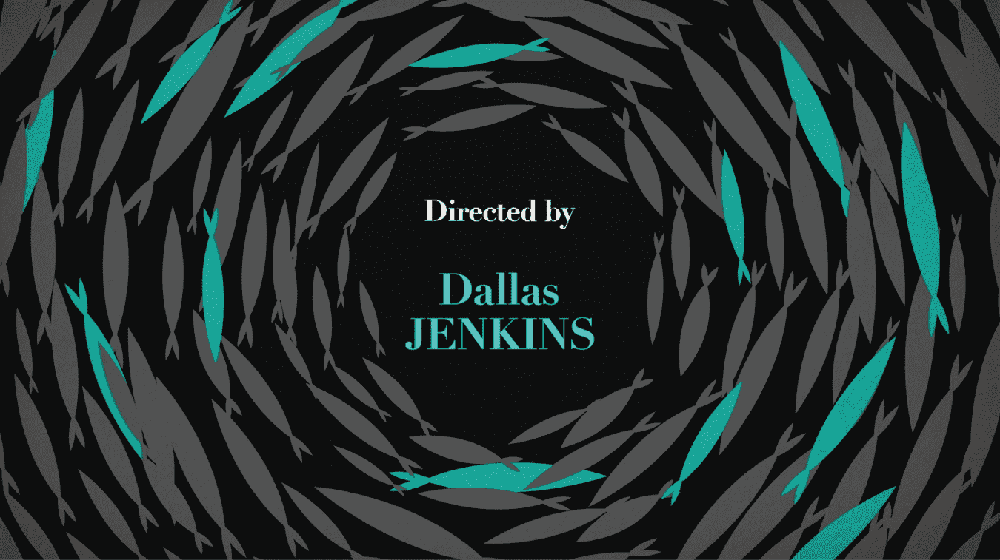

**图 18.1** ***被选中的***

## 仪式

现在人们知道如何识别你，他们需要知道你是如何运作和做什么的。*原始品牌*中的第四个基本要素是仪式。仪式是你的流程、方法和程序。帕特里克称仪式为运动中的意义。俗语中，仪式就是“我们的方式”。人们已经知道你的情况，现在他们需要看到你是如何做的。一个有趣的经典例子是 20 世纪 60 年代的《蝙蝠侠》电视系列。在每一集的结尾，旁白会说：“明天继续收看！同一蝙蝠时间！同一蝙蝠频道！”这个仪式被该节目的粉丝期待和喜爱。

在*被选中的*系列中，人们知道我们以及何时可以期待什么。我们向他们展示创作的过程——一切是如何组合在一起的。我们展示了很多幕后花絮。这是创作者在创作过程中的一种不同寻常的方法，但对我们的社区来说效果非常好。这为我们提供了一种与人们分享我们的成功和失望的方式。这对我们的观众来说已经成为一个重要的仪式。

在新冠疫情期间，我们决定进行编程仪式，每晚提供八天的免费剧集。然后，我们会在每集结束时进行直播，保持参与度和留存率。达拉斯会欢迎观众，介绍剧集，预告演员采访，播放剧集，讨论剧集中的有趣时刻，进行演员采访，预告下一集，并结束。这成为我们观众的仪式，随着一周的进行，他们不断增加，甚至登上了 YouTube 的热门页面。这是一件大事。我们的频道基本上不存在，然后在 14 天内又增加了 146,886 名订阅者。我们为追随者制定的其他仪式包括众筹、社交存在和倡导。每个达成的目标和里程碑都成为我们与社区分享的仪式。## 神圣的词汇/词典

社区建设的第五个基本要素是人们的交谈方式。这被称为神圣的词语或词典。词语可以识别我们。无论你说英语、西班牙语、普通话还是克林贡语，这种语言都将你视为说话者文化的一部分或特定地方的公民。在体育、公司、游戏、音乐和在线平台的社区中也是如此。帕特里克最喜欢的神圣词汇的例子是在星巴克点一杯饮料：冰镇大杯香草拿铁。你必须知道这些词语，这样他们才能准确地为你点单。甚至家庭也有他们自己的神圣词汇。如果我对家人说“我爱你六次”，或者“要振作”，这对我们来说会有特定的含义，外人是无法理解的。

帕特里克解释说，你同时属于许多社区。你可以是音乐家、银行家、艺术家或扑克玩家……或者你可以是所有这些。你对所有这些都有不同的词语和联系，你不能混淆它们。你不会把摇滚术语带到银行工作中。当你得到一份新工作时，你必须学会所有的词汇和笑话，并学会适应那个空间。

信条和神圣的话语可以融合，所以我们的“适应不同”的信条也属于*The Chosen*的词汇。不属于我们社区的人不理解这意味着什么。知道正确的词语证明你是内部人。如果你不明白，你就是外部人。拥有外部人实际上是很好的——当一个社区的词汇被口头、虚拟地或在商品上分享时，它让外部人有机会询问它的含义。社区成员可以传播品牌意识，从而吸引更多的人加入到这个群体中。

达拉斯想出了一个小小的歌谣，鼓励人们为《被选者》做出贡献或分享。他会唱着这句话：“[www.thechosen.tv](http://www.thechosen.tv)…” 这演变成了“[www.thechosen.tv](http://www.thechosen.tv)斜杠 merch”或“…斜杠 store”。这些歌谣是我们词汇的一部分。我们甚至有粉丝寄来他们自己唱这个歌谣的视频。达拉斯有时在视频结束时会提醒我们的观众我们的创世纪和信条，说：“你的工作不是喂饱五千人，只是提供饼和鱼。”## 非信徒

第六，一个社区如果没有仇恨者会是什么样子。在*原始品牌*中，他们被称为非信徒。他们是你所代表的、你所相信的和你所做的对立文化。在*The Chosen*中，非信徒不一定是非基督徒，但他们不相信这个项目或这个信息。我们最大的非信徒之一是名义上的基督徒，但他们不同意我们的信息或传递方式。我们因为我们的诗意许可而遭受了很多抨击。有些人认为它应该完全按照他们版本的圣经或他们宗教的教义来历史准确。

当涉及到*The Chosen*的故事情节时，我们的团队非常细致。我们想要讲述耶稣基督在圣经福音书中的生活，但我们也参考了历史作品和学者，以及来自许多不同宗教的领袖和学者。我们非常小心地保持我们的信息非宗派性。然而，无论我们如何小心地涉足这些领域，总会有仇恨者。我们对此无所谓。当人们憎恨时，人们会辩护。分化往往会为社区注入能量，并帮助它更加繁荣。当他们为内容辩护时，人们会更加投入其中。社区与仇恨者的经典例子包括民主党与共和党，或者苹果与安卓。## 领袖

*原始品牌*中的最后一个元素是领袖。社区需要有一个发言人。表现良好的品牌和渠道都有一个明确定义的领袖。领袖发出集结号，忠实的追随者会响应。我最终说服达拉斯成为*The Chosen*社区的领袖或影响者，尽管他在这个问题上和我争论了几年。他最终同意了，并进行了一次直播，要求我们的追随者购买商品。他唱着他的小歌谣，你知道我们很快就有了很多钱进账。这对达拉斯来说是一个强有力的肯定，他需要成为我们品牌的领袖。他在很多方面都是我们的领袖：他是导演，他是作家——他需要成为我们的领袖是很合理的。这是我们真正增长并将我们的信息传播给大众所需要的触发点。其他社区领袖的例子包括比尔·盖茨的微软和埃隆·马斯克的特斯拉和 SpaceX。他们是品牌的代表，这完全奏效。

当你把这七个基本要素结合在一起，你就能创造一个人们能够认同和连接的叙事。你可以围绕产品和服务、个性或社交媒体影响者、同事或员工等建立一个社区。如果你有一个信仰体系，并且能够以建立社区的方式分享你的信仰，那么你就比那些没有有效建立社区的竞争对手具有优势。## 分发

在 Patrick 2015 年在[medium.com](http://medium.com)上写的一篇文章中，他补充说社区建设的第八个基本原则是分发。你必须将你的信息传达给人们。你要在哪里做到这一点？什么元素在什么平台上起作用？你在 Facebook 上讲述你的创世故事吗？你的图标在实体产品和在线上是什么样子？你的社区是否在 Instagram 上花费了大量时间？Twitter 呢？了解你的人在哪里，以及如何在那里实施你的品牌战略。有一些社交平台和在线社区，你的目标受众已经聚集在那里，所以去他们所在的地方。这个概念似乎很明显，但我想强调一下，因为重要的是你要去你的受众所在的地方。如果你有一个游戏受众，你不会去 Pinterest，你会去 Twitch。许多品牌仍在试图将方形钉子塞进圆孔，他们认为如果他们足够努力或者花足够多的钱，就会奏效。不要把你的内容推到不适合的地方。去你的受众所在的地方。

## 第九个基本原则

我们已经讨论了社区建设的七（或八）个基本原则，但还有一个重要的元素我们需要解决。这一点非常重要，以至于我甚至会称它为*原始品牌*的第九个基本原则。当你完成了所有步骤，围绕你的内容建立了一个忠诚的社区，那么在这个社区中应该有一种有机的吸引力，吸引着更多的人加入进来，他们走得更远。这些人不仅仅是消费你的内容；他们成为了超级粉丝。他们基本上是你的粉丝俱乐部主席类型。他们成为了你品牌的传教士、促进者和组织者。这些不仅仅是“从不错过一集”的人；这些人把业余时间花在传播你的理念，甚至围绕你的品牌创作自己的内容。这些人制作粉丝艺术并发送给你。他们用乐高积木复制你的图标或某一集的场景。他们围绕你的品牌组织活动。他们拥有你的愿景，就好像它一直是他们的一样。

我们联系了一个成为*被选者*的追随者和倡导者的人，并问他是否愿意帮助我们管理评论。他建议我们创建一个 Facebook 小组，并拍卖*被选者*的签名商品，以帮助我们的众筹活动。这是一个很好的主意，为我们筹集了数万美元。如果我们没有将这位粉丝转变为倡导者融入我们的社区建设中，我们就不会赚到这笔钱。拥抱他们并奖励他们，因为他们将帮助你成长。

超级粉丝的终极例子是以“死者头”为昵称而闻名。他们是感恩的死者乐队的忠实追随者，成为了一个有机的亚文化。他们嫁入了共同的理想和仪式，随着乐队一起巡回演出，有时连续几年。他们甚至在舞台上实时影响乐队的歌曲选择。乐队允许死者头录制音乐会，这在智能手机时代之前是独一无二的。音乐会录音交易成为了死者头的仪式，延长了乐队的忠诚度和长久性，即使在乐队的主唱杰里·加西亚去世和乐队解散之后。成为死者头是一种生活方式，而不是周末的音乐会活动。并不是说死者头主义应该是你的目标，但这是你在创建自己的追随者时要牢记的超级忠诚度的例子。

让我们从故事元素的角度来看看。你还记得第十三章的叙述模式吗？在你讲述一个好故事之后，你的“出其不意”的元素就是“goosh”，或者是奖励。这是结尾的惊喜，让他们成为重复观众。如果我们把你的社区建设与叙述模式联系起来，超级粉丝就像“goosh”。他们是让你的品牌有所不同的奖励特色。当你看到这些人在你的社区中扮演角色时，你就知道你的社区建设活动是成功的。当你转化了这些人，你的运动就会在没有领袖的情况下继续进行；他们本身就是一个有机体。如果你不断用新内容滋养他们的热情，甚至是各种媒介的内容，他们会把你的内容推向世界。你必须滋养粉丝。肯定他们，让他们感到被看到和对你很重要。给他们的粉丝艺术作品一个喊话，告诉他们你欣赏他们的爱和支持。你必须认可他们，否则他们会断开联系。## 人就是品牌

你的社区是你的快乐圈子。他们对你或你的品牌、你的信仰和你的信息有情感上的依恋。要明确，你并不是在操纵任何人。这实际上与传统的操纵性广告方法相悖。当你试图建立一个忠诚的社区时，不要改变你自己，只需倾听你的人们，并通过给予他们更多他们所连接的东西来回应。

前客户史蒂文·夏普·纳尔逊和乔恩·施密特，也就是“钢琴家”，拥有一个非常忠诚的社区。他们的 YouTube 频道总共有 19 亿次观看，他们的视频每天被观看超过 300 万次。他们的热门视频展示了他们在世界各地演奏美妙的音乐。我看到他们在视频中进行了一次惊人的表演，然后我们决定拍摄一个有趣的结尾，其中包括一场打斗。大提琴弓被用作剑，钢琴被用作打击表面。这是非常棒的内容。然而，当史蒂文和乔恩谈论这件事时，他们决定不包括结尾。我坚持要保留它，因为我知道这是病毒式的内容，但他们反对。他们了解他们的社区，他们知道这对他们的社区来说是错误的内容，尽管它是很棒的内容。所以他们做了一个普通的“无聊”结尾。向史蒂文和乔恩致敬，他们保护了他们的信息和粉丝。这让我更加了解了如何保持品牌一致，不偏离你的信息，即使你有可能大获成功的内容。

消费主义中的沟通过去是自上而下的：制造商会告诉消费者关于产品。但现在情况已经颠倒。消费者处于上风，他们在说：“嘿，我有钱，来找我”，品牌必须做出回应才能获得业务。帕特里克说：“今天最大的转变是，品牌过去是关于产品和服务，但今天‘品牌’是关于购买这些产品和服务的人。”一切都关乎社区。

帕特里克曾经在一个活动上演讲，有一个观众真的对他的信息深有感触。他回到办公室，想出了*原始品牌*的七个基本原则如何与他的业务相关。他通过建立社区改变了他的公司。公司的增长呈指数级增长，五年后以 1200 万美元的价格出售。买家随后在九个月后以 1.5 亿美元的价格出售了公司。他们将公司的价值归因于其社区，称其无法复制。

*Primal Branding*的信息很明确：相信你所做的事情。知道你来自哪里，你是谁。找出一种方式来识别和宣布自己，这样别人就能找到你并与你产生共鸣。为他人创造一种仪式，为自己的社区创造词汇或语言。确保人们知道你不是什么样的。并引领道路。你不必像苹果公司那样拥有庞大的社区来改变世界，你只需要团结一致。如果你拥有一个社区的正确组成部分，你就会成功，无论你的频道有多大或多小，你都可以真正改变世界。有些频道我就是不明白，所以我不是他们社区的一部分，但有很多人确实明白并且想成为其中的一部分。对我来说也是如此，有些我在意的群体别人可能不在意。我们都有自己的位置；我们都属于某个地方。

我鼓励大家都分析一下自己的社区。你有发展忠实的追随者吗？你是否正在利用建立社区的基本原则？你可能认为自己没有正确的流派或内容来获得忠实的追随者，但请记住，即使 Squatty Potty 也找到了一个愿意分享他们信息的独特观众。如果 Bronies 可以拥有自己的社区，你也可以。## 行动练习

+   **任务 1：**利用你的观众角色，制定一个与你最忠实的追随者建立社区的计划。问问自己：

    +   你的社区每个月会如何与观众互动？

    +   你的社区每个月会采取什么行动步骤？

+   **任务 2：**认识并联系一些最忠实的追随者，并邀请他们成为你的频道管理员。

获取配套工作手册，并在[www.ytformulabook.com](http://www.ytformulabook.com)上找到更多资源。

# ## 如何上传视频

优化、发布和推广你的视频

大多数内容创作者上传视频后就让它自行发展，但上传并不是结束。如果你真的想在 YouTube 上取得成功，你必须积极地观察并回应上传后的数据。你的首要目标是迅速吸引到正确类型的观众，这样算法才能识别他们并知道该推送给谁。当你发布新视频时，你应该把上传视为一个序列的一部分。让我们逐步了解如何上传视频到 YouTube。然后我们可以开始优化、发布和推广你的内容的有趣部分。

在你的 YouTube 创作者工作室中，点击右上角的图标，选择上传视频的选项。然后你可以通过两种方式上传视频：拖放或点击选择文件。你实际上可以一次上传多达 15 个视频，这可以节省大量时间。上传所需的时间显然取决于你的文件大小和互联网速度。一旦处理时间结束，你需要将默认标题更改为你在[第十五章]中精心制作的自定义标题。然后你需要填写描述，其中也很重要包括能够实现标题和视频承诺的词语。接下来，将自动生成的缩略图更改为你花了很多时间创建的自定义缩略图（也来自[第十五章]）。

在你插入了令人惊叹的可点击缩略图之后，你可以选择将视频添加到哪个播放列表。然后你会看到一个相当新的上传功能：选择你的观众。YouTube 增加了这一步骤，是因为他们与《儿童在线隐私保护法》（COPPA）有问题。他们只需要知道你的内容是否面向儿童。在这个功能中，你还可以指定你的内容是否适合成年观众。填写这部分非常重要，这样你就不会被取消广告。

在屏幕上的这一点上，许多创作者会跳过接下来的部分，“更多选项”。继续点击，这样你就可以指定你的内容是否包含集成品牌交易、赞助或其他付费推广。在这里，你还可以添加标签。首先包括视频标题和描述中的关键词标签。然后你可以选择你的语言和关闭字幕（CC）偏好。我通常会跳过下一个选项，因为它要求视频的录制日期和位置，这并不重要；它不会影响算法或你的视频曝光。在许可和分发部分，你可以选择标准的 YouTube 许可证，保护你的内容免受版权侵犯，或者你可以选择创意共享，让任何人都可以自由使用你的内容而不受法律制裁。

确保下面两个框都被勾选上，这样你就可以在其他网站上嵌入视频，更重要的是，你的订阅者会收到通知，知道你有新视频了。现在你可以选择你的类别和评论偏好了。如果你想要审核潜在的不适当评论，或者干脆关闭评论，就在这里勾选那个框。

在这一点上，你已经完成了“详细信息”选项卡，准备好去“货币化”选项卡了。如果你有货币化可用，你可以选择你想要在你的内容中运行的广告类型，无论是悬浮广告、展示广告，还是可跳过/不可跳过的广告。你还可以选择是否要在视频之前、之后或者视频长度超过 10 分钟时在视频中播放广告。

如果你是 YouTube 合作伙伴，并且可以在你的内容中播放广告，接下来的部分就很重要。它可以帮助你缩小广告适用性的范围。再次填写正确，以免被取消货币化。你可以具体指定你的内容中是否包含成人内容、暴力、有害或危险行为、与毒品相关的内容、仇恨内容、与枪支相关的内容，或者敏感问题。这里有一个选项可以点击“以上都没有”，但如果你的内容中有任何值得质疑的东西，不要点击它，因为算法会发现它，你很可能会收到社区准则警告，这绝对不是你想要的。再次强调，不要冒险被取消货币化。

我们快要完成了！你现在可以指定你想要添加的视频元素，比如结束屏幕和卡片。结束屏幕在视频结束时播放，而卡片可以随时添加。一旦你添加完你想要的东西，点击“返回 YouTube 工作室”按钮。

你已经到达最后一个选项卡：可见性。大多数时候，你希望你的视频是公开的，但有时你可能会选择其他选项之一，比如私人的、未公开的，或者仅限会员。你还会在这个屏幕上看到视频链接。你需要点击该链接，进入视频设置，检查视频是否已完全处理并准备好高分辨率。检查完后，你可以安排视频在特定日期和时间发布。我几乎总是安排视频。这让我有自由的时间来上传视频，不受时间的束缚。

我推荐给每个创作者的一个很棒的服务叫做 TubeBuddy。TubeBuddy 是一个扩展程序，提供了许多有用的工具，可以优化你的视频并节省大量时间。当你注册并安装它时，你会看到它可以帮助你简化上传过程和优化视频的所有惊人功能。## 如何优化视频

优化都是关于人和点击的。我可以说一百遍算法的工作是预测观众会观看什么。它会跟踪人们点击和不点击的内容。当你有更高的点击率（CTR）时，这告诉 YouTube 人们实际上对你的内容感兴趣。吸引人们对你的内容感兴趣！

YouTube 上所有表现最好的视频中，有 90%都使用了自定义缩略图。这就是为什么创建一个好的缩略图应该是你的首要考虑。投入精力和时间使它变得更好。这需要比你意识到的时间更长……可能还要更长。

使用颜色让你的缩略图真正突出。必要时使用文字。使用情感，因为它会引起潜在观众的好奇心。始终要诚实。你的缩略图和标题需要真实地反映视频的内容，否则你的平均观看时长可能会很低。使用吸引人点击的标题，吸引人类（而不是机器）。标题的一个好的原则是引人注目但简洁。尽可能将主要关键词放在标题的最前面——这有助于你的排名和推荐。当然，你的标题必须是相关的。耸人听闻、不相关的标题会导致低观看时长。不要忘记你的“buckets”！在标题中使用连接视频到同一类别中其他视频的词语。

描述中的正确关键词将帮助你获得更多的观看次数和在搜索中的可见性。“Above the fold”是描述中最重要的部分，因为这是人们首先看到的，也是算法首先看到的。而“Below the fold”指的是在“显示更多”下面。人们必须点击这里才能看到“below the fold”。在“above the fold”中只有 200 个字，但在“below the fold”中你可以写更多。在描述中，告诉人们可以期待什么，但始终要像人类一样写。算法喜欢人类，记住。在“below the fold”中是放置其他视频链接、社交链接、相关标签和时间戳的好地方。这里需要警告一下，不要一遍又一遍地重复相同的描述；算法不喜欢这样做。

一些创作者不使用卡片和结束屏幕进行优化，我认为这很疯狂。为什么你不想给观众更多观看你内容的方式呢？然而，不要犯把卡片放在视频的前三分之一的错误，因为你不希望观众太快地离开，从而破坏你的观看时长。在你的卡片和结束屏幕中，选择观众更有兴趣的视频。我称之为目标视频。在制作前期考虑你的目标视频、标题和缩略图，因为连接你的数据和你的“buckets”是你的最终目标。我还使用了结束屏幕上的一个功能叫做“最适合观众”，它让算法从我的视频库中选择一个它认为特定观众可能观看的视频。使用这个功能来补充，而不是取代你的目标视频建议。此外，利用最后 8 到 10 秒的时间，口头呼吁观众观看目标视频。即使点击你建议的卡片和结束屏幕的人数比例很低，这仍然是算法正在观察并将奖励的活动。当他们点击你的建议时会发生什么呢？算法会认识到这种联系，并将其放在推荐中。

写相关的标签。标签不如标题、缩略图和描述重要，但它们仍然有帮助，特别是如果一些单词经常被人拼错。对于标签，使用你的主要和次要关键词以及其他相关的词语。标签中的字符数保持在 300 个字符以下。TubeBuddy 是一个很好的工具，可以根据你当前视频的内容为你显示相关的标签。

**技巧 1：**使用闭路字幕（CC）。但不要使用 YouTube 的自动 CC，因为它可能会影响你的排名和 CPM；它并不是很好。有一些服务可以以很低的价格为你做 CC。CC 有助于验证视频智能和自然语言的工作。CC 也会增加你的观看时间。

**技巧 2：**在 TubeBuddy 上使用默认配置文件。这在多年来为我节省了大量时间。它允许您保存最常用的标签和描述，您可以根据当前视频进行调整，但您不必从头开始。##如何发布内容

还记得丹·马克姆在第十七章发布他的足球视频时的发布策略吗？那是一个很好的合作、趋势、支撑和甚至将发布时间精确到小时以最大化他的观众和成功。这对于发布视频非常有用，但当你发布一个频道时，你可以进一步进行。

我一遍又一遍地用 MrBeast 作为要做的示例。他只是知道公式并且做得对。MrBeast 的主要频道做得很好，但他准备开始一个游戏频道。他想围绕*Minecraft*和游戏创建他的新内容，因为那是他开始并花费最多时间的地方。我们开始进行比较分析和研究类似的游戏频道。我们对 YouTube 公式和找到正确的观众非常敏感。他非常小心地不要将主频道的观众推向他的新游戏频道，因为它们是不同的化身。如果你让错误的观众观看你的内容，它会干扰算法。

我们开始在频道发布前几个月创建和测试内容，我们的理想化身最终与我们之前认为的不同。我们根据收集到的数据放弃了以前的策略和内容，重新制定了根据数据面向理想化身的内容。在发布前一个月，我们已经确定了理想化身，并创建了相关内容和计算标题/缩略图组合。我们的主要重点是获得正确的点击。我们的 A/B 分割测试帮助我们确定什么可能有效。由于我们在 YouTube 上的联系，我们能够利用在这一领域取得巨大成功的人。MrBeast 在这个游戏频道上的常规节奏和编辑不起作用，所以看他转变并为这个新频道做一些完全不同的事情是很有趣的。

我们决定每周发布新视频三次，这相当激进，但对于游戏频道来说并不是。我们知道我们有足够的内容可以开始推动，所以我们开始了。我们需要推广内容，但我们等到第三个视频才开始推广。我们所做的就是要求一些大型游戏创作者在他们的社区选项卡中分享我们的视频。这些是我们想要合作的创作者。当我们这样做时，我们的观看量从每天 20 万观看量增加到一天 110 万观看量。我们利用了算法并使用了 YouTube 公式，它起作用了。第二天，我们获得了 160 万观看量，第三天是 170 万。收入也开始进来。

这是为了频道发布，是的，但对于视频发布也适用。给算法提供它正在寻找的内容。不要通过将内容推送给错误的观众在错误的地方，包括您的社交媒体朋友和关注者来混淆它。在 1060 万独立观众中，他们每人观看了四个视频，其中有 1/10 的观众成为了订阅者。这些数字非常好。你需要了解：

+   你的观众

+   好的内容是什么

+   流量和动力推动良好的点击率

+   如何吸引他们的注意并保持他们的参与

+   如何使用桶系统推荐类似的内容，以便获得建议

当你了解这些事情，那么你就了解了利用 YouTube 的力量的公式。

## 如何推广视频

我从 2005 年开始使用 YouTube，每年都会听到一个关于增长的问题：为什么我不能只是运行广告来更快地增长？这个问题的答案很复杂，我希望在本章中能简化。如果你想扩大你的影响力，进行产品推广，或销售商品，运行广告可能非常有效。但成功的广告活动远不止是把钱投入广告中。

我看到很多大品牌把钱投入问题，并希望有一个神奇的解决方案。他们的观看量可能会短暂上升，但视频不一定会转化。这可能是一种虚荣指标，因为广告确实产生了一些结果——就像是一种虚拟的鼓励。当我通过我的机构与客户合作时，我会进行一次又一次的分割测试，运行广告与有机内容对比。对于我做的任何工作，我都希望创建一个 100%转化的广告，而不是解决数字问题的临时措施。我不主张把谷歌的付费策略单独围绕一个内容来进行。这是一种工具，可以放大你的作品，但你必须做对。有机地进行市场营销，并辅之以付费策略，可以提高成功的可能性。## 首先有机地推广

当我帮助制作 Squatty Potty 的病毒广告“这只独角兽改变了我的排便方式”时，我们结合了有机推广和付费策略。我们精心计划并测试了一切。我们的最终版本在发布后表现得更好，因为我们进行了多次测试，知道什么内容在什么观众中表现得更好。如果你想扩大频道，你必须弄清楚谁会点击视频。

为了了解观众，我喜欢看他们在线和不在线时聚集在哪里。我也想知道他们喜欢什么内容和产品。这有助于我知道什么内容对更多人来说是相关的。我也想知道客户的最终目标是什么：当客户的目标是销售时，我会使用不同于他们的目标是扩大观众的付费策略。我宁愿花钱在 100 个相关的渠道上有机地推广，而不是随意花钱。这是如何让忠实的人参与你的内容。## 扩大观众的付费策略

如果客户的目标是吸引更多观众，我会找到一个类似的创作者，与我的客户合作，有机地吸引合适的观众观看我们的新内容。在 YouTube 分析中，你现在可以看到你的交叉观众在“你的观众观看的其他视频”中列出。这让我们很容易看到可以联系的人，建立合作关系。见图 19.1。

我还会查看合适的影响者的旧内容，这些内容与我的客户的新内容相关，并支付他们添加尾屏元素、链接和宣传，引导他们的观众观看我们的内容。当某个影响者的忠实观众观看到该人的内容到最后，并且该影响者推广你的内容或产品时，你更有可能得到你需要的东西，因为他们是通过 YouTube 的生态系统有机地来到这里的。

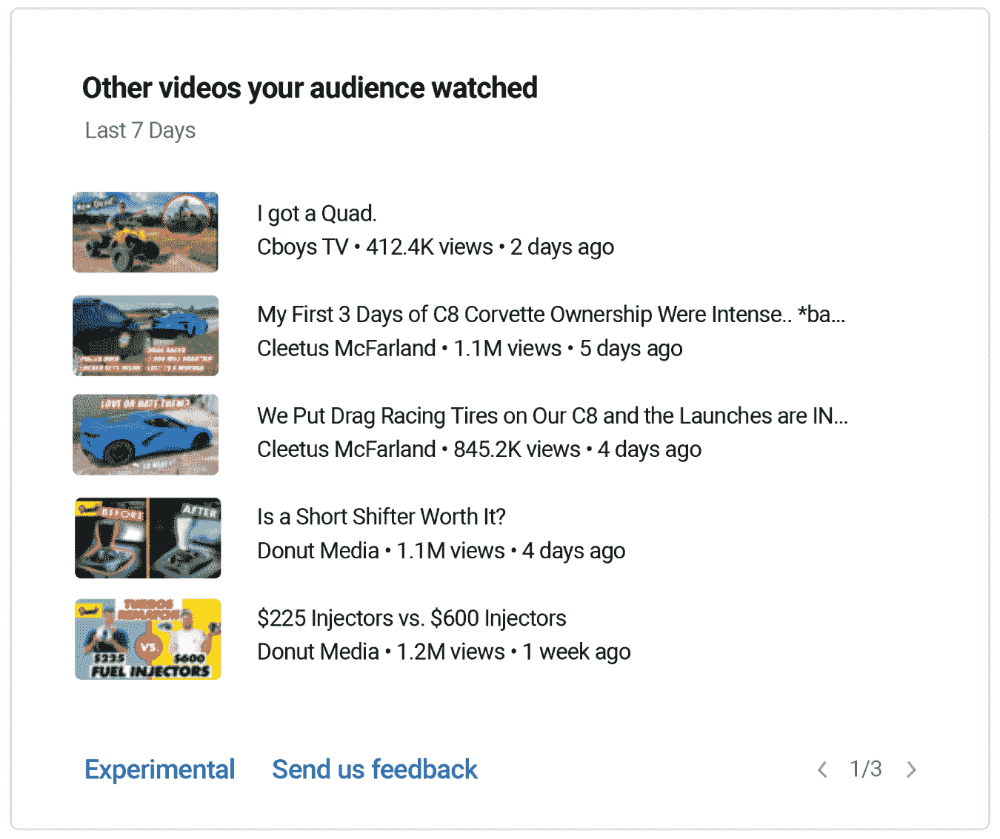

**图 19.1** **你的观众观看的其他视频**

此外，利用社区帖子或故事来吸引更多观看者观看你的新内容。你需要采用这样的综合策略来吸引不同来源的流量观看你的内容。当算法发现观众从多个来源找到你的内容时，它会更多地推荐你的内容。

让我给你一个完美的混合策略的例子。当 BYUtv 的频道*Studio C*刚开始时，我帮助他们进行观众开发，进行侦察和研究，并利用一切可能的工具来尝试找出他们的理想观众是谁。我联系了同卵双生姐妹创作者 Brooklyn 和 Bailey，与*Studio C*合作，因为我注意到我们有一些交叉数据。女孩们实际上是*Studio C*的忠实粉丝，并愿意合作。我们提出进行“一对一”合作，意味着我们将制作两个视频：一个在他们的频道上，我们代替他们制作，一个在我们的频道上。当时，Brooklyn 和 Bailey 有 30 万订阅者，*Studio C*有 2 万。到我们准备推出我们的活动时，Brooklyn 和 Bailey 的订阅者已经接近 100 万。

Brooklyn 和 Bailey 的视频《另一个父母陷阱》是对电影《父母陷阱》的模仿，双胞胎在夏令营中发现了她们的姐妹关系并交换了身份。Brooklyn 到达她爸爸的家，受到了热烈的欢迎，因为爸爸并不知情，而 Bailey 立刻被逮捕，因为妈妈知道她不是 Brooklyn。《Studio C》的视频《晚礼服出错了》中，Brooklyn 和 Bailey 与节目的女演员一起穿着荒谬的晚礼服，让她们的约会对象感到震惊。这个视频目前已经有超过 1100 万次观看。

除了发布了两个视频之外，我使用了一种非常有趣的再营销策略：我拍摄了女孩们谈论她们有多喜欢《Studio C》的片段，并在付费广告活动中使用了这个片段。在 12 天内，《Studio C》获得了来自 Brooklyn 和 Bailey 的推荐的 16.2 万名订阅者。我们还进行了一些有利于双胞胎的活动。这是一个非常成功的双赢局面。

我们有一笔小预算来进行另一种广告再营销策略，我们有针对性地将其推送给了合适的观众。另外 62000 名订阅者来自这次推送。所以，我们又做了一次。为什么不呢？它起作用了！我们等了另外三四个月来积累数据，查看数据，并针对另一个特定的观众群体进行了付费广告策略，这带来了另外 12000 名订阅者。

快进一年。我们决定再次进行一对一的视频活动，与第一次合作类似。我们制作了两个新视频，并采用了相同的策略。这一次，我们的大部分预算都用于内容创作。在 Brooklyn 和 Bailey 的频道上，我们制作了一个名为“高中男友戏剧”的视频，其中*Studio C*的一位演员扮演了被一个女孩甩掉的男朋友，然后立刻找到了另一个看起来和第一个一模一样的女朋友。在*Studio C*的频道上，我们制作了一个名为“舞蹈对决男孩 vs 女孩”的视频，并邀请了 Brooklyn 和 Bailey 作为一个女子团体的一部分，他们和一群男孩（当然都是*Studio C*的演员）进行了尴尬的舞蹈对决。我们同时发布了这两个视频，并看到我们的观看次数再次增长到了百万级别。

Brooklyn 和 Bailey 通过在他们的社交媒体页面上大声宣传，有机地将流量推向我们。我们的广告针对的是订阅了 Brooklyn 和 Bailey 但没有订阅*Studio C*的观众。这一次我们获得了超过 8 万名订阅者。通过混合付费策略来扩大观众群体的目标已经实现。

## 销售的付费策略

当目标是销售产品时，大多数创作者实际上都搞错了。 他们不知道如何以有机的方式推动产品推出，同时又通过促销策略推动它。 不要自以为是地认为您的观众会观看视频的最后部分，那里会推出产品。 您需要为他们提供多种方式和地点来看产品。 正确的方式是花费预算，开发和了解您的内容，并使其完美地适合您的理想头像，他将成为您的理想客户。 即使您为此付费，您也希望它感觉自然和有机。 这是让人们按照您的意愿去做的最佳方式，通常是订阅，观看更多或购买。 在这种情况下，购买。

我最喜欢的成功付费销售策略的一个例子再次来自*Studio C*。 2014 年，他们有一个足球小品，一个名叫斯科特·斯特林的角色在点球大战中一次又一次地被足球击中脸部。 最初的视频“斯科特·斯特林的顶级足球点球大战”已经走红。 我试图从一开始就鼓励他们销售商品，但他们没有这样做。 所以他们想要做一个关于斯科特·斯特林在医院的后续视频，这一次，他们的目标是销售 T 恤。 这个视频“斯科特·斯特林的突发新闻更新”发布于原视频之后将近五个月。

在这个视频中，一个爱管闲事的新闻记者闯入了斯科特·斯特林的病房，并开始询问他关于未来是否打算重返足球的计划。 斯特林的教练拦截了这个讨厌的记者并为他辩护。 视频只有两分钟多，包括*Studio C*的常规喜剧节奏，这使得它对他们的常规，理想的观众来说感觉很自然。 但是在视频的 47 秒处，您将看到第一个购买的呼吁框“点击购买”T 恤。 然后教练将购买的呼吁引入剧本，通过向 CTA 添加喜剧元素来保持观众的参与。 他们完成了小品，最后，购买的呼吁框再次出现在屏幕上。 教练对商品推广添加了讽刺性评论，告诉观众不要为他们的朋友和家人购买，并提到面料的质量和合理的价格。 我们在这次促销上只花了几千美元，但我们在 T 恤销售上赚了数百万美元。

正如您所看到的，通过有机推广和付费推广的混合策略产生了最佳结果。 无论您的目标是扩大观众群还是销售某物，您都希望对您试图接触的人进行功课。 然后，您可以找到其他创作者或具有交叉数据的企业，他们可以帮助您有机地接触这些人。 我已经在各种不同类型的客户中一次又一次地做到了这一点。 做对了，您将获得您所寻找的转化。

## 行动练习

+   任务 1：在您的下一个视频中，使用本章的策略来优化，推出和推广您的视频。

+   任务 2：查看您的分析数据，看看您的观众观看了哪些其他视频。列出您想与之合作的 5-10 位创作者。

获取配套工作手册，并在[www.ytformulabook.com](http://www.ytformulabook.com)找到更多资源。

# 20 调整您的内容

我们已经讨论了如何创建引人入胜的内容，良好的缩略图和标题，以及如何将您的视频放在 YouTube 上。 在第十九章中，我们讨论了优化和推广视频的实践。 现在，您已经准备好了解视频上架后该做什么。 如果您的视频表现不佳，您知道该怎么办吗？ 除了观看次数之外，您甚至知道如何判断它是否表现不佳吗？ 如果它开始起飞了怎么办？ 您该如何回应？

我说过一千次：你必须分析和调整；分析和调整。理论上，这意味着你必须改进你的内容。实际上，这意味着你要查看 YouTube 分析中的数据，看看发生了什么，你实际上可以对此做些什么。你必须评估你的进展。这对每一个 YouTube 频道都是真实的，无论它有多大或多小，有多老或多新。这是你在这本书中学到的一切的实践。

某些内容擅长获得新订阅者，其他内容擅长保留订阅者，还有一些内容适合订阅者和非订阅者。弄清楚你正在处理的是哪种类型的内容，以及它是面向谁的，就知道在表现不佳时要进行哪种微调。例如，我曾和 MrBeast 以及其他数据驱动型创作者在拉斯维加斯的私人撤退中交谈。我们在谈论 MrBeast 的内容和他的观众。我问他哪些视频他最喜欢制作，他说他喜欢帮助有需要的人的视频。MrBeast 有很多视频送钱和大礼物，但通常是送给他的朋友。

我看了 MrBeast 的视频以及它们的平均表现。我注意到，他给有需要的人物品的视频比给他的朋友的视频表现更好。他从这些视频中获得了 4 到 10 倍的新订阅者。他需要制作更多这样的视频，这太棒了，因为那是他最喜欢制作的视频类型。这是一个小的微调，带来了订阅者和观众数量的巨大回报。## 实时微调与长期微调

你需要以两种方式进行分析和调整：实时和为未来的内容制定战略。为了做到这一点，你必须知道你的内容在与平均表现相比的情况下表现如何。你如何分析你的视频是否表现良好？当你知道如何分析时，你如何调整来修复它？我会告诉你如何找到你的平均数字，也称为基准，这样你就知道你的新视频在与你的内容平均表现相比时表现如何。然后我会告诉你如何调整异常值——表现高于或低于平均水平的视频。

当你学会追踪你的基准时，你会学会识别模式。模式告诉你什么是有效的，以及你需要改变什么，这样你的内容才能表现更好。我们不是在谈论巨大的改变和调整。它们是小改变，所以我们称它们为“微调”。小的微调可以转化为你的指标图表中的大峰值。就像蝴蝶效应：这是一个想法，世界的一边蝴蝶拍动翅膀可以显著改变世界另一边的天气。你的小微调可以显著改变你视频的轨迹。但是你必须知道你的基准，才能知道要进行哪些微调。## 如何确定你的基准

（*注意：如果你有一个新频道，还没有你需要的数据，回到侦察和研究，看看在你的领域做得很好的另一个频道，分析哪些是有效的，这样你就知道你应该做什么*。）

大多数创作者试图从整个频道的角度确定他们的基线，但这是一个巨大的错误。整个频道的方法不能给你准确的平均值，无法知道谁从哪里观看。为了说明这一点，假设你上学，有五节课。你在四节课上成绩很好，但有一节课不及格。如果你只看五节课的平均分，看起来你做得很好。这个总体分数不能告诉你，平均分下降的原因是一门不及格的成绩。但如果你按班级分数来分析，你会发现有一门课需要严重关注。这就是为什么在确定你的基线和知道哪些内容需要调整时，你需要从宏观视角转向微观视角。为了做到这一点，你必须将其分解到流量来源的水平。

YouTube 不会根据流量来源为你提供基线；你必须手动找到这些数据。当你上传视频时，你需要跟踪流量来源的最重要的指标。最重要的指标是：

+   点击率（CTR）

+   印象

+   平均观看时长（AVD）

+   平均观看百分比（APV）

+   观看时间和观看次数

+   每位观众的平均观看次数（AVPV）

我喜欢至少有 10 个视频的数据，这样我就有足够的数据来建立一个良好的基线。要建立你的基线，选择一个流量来源。然后在该流量来源中选择 10 个视频。所以如果你首先选择了 Suggested traffic 和 CTR，你会得到你的 10 个视频，把这些数字加起来，然后除以视频的数量。这就是你的 Suggested traffic CTR 基线。（注意：如果你已经确定了视频桶，把你的视频按桶分组，然后找到平均值。）对于其他流量来源的 CTR，重复这个过程。然后转移到下一个指标，重复为每个流量来源找到其基线的过程，就像你为 CTR 所做的那样。

CTR 和印象基线是最重要的，特别是对于实时观察。然而，你还需要为 AVD 和 APV 找到长期观察的基线。这很重要，因为即使你的 CTR 很高，如果它不能产生良好的 AVD 和 APV 数字，AI 就不会将你的内容推荐给更广泛的观众。YouTube 希望将你的内容推送给尽可能广泛的观众，这样你的内容就能获得更多的印象和观看次数。你获得的印象越多，你的 CTR 就会越低，因为它会传递给更多的观众。

## 如何处理你的实时基线

在 YouTube 分析中所做的一切都源于了解你的指标基线。不要陷入比较的陷阱，总是将你的数据与其他创作者进行比较。其他创作者的数字无法与你的匹敌，因为有很多因素决定了这些数字。只关注你自己的数字。在你的分析中有数十种方法来查看指标，但要坚持我们上面列出的最重要的方法。对你的 CTR 和印象数据做以下操作：

1.  YouTube 给你提供数据后，立即查看你的点击率，通常是在上传新视频后的两到三个小时。这是你的实时数据。

1.  如果你的 CTR 低于你建立的基线，下一步是在改变任何东西之前查看你的印象数据。这非常重要，因为如果你的印象增加了，这意味着 AI 正在将你的视频推送给更广泛的观众。更多的人有机会看到你的缩略图和标题，这是一件好事，所以即使这会降低你的 CTR 数字，你的视频实际上被更多的观众看到了！这对很多创作者来说是一个难以理解的概念。把你的思维方式从“低 CTR=糟糕”转变为“低 CTR=可能是好事，让我们再仔细看看”。

1.  如果你的点击率低但曝光量很高，暂时不要做任何改变。让你的内容慢慢发酵，看看会发生什么。但是如果你的点击率低而曝光量平均或低于平均水平，那么现在是时候实时调整了。你需要立即更换缩略图或标题。我建议先更换缩略图，因为这是在观众看标题之前吸引他们注意力的东西。

大多数创作者在这里出错了，他们关注的是一些根本不重要的事情，或者他们没有从流量来源的角度来看。不要因为看得太多而让自己不知所措。你会学会如何看待这些基线，并理解你需要做出什么样的调整来获得结果。只要记住，实时情况下，最重要的基线是你的点击率（CTR）。算法机器中的一切都源自这里。如果你还没有把这个指标作为优先考虑的内容，现在就开始吧。

## 准备备用计划

这就是我和大多数创作者的不同之处：当我上传视频时，我已经准备好了 A 计划、B 计划、C 计划和 D 计划。有些人认为这有些过分。也许是吧。关键是，你必须准备好可以尽快更换的缩略图选项。当你能更快地纠正错误时，算法会看到你做出了快速的改变，并做出相应的反应。我曾与一个客户合作，他有一个很棒的缩略图和一个很棒的视频。在他将视频上传到他的频道之前，他向我们的 Discord 小组寻求反馈，并得到了一些很好的建议。但当他上传视频时，它的表现低于基线，所以我们不止一次地更换了缩略图，而是三次。最终，视频大获成功，获得了 5000 万次观看。*五千万*。

你认为我们后悔提前准备了四个缩略图吗？另一个客户也发生了同样的事情：他上传了一个视频，但表现不佳。他等了两天才更换缩略图，视频确实有所改善，但如果他在上传后两个小时而不是两天后更换了缩略图，效果会好得多。

让我详细解释一下。当你在 YouTube 上上传一个新视频时，该视频的时钟开始计时。它在“老化”。它的新鲜度因子从一开始就在稳步下降。有点像那句关于购买新车的话：你开车离开停车场的那一刻，车的价值就开始下降。这就是为什么你必须迅速对视频表现的数据做出反应的原因。如果你不迅速采取行动，你将无法利用主页、热门和订阅源的浏览功能。这些是你需要“快速行动”的指标。

## 如何处理长期基线

当你开始观察上传后通常在 48 小时内可用的 AVD 和 APV 基线时，注意它们是低于还是高于平均水平。然后去看看视频中你失去观众的地方，或者视频中哪些地方有更多的互动，并尝试找出为什么在视频的那一点上会发生这种情况的模式（在第十六章中了解更多关于 AVD 和 APV 的信息）。我已经做过这种事情成千上万次，总是能发现一些模式。当你能识别出模式，你就会知道如何调整未来的内容创作。

推荐源需要缓慢而稳定的一致性和小的调整。在你的分析中，点击“触达”，查看过去 7 天、90 天和一年中你的最高流量来源。这是很多 YouTube 频道犯错的地方；他们只看最新的视频以及目前发生的事情。但当你看到你的内容随着时间的推移而表现如何时，你会看到不同的模式。

即使你随着时间的推移，最高百分比的流量显示为浏览和订阅，你知道吗？你可以进行小的调整，随着时间的推移，帮助你的频道在推荐流量中获得更高的位置。你不必被困在只有浏览流量的频道，你也不想这样。你的浏览功能流量（主页、趋势和订阅动态）是你最宝贵的一群观众，你需要做出决策来迎合他们。他们是你忠实的追随者。但如果你不努力提高你的推荐百分比，你就做错了。

## 分割测试

我已经使用了一个叫做 TubeBuddy 的工具很多年了，我强烈推荐你也在你的频道中使用它。你可以在[www.tubebuddy.com/go](http://www.tubebuddy.com/go)下载 TubeBuddy。它会为你节省大量的时间和精力，更不用说它会帮助你解决一些内容方面的问题。我喜欢使用的一个无价的功能是 A/B 分割测试。要运行一个分割测试，点击你的库中的一个视频，添加一个带有微小变化的次要缩略图，比如改变背景颜色。如果你使用完全不同的缩略图变化，效果就不会那么好。测试结束后，查看哪个缩略图表现更好，更具体地说，流量来自哪里。小心不要匆匆一瞥就做出决定；如果你没有正确地看待这些数字，它们可能会欺骗你。动动脑筋，深入挖掘一下。看看哪个流量来源正在改善，以及这是否是你这个特定视频的目标。

## 小调整

我们花了一整章的时间来讨论如何让人们点击或触摸你的视频。你必须有好的标题和缩略图。让人们点击会触发数据开始反馈你的指标。然后你就能看到这个视频与你的平均表现相比如何，这样你就会知道是否需要做出改变。通常情况下，改变意味着首先更换缩略图，看看是否有效。如果在更换后观察你的基线，情况没有改善，那么你可以调整标题，再次观察你的基线。如果这仍然不起作用，你可以回去再更换另一个缩略图。不要害怕这样做。我一次又一次地看到，第二或第三（有时甚至第四！）个缩略图最终点击了，数字开始上升。

我的一个学生有一个真正火爆的频道。它叫做《马特的越野救援》。马特记录了他在地理区域内拖车救援被困的人的过程。马特来找我和我的团队寻求帮助，所以我们查看了他的指标，并帮助他确定了流量来源的基线。

我们首先关注了他的缩略图。我们找到了所有点击率最高的缩略图的基线，并注意到了一个模式。那些在缩略图上有马特表情的缩略图的表现要高三倍。我们进行了一些测试，并确定了我们关于他的面部表情的假设是正确的。

接下来，我们需要修复他的 AVD/APV。查看图 20.1、20.2 和 20.3 来了解马特的频道。在图 20.1 中，视频的 AVD 有一个大幅下降。我们拿出了所有表现不佳的马特视频，并寻找了模式，并假设了观众为何不参与。然后我们仔细观察了他的最佳表现视频组。我们注意到了一些在他的视频中有更高 AVD 和 APV 的模式。我们能够在接下来的几个视频中测试这些假设，实施我们认为会奏效的策略。然后我们看了观众最感兴趣的地方。

在我们查看了马特的基线之后，我们能够随着时间对内容进行小的调整。查看图 20.2。我们的调整使马特的 AVD/APV 回到了平均线。请注意，他的 APV 从 52.5%上升到了 71.8%。

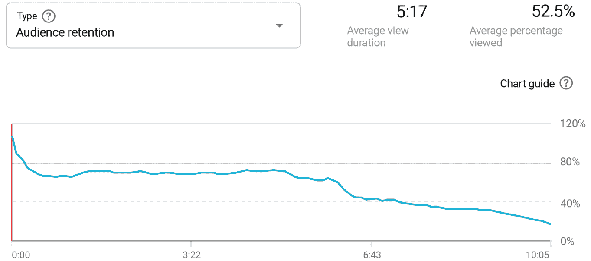

**图 20.1** **Matt 的 AVD 下降**

**图 20.2** **Matt 的 AVD 恢复**

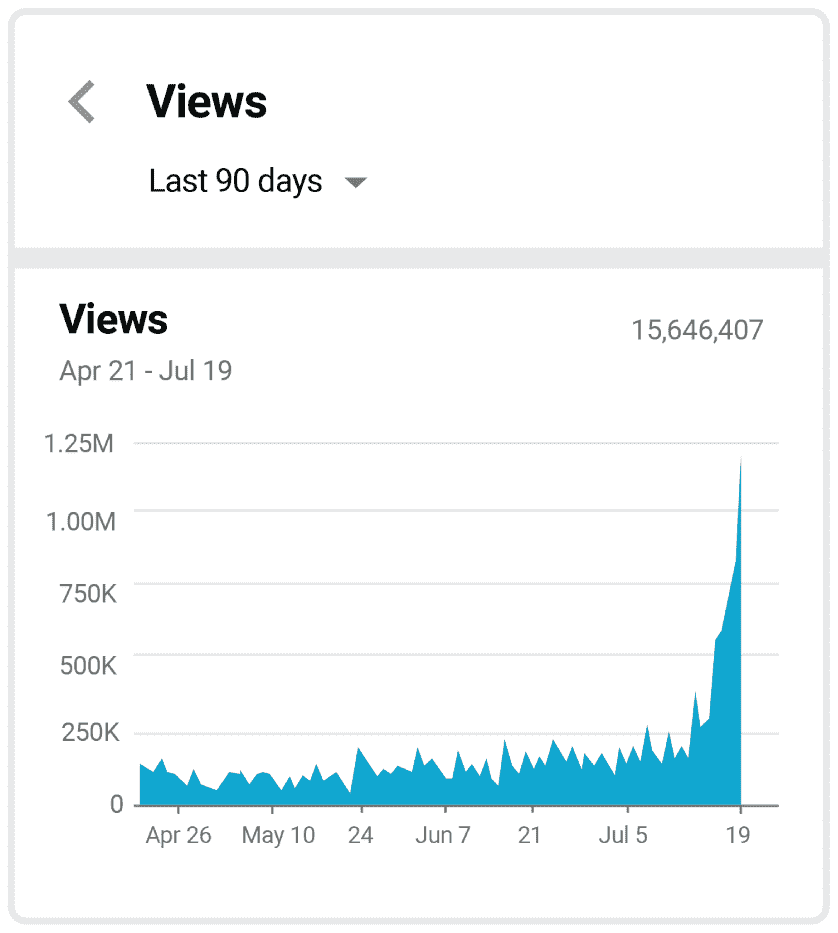

**图 20.3** **Matt 的视频观看次数**

Matt 的视频观看次数飙升了。图 20.3 显示了我们对他的频道所做的小调整。

记住，这一切都是关于观众——从看到你的缩略图和标题并想要点击（印象、点击率），到想要完成你的视频（AVD/APV、观看时间）并观看更多（观看时间、AVPV）。这是关于始终努力学习和改进，通过分析和调整。## 就是这样

你弄清楚所有这些与你的内容有什么关系的最佳方法是深入研究。进入你的分析数据，学会阅读你最重要的指标。准备好各种缩略图的变体，当一个不起作用时可以快速更换。了解你的流量来自何处，以及你的基线是什么。如果你无法读取实时数据，几乎不可能修复表现不佳的视频。你练习得越多，就越能看到模式，并知道何时要迅速行动，何时要让你的内容慢慢发酵。你会在不知不觉中成为一个分析专家，你的内容也会因此大幅改善。

你会搞明白的。这需要时间和努力，但我保证这是值得的。你有什么可以失去的呢？有些人比其他人更快地掌握模式和数据分析，但无论学习需要多长时间，最终结果都是一样的。你会学会如何分析你的频道数据，以便做出必要的调整以取得成功。## 行动练习

+   **任务 1：**通过本章概述的步骤找到你的一个视频桶中的视频基线。

我在本书的配套课程中深入讲解了基线分析。获取配套工作手册，并在[www.ytformulabook.com](http://www.ytformulabook.com)找到更多资源。

# 21 尝试、失败、分析、调整：你的 YouTube 成功之道

让我给你讲一个关于一个令人惊叹的 YouTube 家庭的故事。Jase 和 Rachel Bennett 的 YouTube 频道是*The Ohana Adventure*，或者他们称之为*TOA*。这是一个家庭视频博客频道，为 Bennett 家庭提供了舒适的生活方式，但并不总是这样。2013 年，Jase 将他的长板品牌 jaseboards 引入 Costco 和其他大型零售空间，当时一段水下滑板视频在 YouTube 上走红。Jase 看到了 YouTube 上的机会，为他多年来一直是常规博主的妻子 Rachel。Rachel 喜欢开始一个家庭视频博客的想法，于是*TOA*诞生了。

Rachel 开始时并没有太多方向性地进行视频博客。起初，她甚至没有观看其他 YouTube 频道，看看其他视频博客家庭在做什么。但她做了一件强大的事情：她找到了她的目标。她想成为那些能够通过共同玩乐来激发他人培养健康家庭关系的家庭之一。花了九个月才有任何观看次数，当频道达到一百名订阅者时，感觉很棒（就像以后达到一百万名订阅者会感觉一样）。

特别是有一个视频推动了*TOA*的 YouTube 成功。Rachel 和她的青少年女儿一起做了一个“如何刮腿毛”的视频。这触发了一段不错的赚钱期，让 Jase 决定辞去工作，全职在 YouTube 上和家人一起工作。Bennetts 拍摄了家庭生活中的一切，包括“啊哦”时刻，比如孩子撞到头或受伤。然后《儿童在线隐私保护法》（COPPA）和 YouTube 的超严格反应出现了：所有“可疑”的儿童内容都被取消了广告，包括*The Ohana Adventure*，因为他们的“啊哦”内容。这对 Bennett 家庭来说是一个沉重的打击，他们的生计依赖于他们在 YouTube 上的收入。

这个时候我和 Jase 和 Rachel 进行了一次对话。我们谈到了在视频中创建数据关系的重要性，以及让他们的内容出现在推荐频道中。我们谈到了与其他家庭视频博主合作的事情。他们基于这些想法制定了新计划，并承诺要实施。Rachel 决心让她的频道重新回到正轨，所以她给自己设定了一个重新建立货币化的截止日期，并开始努力制作更好的内容。

Jase 和 Rachel 让自己与志同道合的人为伍，并进行了一些很棒的合作。他们甚至与类似的家庭视频博主分享了观众、主题和上传时间表。他们确保他们的观众与他们选择合作的频道有良好的交叉数据，这样他们就能吸引到合适的观众观看他们的内容。两年来，每个星期一晚上，他们都会进行直播并玩家庭游戏。他们知道一贯性很重要，所以他们从未错过过一周。这是一个新策略，让他们的观众有机会更深入地联系。观众们给了他们很好的评论，给了他们更多视频的创作灵感，而他们也在倾听。

观众参与度非常重要。当他们倾听建议并进行宣传时，吸引了他们理想的观众更多地关注他们的内容。Jase 开始在每次直播结束时做一个愚蠢的说唱，他会在说唱中插入观众的用户名。这给了他一个创意，他和女儿一起做了一个模仿泰勒·斯威夫特的歌曲“Look What You Made Me Do”的视频。这个模仿视频成为他们观看次数最多的视频，观看次数超过 1 亿次。由于这个视频的巨大成功，他们制作了更多与该内容桶和整体内容相关的数据关系的视频。他们制作了模仿视频的花絮、幕后花絮和编舞视频。围绕正在起作用的内容建立更多内容的策略使他们在第一周就获得了 2 万美元的广告收入。

每个 YouTube 频道都会犯错，*TOA*也不例外。Jase 和 Rachel 陷入了比较的陷阱，认为如果他们开始模仿其他成功创作者的做法，那对他们也会奏效。但事实并非如此。Jase 陷入了算法思维，创作内容是为了机器而不是为了观众。他们停止了与自己的观众交流，他们的频道从每天获得数百万次观看，跌至最多只有 50 万次。他们的频道濒临垂死，失去了观众的动力和兴趣。

所以他们重新集结起来。他们回到了他们的理想观众，实际上是一个年龄较大的孩子群体，并慢慢开始恢复他们的指标。现在他们小心翼翼地将新内容定位到正确的观众。孩子们有自己的频道，与家庭频道分开，每个频道根据他们的年龄和主题吸引不同的观众。因为他们在 YouTube 上长大，孩子们很了解他们的观众，并且在为他们的理想观众创作内容方面做得很好。

Jase 和 Rachel 选择了 YouTube 作为他们家庭的事业和主要收入来源，但对他们来说，让孩子们开心玩耍也很重要。他们以“激励，而非要求”为信条生活和创作。他们尝试过、失败过、分析过，并做出调整，才走到了现在的地步。他们的频道总共有数百万订阅者，这些人受到启发，希望能够享受传统的快乐和健康的家庭关系。最重要的是，他们回到了他们在 YouTube 开始时的初衷。

当我问 Rachel 如果她能回到开始她的 YouTube 频道时，她会给自己什么建议，她说她会告诉自己找出哪种内容表现最好，这样她就可以做更多类似的内容。她会更加一贯。她会有良好的元数据，并在她的内容之间建立观看数据关系。但也许最重要的是，她会告诉自己不要让错误打击自己。继续前进，创作更好的内容。

YouTube 自己的历史遵循着尝试、失败、分析和根据数据做出决策的公式。Jawed Karim、Chad Hurley 和 Steven Chen 创办 YouTube 的初衷是把它做成一个约会网站。但这个想法行不通，所以他们看了看什么是有效的，改变了他们的策略以符合数据。如果你真的想在 YouTube 上取得成功，你必须效仿他们的例子，以及*TOA*的例子。现在你拥有了必要的工具，可以在准备、创作和后续工作中做出明智的决策，这意味着你知道如何根据数据进行尝试、失败、分析和调整。利用数据对你有利，可以消除 YouTube 频道的猜测，不仅有助于你取得成功，而且感觉非常有力量。

你在这本书中做了一些很棒的工作。你了解了人工智能如何随着时间的推移而改变，以及现在每个流量来源都有自己的算法来满足需求。这是一个非常重要的事情要学习，因为它帮助你掌控自己在生态系统中的存在，而不是把失败归咎于 YouTube。现在你知道，机会多得是——有整个世界的观看量可以获取，有钱可以赚。通过社区、合作、品牌交易等方式，有无数种方法可以互动和取得成功。

在你作为创作者的过程中，要把你的优先事项和实践与 YouTube 的要求保持一致。更加重视让观众点击或触摸你的视频，因为如果他们不点击，他们就不会观看。当你让他们观看一个视频时，再让他们观看另一个视频。把观众看作一个人，而不是一个数字，这样你就可以真正了解他们是谁，以预测他们可能想观看的内容。一切都是为了观众！记住，YouTube 的成功不是靠运气。不要认为 Jase 和 Rachel Bennett 是一些“幸运儿”，要意识到任何人都可以做到这一点，包括你，只要有正确的心态和工具。

我希望我已经让你看到了 YouTube 改变生活和业务的力量——它为我们每个人提供了一个机会，让我们无论身在何处，无论环境如何，都可以触及整个世界。如果你在 YouTube 上遇到困难，只需站起来，擦干净，分析发生了什么以及为什么，然后继续制作你热爱的优质内容，无论是视频日志、缝纫或者发展你的业务。找到你的观众并与他们交流。为他们创作，倾听他们，永远不要为了任何人或任何事牺牲你的信息。当某些事情不起作用时，查看你的数据并做出明智的调整，以使你的内容有最好的机会被发现和观看。这就是 YouTube 的公式。使用它，看魔法发生。
